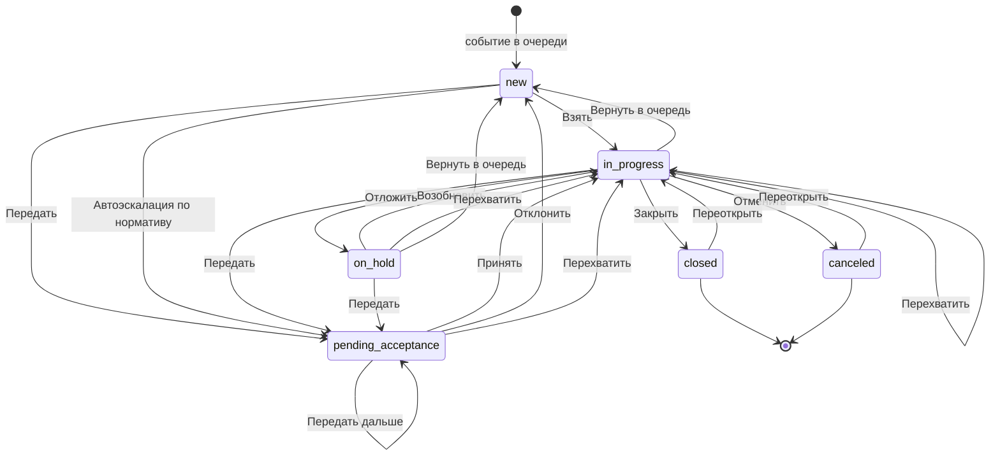

# Правила перехода состояний МИ (v3)

Жизненный цикл инцидента в менеджере инцидентов (МИ): состояния, переходы, права, нормативы и автоэскалация.

Версия 3 опирается на [002 States rules IM.md](002%20States%20rules%20IM.md). Объективные состояния, два таймера и права `own` / `any` сохранены. Главное изменение: ручная **эскалация** и **перенаправление** — это одна операция **Передать**. Кто чей инцидент может передавать, решает право на сервере, а не две кнопки в интерфейсе. Что изменилось относительно v2 — в §16. Что не взято из внешнего разбора панели действий — в §18.

> Документ описывает целевую модель. Прототип приведён к этим терминам.

## 1. Словарь и сокращения

### Сокращения

| Сокращение | Расшифровка | Простыми словами |
|---|---|---|
| **МИ** | Менеджер инцидентов | Рабочее место оператора: очередь событий, карточка обработки, видео и карта на одном экране |
| **SLA** | Service Level Agreement — соглашение об уровне сервиса | Отведённое время на работу с инцидентом. В МИ два норматива: время до взятия и время до закрытия (§4) |
| **ЦОД** | Центр обработки данных | Круглосуточный дежурный пост, куда передают то, что не решается силами объекта |
| **ТСО** | Технические средства охраны | Камеры, датчики, детекторы, турникеты — всё оборудование, которое порождает события |
| **СКУД** | Система контроля и управления доступом | Турникеты, шлагбаумы, двери с картами доступа |
| **СИЗ** | Средства индивидуальной защиты | Каска, жилет, очки. Есть детектор, который замечает их отсутствие |
| **PTZ** | Pan-Tilt-Zoom | Управляемая камера: её можно поворачивать, наклонять и приближать |
| **RBAC** | Role-Based Access Control | Права выдаются не человеку, а роли; человек получает права вместе с ролью |
| **AxxonData** | — | Система хранения и аналитики, куда уходит результат закрытого инцидента |
| **ITSM / ITIL** | — | Практики управления заявками и инцидентами, откуда взяты названия состояний (§16) |

### Термины

| Термин | Что это значит |
|---|---|
| **Событие** | То, что зафиксировала система: сработка детектора, датчика, тревожной кнопки |
| **Инцидент** | Событие, которое нужно разобрать по регламенту. Далее «событие» и «инцидент» — одно и то же |
| **Состояние** | Объективное положение инцидента в жизненном цикле: новое, ожидает принятия, в работе, отложен, закрыто, отменено (§2.1). Одно и то же для всех, кто смотрит |
| **Бейдж** | Подпись состояния в очереди. Вычисляется из состояния и владельца для конкретного смотрящего оператора (§2.4). Не хранится |
| **Владелец** | Оператор, за которым закреплён инцидент. Поле `owner` |
| **Передача** | Ручное действие «Передать»: выбрать адресата и отдать ему инцидент. Своё и чужое — одно действие, разные права (§5) |
| **Адресат** | Тот, кому передают инцидент: человек или дежурная группа |
| **Очередь** | Список инцидентов, из которого оператор выбирает, чем заняться |
| **Карточка обработки** | Экран одного инцидента: шаги сценария, видео, карта, журнал |
| **Сценарий** | Пошаговая инструкция под тип события: что подтвердить, как классифицировать, что запустить |
| **Шаг** | Один вопрос или действие сценария. Бывает обязательным для конкретного перехода (§6.1) |
| **Журнал** | Хронология по инциденту: кто что сделал и когда. Заполняется автоматически |
| **Приоритет** | Насколько срочно: критический, высокий, средний. Влияет на нормативы и порядок в очереди |
| **Оператор** | Человек за рабочим местом МИ |
| **Старший смены** | Руководитель дежурной смены, типовой адресат первого уровня эскалации |
| **Диспетчер** | Служебная часть системы: ставит события в очередь и выполняет автоматические переходы. В журнале такие записи подписаны «Диспетчер» |
| **Детектор** | Модуль, который сам находит событие в видео или звуке |
| **Макрос** | Заранее настроенная команда системе: включить сирену, открыть шлагбаум, оповестить по объекту |
| **Алерт** | Уведомление ответственному без передачи ответственности и без смены состояния |
| **Норматив реакции** | Время от появления инцидента до взятия в работу |
| **Норматив закрытия** | Время от взятия в работу до закрытия |
| **Уровень эскалации** | Сколько раз ответственность за инцидент передавалась. Поле `escalation_level`. Растёт и при ручной передаче, и при автоэскалации: иначе цепочку норматива можно обнулять бесконечно (§8.3) |
| **Причина удержания** | Почему инцидент отложен: ждём наряд, ждём третью сторону и так далее. Поле `hold_reason` |
| **Guard (условие)** | Проверка, без которой переход не выполняется: право, владение, заполненность шагов |
| **Effect (эффект)** | Что переход меняет: владельца, флаги, таймеры, запись в журнал, внешнюю команду |
| **Схема** | Конфигурация: состояния, переходы, условия, эффекты, нормативы. То, что настраивается без программиста |

### Технические имена

Встречаются в таблицах ниже, оператору не видны.

| Имя | Что это |
|---|---|
| `new`, `pending_acceptance`, `in_progress`, `on_hold`, `closed`, `canceled` | Коды состояний |
| `owner` | Владелец-человек |
| `assignment_group` | Дежурная группа-владелец, пока никто не сделал взятие |
| `escalation_level` | Счётчик уровней эскалации, `0` — не эскалирован |
| `hold_reason` | Причина удержания при `on_hold` |
| `cancel_reason` | Причина отмены при `canceled` |
| `group_id` | Признак групповой обработки |
| `reaction_due_at`, `resolution_due_at` | Дедлайны нормативов — метки времени, не счётчики |
| `sla_breached` | Признак «норматив нарушен», для отчётности |
| `schema_version` | Версия схемы, на которой инцидент был создан |

## 2. Модель состояний

### 2.1. Объективные состояния

Состояние одно для всех. Оно не зависит от того, кто открыл очередь.

| Состояние | Код | Категория | Владелец | Терминальное |
|---|---|---|---|---|
| Новое | `new` | pending | нет (либо дежурная группа) | нет |
| Ожидает принятия | `pending_acceptance` | pending | адресат передачи | нет |
| В работе | `in_progress` | active | оператор | нет |
| Отложен | `on_hold` | pending | оператор | нет |
| Закрыто | `closed` | done | кто закрыл | да |
| Отменено | `canceled` | done | кто отменил | да |

Пояснения к выбору:

- **`pending_acceptance` вместо `escalated`.** Из имени видно, что состояние ждёт действия адресата, а значит нужен переход «Принять». В первой версии такого перехода не было, и адресат мог войти в инцидент только через «Перехватить».
- **`on_hold` — отдельное состояние, а не флаг.** Так работают категории (§2.3) и настройки автоэскалации: правило «эскалировать просроченные в работе, но не трогать отложенные» становится обычным перечислением состояний, а не разбором флагов.
- **`canceled` отделено от `closed`.** Ложная тревога, дубликат и прерванная обработка — не «успешно обработано». Складывать их в `closed` с разными результатами неудобно для отчётности.

### 2.2. Флаги и поля

Поля инцидента, влияющие на переходы: `owner`, `assignment_group`, `escalation_level`, `hold_reason`, `cancel_reason`, `group_id`, `reaction_due_at`, `resolution_due_at`, `sla_breached`.

**Причины удержания** (`hold_reason`, обязательна при переходе в `on_hold`):

| Причина | Когда выбирают | Кто ставит |
|---|---|---|
| Ожидание третьей стороны | Вызвана внешняя служба, ждём ответа | оператор |
| Выезд наряда | Наряд в пути, обработка продолжится по прибытии | оператор |
| Нет данных, вернуться позже | Нужны сведения, которых сейчас нет | оператор |
| Перерыв оператора | Оператор ушёл на перерыв с открытой карточкой | система |
| Нет связи с оператором | Сессия оператора не отвечает (§12.3) | система |

**Причины отмены** (`cancel_reason`, обязательна при переходе в `canceled`, вместе с комментарием):

| Причина | Когда выбирают |
|---|---|
| Ложная тревога | Детектор ошибся, события не было |
| Дубликат | То же событие уже разбирается в другом инциденте |
| Плановая проверка | Тест системы, учения |
| Прервано: обработка невозможна | Объект недоступен, данных нет, разобрать по регламенту нельзя |

### 2.3. Категории состояний

У каждого состояния обязательна категория: `pending`, `active`, `done`. От неё зависят группировка очереди, цвет бейджа, счётчики и отнесение в отчётах. Новое состояние, добавленное в схему, получает категорию и сразу попадает во все фильтры и сводки — без доработки интерфейса.

### 2.4. Слой представления: моё, чужое, бейджи

`mine` и `foreign` — не состояния. Это результат сравнения `owner` с текущим оператором, и в модели данных их нет. Бейдж в очереди вычисляется так:

| Состояние | Владелец относительно смотрящего | Бейдж |
|---|---|---|
| `new` | — | Новое |
| `pending_acceptance` | я или моя дежурная группа | Вам на принятие |
| `pending_acceptance` | другой | Ожидает принятия · «адресат» |
| `in_progress` | я | В работе |
| `in_progress` | другой | «ФИО оператора» |
| `on_hold` | я | Отложен · «причина» |
| `on_hold` | другой | Отложен · «ФИО оператора» |
| `closed` | любой | Закрыто |
| `canceled` | любой | Отменено · «причина» |

## 3. Схема переходов

Условия переходов на диаграмме не показаны, чтобы она оставалась читаемой: полный список с правами — в §6.



## 4. Нормативы и таймеры

Один общий «норматив» первой версии разделён на два: он одновременно означал время до реакции и продолжал тикать у оператора, который как раз реагирует.

| Таймер | Смысл | Запускается | Останавливается | Удержание |
|---|---|---|---|---|
| `reaction` | Время до взятия в работу | вход в `new` или `pending_acceptance` (при передаче перезапускается заново, норматив берётся от уровня) | вход в `in_progress`, `closed`, `canceled` | не применимо |
| `resolution` | Время до закрытия | вход в `in_progress` | вход в `closed`, `canceled` | приостанавливается в `on_hold`, продолжается при возврате |

Правила:

1. Дедлайны хранятся метками времени (`reaction_due_at`, `resolution_due_at`), а не убывающими счётчиками. Обратный отсчёт рисует клиент. Значение можно пересчитать после перезапуска сервиса и посчитать запросом в отчёте.
2. Нормативы задаются на тип события, приоритет и группу объектов. Значение по умолчанию — на схему.
3. Истечение `reaction` — основной триггер автоэскалации (§9).
4. Истечение `resolution` по умолчанию не меняет состояние: пишется запись в журнал, ставится `sla_breached`, уходит алерт старшему смены. Настройкой можно включить эскалацию и по этому таймеру.
5. Удержание в `on_hold` не бесконечно: по каждой причине задаётся максимальный срок, после которого уходит алерт, а инцидент помечается как просроченный.

## 5. Права доступа

Ключи в формате `ресурс:действие:область`. Область различает своё и чужое: `own` — свои и ничьи инциденты, `any` — включая занятые другим оператором. Проверка «есть ли у роли хоть какое-то право на действие» выполняется по маске `incident:transfer:*`.

| Право | Что разрешает |
|---|---|
| `incident:claim` | Взять новое, принять адресованную эскалацию, возобновить свой отложенный |
| `incident:hold` | Отложить свой инцидент с указанием причины |
| `incident:release` | Вернуть свой инцидент в очередь; отклонить адресованную эскалацию |
| `incident:close` | Закрыть с записью результата |
| `incident:cancel` | Отменить: ложная тревога, дубликат, прерванная обработка |
| `incident:reopen` | Вернуть в работу закрытый или отменённый инцидент |
| `incident:transfer:own` | Передать своё, ничьё (новое) или адресованное мне |
| `incident:transfer:any` | Передать инцидент, занятый другим оператором или ожидающий принятия у другого |
| `incident:reassign` | Перехватить инцидент у работающего оператора |
| `incident:read:any` | Открыть карточку чужого инцидента только для чтения |
| `incident:bulk` | Обработать несколько инцидентов как один |
| `incident:run_action` | Запускать макросы и команды из карточки |
| `incident:schema:admin` | Менять схему, нормативы и настройки автоэскалации |
| `agent:set_not_ready` | Переводить себя в перерыв |

Отдельно от прав:

- **Видимость записей** — не право и не условие перехода, а фильтр выборки: какие группы объектов попадают оператору в очередь. Право отвечает на вопрос «можно ли выполнить действие», фильтр — на вопрос «виден ли инцидент вообще».
- **Настройки рабочего места** (раскладка панелей, тема, предвыбор адресата в форме передачи) права не требуют: они не меняют данные инцидента.

## 6. Переходы

### 6.1. Ручные переходы

Общее правило для всех строк: переход выполняется сервером атомарно, на перерыве недоступен (§10), передача на себя запрещена (§10).

| Действие | Откуда | Куда | Право | Дополнительные условия | Что происходит |
|---|---|---|---|---|---|
| **Взять** | `new` | `in_progress` | `incident:claim` | лимит активных не превышен | `owner` = я; остановка `reaction`, запуск `resolution`; открывается карточка с первого незаполненного шага |
| **Принять** | `pending_acceptance` | `in_progress` | `incident:claim` | адресат — я или моя дежурная группа; лимит активных | `owner` = я; остановка `reaction`, запуск `resolution`; прогресс сценария сохраняется |
| **Отклонить** | `pending_acceptance` | `new` | `incident:release` | адресат — я или моя группа; указана причина | `owner` очищается; `escalation_level` сохраняется; `reaction` перезапускается; запись в журнал с причиной |
| **Отложить** | `in_progress` | `on_hold` | `incident:hold` | я владелец; выбрана `hold_reason` | `resolution` приостанавливается; возврат к очереди; шаг, ответы и журнал сохраняются |
| **Возобновить** | `on_hold` | `in_progress` | `incident:claim` | я владелец; лимит активных | `hold_reason` очищается; `resolution` продолжается с того же остатка |
| **Вернуть в очередь** | `in_progress`, `on_hold` | `new` | `incident:release` | я владелец; указана причина | `owner` очищается; `resolution` останавливается, `reaction` запускается заново; прогресс сценария сохраняется |
| **Передать** | `new`, `pending_acceptance`, `in_progress`, `on_hold` | `pending_acceptance` | `incident:transfer:own` или `incident:transfer:any` | выбран адресат и указана причина; своё / ничьё / адресованное мне — по `:own`; чужое — по `:any` | `owner` = адресат; `escalation_level` +1; `reaction` перезапускается, `resolution` останавливается; прогресс сохраняется; возврат к очереди. Если передавали чужой — прежний владелец получает уведомление, его открытая карточка закрывается и переходит в режим просмотра |
| **Перехватить** | `in_progress`, `on_hold`, `pending_acceptance` | `in_progress` | `incident:reassign` | я не владелец; лимит активных | `owner` = я; прогресс сценария сохраняется; прежний владелец получает уведомление, его карточка закрывается |
| **Закрыть** | `in_progress` | `closed` | `incident:close` | я владелец; заполнены обязательные шаги набора «закрытие» | таймеры останавливаются; результат уходит в AxxonData внешним эффектом (§14.2) |
| **Отменить** | `in_progress` | `canceled` | `incident:cancel` | я владелец; выбрана `cancel_reason` и заполнен комментарий | таймеры останавливаются; инцидент не считается обработанным в отчётности |
| **Переоткрыть** | `closed`, `canceled` | `in_progress` | `incident:reopen` | не истёк срок переоткрытия (настройка) | `owner` = я; `resolution` запускается заново; запись в журнал со ссылкой на прежний результат |
| **Обработать как одно** | `new` (несколько) | `in_progress` | `incident:bulk` + `incident:claim` | выбрано ≥ 2; правила выборки из §11 | всем выбранным ставится общий `group_id`, `owner` = я, ответы общие |

### 6.2. Автоматические переходы

Выполняются диспетчером. Права оператора в них не участвуют.

| Триггер | Откуда | Куда | Условия | Что происходит |
|---|---|---|---|---|
| Истёк `reaction` | `new`, `pending_acceptance` | `pending_acceptance` | автоэскалация включена; `escalation_level` меньше потолка | `owner` = адресат уровня; `escalation_level` +1; `reaction` перезапускается; запись в журнал от диспетчера |
| Истёк `reaction`, достигнут потолок | `new`, `pending_acceptance` | не меняется | — | `sla_breached` = да; алерт ответственному; инцидент остаётся у последнего адресата |
| Истёк `resolution` | `in_progress` | не меняется по умолчанию | настройка «эскалировать по нормативу закрытия» выключена | `sla_breached` = да; алерт старшему смены |
| Оператор ушёл на перерыв | `in_progress` | `on_hold` | у оператора есть активная карточка | `hold_reason` = «перерыв оператора»; право `incident:hold` не требуется |
| Сессия оператора не отвечает | `in_progress` | `on_hold` | таймаут неактивности (§12.3) | `hold_reason` = «нет связи с оператором»; алерт старшему смены |
| Сессия не отвечает дольше порога | `on_hold` | `new` | причина удержания системная | `owner` очищается; `reaction` запускается заново |

### 6.3. Действия без смены состояния

Первая версия описывала их как переходы, из-за чего таблица переходов смешивала изменение данных с навигацией.

| Действие | Когда доступно | Право | Что делает |
|---|---|---|---|
| **Открыть на просмотр** | инцидент не мой, в любом состоянии | `incident:read:any` | открывает карточку только для чтения; состояние и владелец не меняются |
| **Открыть свой** | я владелец, либо я закрыл этот инцидент | — | открывает карточку; в `closed` и `canceled` — только для чтения |
| **К очереди** | открыта карточка просмотра | — | закрывает карточку; ничего не меняет |
| **Запустить макрос** | я владелец, состояние `in_progress` | `incident:run_action` | внешняя команда; результат пишется в журнал (§14.2) |

Правило для закрытых инцидентов: свои закрытые доступны всегда, закрытые другими — по `incident:read:any`, как и любые чужие. Отдельного условия «всегда» больше нет.

## 7. Кнопки: очередь и карточка

Кнопка показывается, если соответствующий переход доступен: есть право, выполнены условия, состояние подходит. Права нет — кнопки нет.

### В очереди

| Бейдж | Основная кнопка | Дополнительно |
|---|---|---|
| Новое | **Взять** | **Передать** |
| Вам на принятие | **Принять** | **Отклонить**, **Передать** |
| В работе (моё) | **Продолжить** | **Передать** |
| Отложен (моё) | **Возобновить** | **Передать** |
| «ФИО оператора» / Ожидает принятия | **Открыть** (просмотр) | **Передать** — если есть `incident:transfer:any` |
| Закрыто / Отменено | **Просмотр** | **Переоткрыть** |

«Продолжить» и «Возобновить» — разные кнопки: возобновлять активный инцидент нечего, для него это просто возврат в карточку. В первой версии обе строки предлагали «Возобновить», и соответствующего перехода в таблице не было.

### В карточке

| Ситуация | Кнопки |
|---|---|
| Мой, `in_progress` | **Назад / Далее** по шагам, **Отложить**, **Передать**, **Вернуть в очередь**, **Закрыть**, **Отменить** |
| Мой, `on_hold` | **Возобновить**, **Передать**, **Вернуть в очередь** |
| Адресован мне, `pending_acceptance` | **Принять**, **Отклонить**, **Передать** — отдать дальше, не принимая |
| Чужой | **Перехватить**, **Передать** — по правам; иначе только просмотр |
| `closed`, `canceled` | **Переоткрыть** — по праву; иначе только просмотр |

**Перехватить** — действие только из карточки: оператор должен сначала увидеть, что уже сделано. В очереди его нет.

Цвета: обычная работа с инцидентом — основной цвет интерфейса; **Передать** — один акцент передачи ответственности (не две кнопки разного цвета); перехват и отмена — красный, как вмешательство в чужую работу или отказ от обработки.

Двух кнопок «Эскалация» и «Перенаправить» нет. Оператор не должен решать, «вверх» он отдаёт или «вбок»: он выбирает адресата. Иерархия — в справочнике адресатов и в цепочке автоэскалации, не в названии кнопки.

## 8. Передача: адресаты и уровни

### 8.1. Кто может быть адресатом

| Правило | Поведение |
|---|---|
| Список адресатов | люди и дежурные группы, разрешённые схемой |
| Назначение на группу | инцидент принадлежит группе (`assignment_group`), пока кто-то из неё не выполнит «Принять»; после этого `owner` — человек |
| Исключение себя | текущий оператор из списка исключён всегда. Иначе оператор с правом передачи, но без права взятия, мог бы получить инцидент в работу в обход `incident:claim` |
| Исключение владельца | при передаче чужого из списка исключён текущий владелец |
| Доступность | у адресатов не на смене это указано в строке списка |
| Окончание смены адресата | если адресат ушёл со смены, не приняв инцидент, инцидент возвращается его дежурной группе |

### 8.2. Два разных значения по умолчанию

В первой версии одно и то же значение использовалось и как персональная настройка, и как системный параметр автоэскалации. Для ничьего инцидента это неопределимо: в смене десять операторов с разными значениями.

| Настройка | Кто задаёт | Право | Где применяется |
|---|---|---|---|
| Предвыбор адресата в форме | каждый оператор себе | не требуется | только подставляет значение в выпадающий список ручной передачи |
| Адресаты уровней автоэскалации | администратор смены или схемы | `incident:schema:admin` | автоэскалация; на ручную форму не влияет |

### 8.3. Уровни

Однократный флаг «автоэскалация уже была» заменён счётчиком: иначе цепочка «старший смены → ЦОД» невозможна, а не принятый инцидент лежит без движения.

| Уровень | Адресат по умолчанию | Норматив реакции |
|---|---|---|
| 0 | нет, инцидент в общей очереди | норматив типа события |
| 1 | старший смены | сокращённый |
| 2 | дежурный ЦОД | сокращённый |
| потолок | дальше не передаётся | алерт и `sla_breached` |

Потолок и состав уровней настраиваются. Ручная передача тоже увеличивает `escalation_level`: иначе передачей коллеге можно было бы бесконечно обнулять цепочку норматива. Автоэскалация — тот же эффект передачи, но без кнопки: её запускает таймер, адресата берёт схема, не оператор.

## 9. Автоэскалация: настройки

Автоэскалацию выполняет система, поэтому права оператора её не ограничивают. Настройки — под правом `incident:schema:admin`.

| Параметр | Назначение | Значение по умолчанию |
|---|---|---|
| `enabled` | Включить или выключить | включена |
| `trigger` | По какому таймеру срабатывает | `reaction` |
| `from_states` | Из каких состояний | `new`, `pending_acceptance` |
| `levels[]` | Адресат и норматив на каждом уровне | старший смены, затем ЦОД |
| `max_level` | Потолок цепочки | 2 |
| `on_resolution_overdue` | Что делать при истечении норматива закрытия | алерт без смены состояния |
| `reason` | Текст записи в журнале | «Автоэскалация: превышен норматив реакции» |

Состояния `in_progress` и `on_hold` в `from_states` по умолчанию не входят: реакция по ним уже состоялась, а эскалировать оператора «за отсутствие реакции» в момент, когда он реагирует, бессмысленно. Если политика объекта требует эскалации просроченных в работе, состояния добавляются в перечень явно — и `on_hold` при этом можно не включать, потому что это отдельное состояние, а не флаг.

### Порядок срабатывания

1. Планировщик на сервере ведёт дедлайны. Клиент только рисует обратный отсчёт.
2. При наступлении `reaction_due_at`, если состояние входит в `from_states` и `escalation_level` меньше `max_level`: состояние → `pending_acceptance`, `owner` → адресат следующего уровня, `escalation_level` +1, `reaction` перезапускается по нормативу уровня, в журнал пишется запись от диспетчера.
3. Если оператор в этот момент держал карточку открытой, карточка переводится в режим просмотра с уведомлением.
4. При достигнутом потолке состояние не меняется: ставится `sla_breached` и уходит алерт.
5. Дедлайны, наступившие во время простоя сервиса, обрабатываются при старте (§14.3).

## 10. Ограничения и защита от тупиков

### 10.1. Инварианты

1. **Переход атомарен и выполняется сервером.** Клиент присылает идентификатор перехода вместе с ожидаемым состоянием и версией записи; при рассинхроне сервер отклоняет запрос и возвращает актуальное состояние.
2. **На перерыве доступен только просмотр.** Любое действие, меняющее состояние инцидента, недоступно. Это одно правило вместо выборочной пометки «не на перерыве» у части переходов.
3. **Передача на себя запрещена.**
4. **Терминальные состояния меняются только через «Переоткрыть».** Право `incident:reopen` — единственное исключение из правила «закрытый инцидент не меняется».
5. **Ручное действие выигрывает у таймера.** Если переход по таймеру и действие оператора приходятся на один момент, применяется действие оператора, срабатывание таймера отменяется и фиксируется в журнале.

### 10.2. Лимит одновременных инцидентов

| Параметр | Значение по умолчанию | Смысл |
|---|---|---|
| `max_active` | 1 | сколько инцидентов может быть в `in_progress` у одного оператора |
| `max_on_hold` | 5 | сколько отложенных он может держать |

При попытке взять инцидент сверх лимита кнопка заблокирована с подсказкой, какой инцидент нужно завершить или отложить. Горячая клавиша «взять следующее новое» подчиняется тому же лимиту.

### 10.3. Гарантия выхода из карточки

Первая версия допускала тупик: без права откладывать, без права эскалировать и с незаполняемыми обязательными шагами выхода из карточки не существовало.

Выходов теперь три, и хотя бы один доступен всегда:

1. **Отложить** — `incident:hold`.
2. **Вернуть в очередь** — `incident:release`.
3. **Отменить** с причиной «Прервано: обработка невозможна» — `incident:cancel`, обязательные шаги закрытия при этом не проверяются, но комментарий обязателен.

Схема при сохранении проверяет: если роли выдано `incident:claim`, у неё должен быть хотя бы один из `incident:hold`, `incident:release`, `incident:cancel`. Иначе конфигурация не публикуется.

### 10.4. Запреты

| Ситуация | Запрещено |
|---|---|
| Нет права `incident:claim` | Взять, Принять, Возобновить, групповая обработка |
| Нет права `incident:reassign` | Перехватить; остаётся просмотр |
| Нет права `incident:transfer:own` | Передать своё, новое или адресованное мне |
| Нет права `incident:transfer:any` | Передать чужой или ожидающий принятия у другого |
| Нет права `incident:read:any` | Открыть чужую карточку, включая закрытые другими |
| Оператор на перерыве | любые действия, меняющие состояние; правки сценария и макросы |
| Инцидент не мой | правка шагов, макросы, закрытие и отмена — только после перехвата |
| Обязательные шаги набора «закрытие» не заполнены | Закрыть (Отменить — можно) |
| Достигнут потолок уровней | дальнейшая автоэскалация |
| Лимит активных исчерпан | Взять, Принять, Возобновить, Перехватить |

## 11. Групповая обработка

Правила, которых не было в первой версии.

| Вопрос | Правило |
|---|---|
| Что можно включать в выборку | только `new`, только видимые оператору, только один тип события |
| Сколько | от 2 до `max_bulk` (по умолчанию 10) |
| Что происходит с состояниями | каждый инцидент сохраняет собственное состояние и собственные таймеры; общими становятся `group_id`, владелец и ответы сценария |
| Родительский инцидент | не создаётся: группа — это признак, а не сущность |
| Закрытие | одним действием на всю группу, один набор ответов, отдельная запись в журнал каждого инцидента |
| Если норматив истёк у одного из членов | этот инцидент выходит из группы и эскалируется по общим правилам; в журнал всех членов пишется запись о выходе; остальные продолжают обрабатываться |
| Почему не «остановить таймеры группы» | иначе групповая обработка становится способом легально обойти нормативы |
| Частичное завершение | оператор может исключить инцидент из группы вручную, он возвращается в `in_progress` со своими ответами |

## 12. Состояние оператора

Состояние оператора — отдельная машина состояний. В первой версии «перерыв» лежал в общем списке прав и условий переходов инцидента, хотя к инциденту не относится.

### 12.1. Состояния

| Состояние | Смысл | Назначаются ли новые инциденты |
|---|---|---|
| На смене | готов принимать инциденты | да |
| Занят | работает с инцидентом | да, в пределах лимита |
| Перерыв (с причиной) | обед, инструктаж, обход | нет |
| Не на смене | сессия закрыта или смена окончена | нет |

### 12.2. Переход в перерыв

Право `agent:set_not_ready`. При уходе на перерыв активный инцидент автоматически переводится в `on_hold` с причиной «перерыв оператора» — системным действием, право `incident:hold` для этого не нужно. Иначе оператор без права откладывать не смог бы уйти на перерыв.

### 12.3. Отвал оператора

Сессия оператора присылает признак активности. При его пропаже:

| Порог | Действие |
|---|---|
| `idle_hold` (по умолчанию 5 минут) | активный инцидент → `on_hold`, причина «нет связи с оператором», алерт старшему смены |
| `idle_release` (по умолчанию 20 минут) | отложенные по системной причине → `new`, владелец очищается |

Без этого инцидент, брошенный вместе с закрытым браузером, может отобрать только обладатель права перехвата, и до этого он никак не помечен как проблемный.

## 13. Горячие клавиши

| Клавиша | Действие | Право | Работает в поле ввода |
|---|---|---|---|
| `N` | Взять следующее новое | `incident:claim` | нет |
| `A` | Принять адресованную передачу | `incident:claim` | нет |
| `R` | Возобновить свой отложенный | `incident:claim` | нет |
| `E` | Передать выбранный | `incident:transfer:own` / `:any` | нет |
| `T` | Перехватить | `incident:reassign` | нет |
| `H` | Отложить с указанием причины | `incident:hold` | нет |
| `G` | Обработать выделенные как одно | `incident:bulk` | нет |
| `B` | Перерыв или возврат на смену | `agent:set_not_ready` | нет |
| `F1` | Регламент обработки инцидента | — | да |
| `?` | Список горячих клавиш | — | нет |
| `Enter` | Открыть форму закрытия инцидента | `incident:close` | нет |
| `Esc` | Отмена по контексту, см. ниже | — | да |

Правила, снимающие неоднозначность первой версии:

1. **`Esc` разбирается по приоритету:** открытая форма или модальное окно → полноэкранный режим → панель групп на узком экране → и только если ничего из этого не открыто, карточка откладывается с возвратом к очереди. Внутри формы передачи `Esc` закрывает форму, а не откладывает инцидент.
2. **`Enter` не закрывает инцидент напрямую.** Он открывает форму закрытия с результатом — подтверждение нужно нажать отдельно. Случайное закрытие опаснее случайного открытия справки.
3. **В полях ввода работает только `F1` и `Esc`.** Остальные клавиши игнорируются, чтобы набор комментария не вызывал действий по инциденту.
4. Дубли клавиш и конфликты с контекстом ввода проверяются при сохранении схемы.

## 14. Требования к реализации

Пункты, без которых схема остаётся картинкой. Настраивать её будет можно, а работать под нагрузкой она не будет.

### 14.1. Конкурентность

Оптимистичная блокировка: клиент присылает ожидаемое состояние и версию записи. Типовые гонки, которые обязаны разрешаться предсказуемо: двое одновременно берут один инцидент; автоэскалация срабатывает в момент взятия; перенаправление уводит карточку, в которой оператор заполняет шаг. Правило разрешения — ручное действие выигрывает у таймера (§10.1).

### 14.2. Эффекты переходов

Эффекты делятся на два класса:

| Класс | Примеры | Поведение при отказе |
|---|---|---|
| Транзакционные | смена состояния и владельца, флаги, таймеры, запись в журнал | выполняются в одной транзакции с переходом; при отказе переход не применяется |
| Внешние | макросы ТСО, шлагбаум, вызов наряда, запись результата в AxxonData | через очередь исходящих сообщений с повторами и идемпотентными ключами; переход не откатывается, в журнал пишется неуспех, инцидент получает признак «команда не доставлена» |

### 14.3. Таймеры

Единый серверный планировщик. Дедлайны — метки времени. При старте сервиса выполняется догон срабатываний, пропущенных во время простоя. Часы клиента на срабатывание не влияют. Отдельно решается, считается ли норматив в календарных минутах или по расписанию смен.

### 14.4. Область применения схемы

Схема привязывается к типу события, группе объектов и приоритету. Есть схема по умолчанию и детерминированное правило разрешения конфликтов — по специфичности условия. Пожар, проникновение и отказ оборудования могут иметь разные состояния, нормативы и цепочки адресатов.

### 14.5. Связь со сценарием обработки

Наборы обязательных шагов привязываются не к инциденту, а к переходу: закрытие требует одного набора, отмена — другого, передача — третьего. Сценарий версионируется вместе со схемой; уже открытые инциденты доигрывают на своей версии.

### 14.6. Публикация и версионирование

Идентификаторы состояний и переходов стабильны, названия — отдельные переводимые лейблы: переименование состояния не должно быть миграцией данных. При публикации новой версии задаётся сопоставление старых состояний новым, ведётся аудит изменений с автором и временем, доступен откат.

### 14.7. Валидация и симуляция

Валидатор при сохранении схемы ловит: недостижимые состояния; нетерминальные состояния без исходящих переходов; состояния без входящих переходов; комбинации «роль + состояние» без единого доступного перехода; состояния, из которых типовая роль-адресат не может выйти; дубли горячих клавиш; ссылки на несуществующие права и права, не используемые ни одним переходом.

Симулятор отвечает на вопрос «роль, состояние и флаги — какие кнопки видны и что произойдёт» и позволяет прогнать схему по историческим инцидентам перед публикацией.

### 14.8. Как строка таблицы переходов выглядит в схеме

Каждая строка §6.1 — это запись конфигурации. Условия и эффекты берутся из фиксированного реестра с параметрами, а не пишутся скриптом: тогда редактор — это выпадающие списки, схему можно статически проверить, а список прав для админки ролей собирается из схемы автоматически. Ниже — переход «Принять», которого не было в первой версии.

```json
{
  "id": "accept_escalation",
  "label": "Принять",
  "from": ["pending_acceptance"],
  "to": "in_progress",
  "trigger": "manual",
  "concurrency": { "expectedVersion": true, "onTimerConflict": "manual_wins" },
  "guards": [
    { "fn": "hasPermission", "args": ["incident:claim"] },
    { "fn": "isTarget" },
    { "fn": "agentReady" },
    { "fn": "withinActiveLimit" }
  ],
  "effects": [
    { "kind": "transactional", "fn": "setOwner", "args": ["actor"] },
    { "kind": "transactional", "fn": "stopTimer", "args": ["reaction"] },
    { "kind": "transactional", "fn": "startTimer", "args": ["resolution"] },
    { "kind": "transactional", "fn": "appendLog", "args": ["Передача принята"] }
  ],
  "ui": { "surface": ["queue", "card"], "style": "primary", "hotkey": "A" }
}
```

Реестр условий: `hasPermission(key)`, `isOwner`, `isTarget`, `agentReady`, `withinActiveLimit`, `requiredStepsFilled(set)`, `timerExpired(id)`, `flagBelow(field, n)`, `minSelected(n)`, `settingEnabled(key)`.

Реестр эффектов: `setState`, `setOwner`, `setAssignmentGroup`, `setHoldReason`, `clearHoldReason`, `startTimer`, `stopTimer`, `pauseTimer`, `resumeTimer`, `increment(field)`, `setFlag(field)`, `appendLog(template)`, `returnToQueue`, `evictOpenCard`, `notify(target)`, `externalCommand(id)`.

Границу расширяемости стоит зафиксировать сразу: продуктовая команда меняет схему — состояния, переходы, условия из реестра, нормативы, привязки; разработчики расширяют сам реестр условий и эффектов.

## 15. Открытые вопросы

Требуют продуктового решения, в этой версии сознательно не зафиксированы.

| Вопрос | Варианты |
|---|---|
| Норматив считается в календарных минутах или по расписанию смены | календарные проще; по расписанию честнее для объектов с ночным простоем |
| Нужно ли разделять «выполнено» и «закрыто» | одноактное закрытие проще для смены; двухступенчатое даёт верификацию старшим смены |
| Срок, в течение которого закрытый инцидент можно переоткрыть | до конца смены / фиксированные часы / бессрочно по праву |
| Кто настраивает сценарии обработки и как они соотносятся со схемой | одна конфигурация или две связанные |
| Уведомления адресату: канал и обязательность подтверждения прочтения | — |

## 16. Что изменилось относительно v2

Разбор v1 → v2 остаётся в [002 States rules IM.md](002%20States%20rules%20IM.md) §16. Здесь только дельта этой версии.

| Что было в v2 | Проблема | Решение в v3 |
|---|---|---|
| Два перехода: **Эскалация** (`escalate:own`) и **Перенаправить** (`escalate:any`) | Одна операция — отдать инцидент адресату. Две кнопки выглядят как дубли и заставляют оператора выбирать «вверх» или «вбок» | Один переход **Передать**. Своё и ничьё — `incident:transfer:own`, чужое — `incident:transfer:any`. Эффект тот же; уведомление прежнего владельца срабатывает, если отдавали чужой |
| Кнопки разного цвета и разных подписей в очереди и карточке | Оператор читает две команды там, где нужна одна | Везде подпись **Передать**, один акцент |
| Права `incident:escalate:*` | Имя обещает «вверх по иерархии», хотя адресатом может быть коллега того же ранга | `incident:transfer:*` — «разрешено передавать своё / чужое» |
| Автоэскалация как отдельная кнопка или синоним ручной | Путается с ручной передачей | Автоэскалация остаётся **системным** переходом по таймеру (§6.2, §9). Кнопки у неё нет |

Не менялось: шесть объективных состояний, два таймера, `pending_acceptance` + **Принять** / **Отклонить**, **Перехватить** только из карточки, лимиты, перерыв, групповая обработка, §14.

## 17. Соответствие прототипу

Прототип приведён к v3.

| Было в прототипе (v2) | Стало |
|---|---|
| Переходы `escalate` и `redirect` | один переход `transfer` |
| Кнопки «Эскалация» / «Перенаправить» | **Передать** |
| `incident:escalate:own` / `:any` | `incident:transfer:own` / `:any` |
| Две формы с разными заголовками | одна форма «Передать инцидент» |
| `E` выбирает escalate или redirect | `E` вызывает `transfer` |

Автоэскалация по нормативу реакции, журнал и чип уровня не переименовывались: это системная цепочка, не кнопка.

## 18. Внешний разбор панели действий — что взято и что нет

Независимый разбор предложений из [обсуждения кнопок](https://chat.deepseek.com/share/w22p4noxtn5d91lgvc) и [демо панели](https://chat.deepseek.com/share/4l9wvwfp8eye7rifbn). В схему и прототип этой версии попало только то, с чем согласен.

| Предложение | Решение | Почему |
|---|---|---|
| Переименовать «Перенаправить» в «Передать» | **взято** | Совпадает с тем, что две кнопки — одна операция |
| Отдельная кнопка «Эскалация» с индикатором, что SLA под угрозой | **отклонено** | Это снова две кнопки на одну передачу. Угроза SLA уже на таймере; автоэскалацию делает диспетчер, не оператор |
| Собрать действия в одну панель primary / secondary / danger | **уже есть** | В карточке — ряд `work-acts`, в очереди — колонка кнопок с весами. Пересобирать панель под демо не нужно |
| «Открыть» сделать primary, Enter открывает карточку | **отклонено** | Enter в v2 открывает форму закрытия своего инцидента (§13). Менять это из демо одной карточки нельзя: сломается закрытие |
| Поповер со списком людей, загрузкой и статусом смены | **частично уже есть** | Форма передачи со списком адресатов и предвыбором есть. Аватары и «N активных» — улучшение справочника, не смена схемы; в этой версии не делалось |
| Toast, живой SLA, бейджи, полоса приоритета, тёмная тема | **уже есть** | Не повод переписывать прототип под демо |
| Ripple, спиннер 400 мс, подъём карточки, звук, DnD приоритета, превью камеры в строке | **отклонено** | Косметика или новые продуктовые решения. Спиннер на клиентском прототипе — фальшь. DnD приоритета в модели нет. Превью в строке очереди противоречит правилу «в работе оператор смотрит карточку, а не очередь» |
| Пульсация всех новых критических | **отклонено** | Таймер уже мигает при просрочке. Пульс всей строки шумит на пульте |
| Легенда хоткеев над очередью | **не бралось** | Хоткеи остаются в `?` и в подсказке кнопки. Отдельная легенда на каждом экране — шум |
