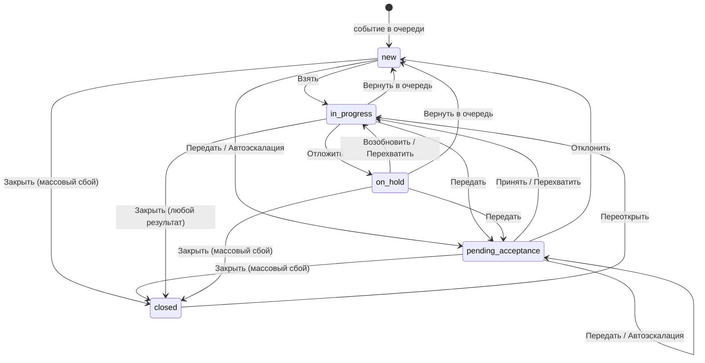

# Операторская часть МИ — контракт «фронтенд → бэкенд»

Предложение фронтенда по задаче **CLOUD-23465 «Разработка единой JSON-модели workflow»**. Документ отвечает на два вопроса: **какая модель workflow принимается за единую** и **какое API должен реализовать бэкенд**, чтобы операторское рабочее место заработало.

## Артефакты

| Файл | Что это | Кому |
|---|---|---|
| [`workflow.v4.json`](./workflow.v4.json) | **Единая JSON-модель workflow.** Состояния, переходы, guard'ы, эффекты, таймеры, права, лимиты, формы, горячие клавиши — как конфигурация, а не как код | Бэкенд хранит и исполняет; фронтенд читает и рисует по ней интерфейс |
| [`openapi.json`](./openapi.json) | **OpenAPI 3.1** — 34 эндпоинта, 60 схем. Контракт REST-API операторской части | Бэкенд реализует; фронтенд генерирует типы |
| `README.md` | Этот документ: как устроен workflow и какое API за что отвечает | Обе стороны |

### Источники требований

- **[`States rules IM.md`](../State_rules/States%20rules%20IM.md)** — действующие правила, нормативный документ. Модель собрана по v4 и приведена к изменениям после неё (журнал §16). Все ссылки вида «§6.1» ведут туда.
- **[`prototype/app.js`](../../prototype/app.js)** оттуда же — работающая реализация v4, из неё взяты конкретные значения: причины, нормативы, тексты журнала, наборы кнопок.
- **[`Axxon Incident Manager Vision.md`](../Axxon%20Incident%20Manager%20Vision.md)** — требования к панелям, видео, карте, отчётности.
- Модель шагов сценария переиспользуется из уже существующего редактора: `src/shared/types/scenario.ts`.

---

## Главный принцип

**Workflow живёт в конфигурации на сервере. Клиент не содержит собственной таблицы переходов.**

Без этого принципа любое изменение правил (новая причина удержания, другой лимит, новый уровень эскалации) превращается в релиз фронтенда. С ним — в запись в схеме.

Практически это значит три вещи:

1. Сервер отдаёт схему (`GET /operator/workflow/active`) — по ней клиент строит формы переходов, справочники, бейджи, горячие клавиши, фильтры очереди.
2. Сервер для **каждого инцидента** возвращает готовый список действий (`actions`) с флагами `visible` / `enabled` и текстом причины недоступности. Клиент не вычисляет права, владение и лимиты — он рисует то, что пришло.
3. Любое изменение состояния — один вызов `POST /operator/incidents/{guid}/transitions/{transitionId}`, выполняемый сервером атомарно (§10.1).

Аналогия с Jira: `states` ≈ statuses, `transitions` ≈ transitions, `guards` ≈ conditions + validators, `effects` ≈ post functions, `forms` ≈ transition screens, `schema.appliesTo` ≈ workflow scheme.

---

## Модель workflow

### Состояния (§2.1)

Состояние **объективно** — одно для всех, кто смотрит. `mine` / `foreign` состояниями не являются: это результат сравнения `owner` со смотрящим, он же определяет бейдж (§2.4) и вычисляется сервером.

| Код | Название | Категория | Владелец | Активный таймер |
|---|---|---|---|---|
| `new` | Новое | pending | нет либо дежурная группа | `reaction` |
| `pending_acceptance` | Ожидает принятия | pending | адресат передачи | `reaction` |
| `in_progress` | В работе | active | оператор | `resolution` |
| `on_hold` | Отложен | active | оператор | `resolution` приостановлен |
| `closed` | Закрыто | done | кто закрыл | — |

Конечное состояние одно. Чем закончился инцидент, говорит результат закрытия `close_result` (§2.2): «Обработан», «Ложная тревога», «Дубликат», «Плановая проверка», «Прервано», «Массовый сбой». Отдельного «Отменено» нет (RULE-02).



### Переходы (§6.1)

10 ручных переходов. Каждый — запись в `workflow.v4.json` формата §14.8: `from` / `to` / `guards` / `effects` / `form` / `ui`.

| id | Кнопка | Откуда → Куда | Право | Форма |
|---|---|---|---|---|
| `claim` | Взять | `new` → `in_progress` | `incident:claim` | — |
| `accept` | Принять | `pending_acceptance` → `in_progress` | `incident:claim` | — |
| `reject` | Отклонить | `pending_acceptance` → `new` | `incident:release` | причина |
| `hold` | Отложить | `in_progress` → `on_hold` | `incident:hold` | причина + комментарий |
| `resume` | Возобновить | `on_hold` → `in_progress` | `incident:claim` | — |
| `release` | Вернуть в очередь | `in_progress`, `on_hold` → `new` | `incident:release` | причина |
| `transfer` | Передать | `new`, `pending_acceptance`, `in_progress`, `on_hold` → `pending_acceptance` | `incident:transfer:own` / `:any` | адресат + причина |
| `takeover` | Перехватить | `pending_acceptance`, `in_progress`, `on_hold` → `in_progress` | `incident:reassign` | подтверждение |
| `close` | Закрыть | `in_progress` → `closed`; для «Массовый сбой» ещё `new`, `pending_acceptance`, `on_hold` | по результату: `incident:close` или `incident:close:unprocessed` | результат + комментарий (кроме «Обработан»); у массового сбоя — причина |
| `reopen` | Переоткрыть | `closed` → `in_progress` | `incident:reopen` | основание |

Право, исходные состояния, владение и обязательные шаги у `close` зависят от результата. Они записаны в строках справочника `reasonCatalogs.close_result`, а проверяет их одно условие `closeResultAllowed`. Кнопка видна, если доступен хотя бы один результат; список доступных результатов сервер отдаёт в `fieldOptions.resultId` действия.

Плюс 7 автоматических (`trigger: timer` / `system`), которые выполняет сервер без участия оператора: `auto_escalate`, `escalation_ceiling`, `resolution_overdue`, `hold_overdue`, `system_hold_break`, `system_hold_idle`, `system_release_idle`.

### Таймеры (§4)

Два норматива вместо одного общего: старый одновременно означал время до реакции и продолжал тикать у оператора, который как раз реагирует.

| Таймер | Смысл | Приостанавливается |
|---|---|---|
| `reaction` | До взятия в работу. Истечение — триггер автоэскалации | нет |
| `resolution` | До закрытия. Значение зависит от приоритета. Запускается один раз, при первом взятии в работу | да, при любом выходе из `in_progress`: удержание, передача, возврат в очередь, закрытие. Взятие, принятие и переоткрытие продолжают с остатка |
| `hold` | Предельный срок удержания по выбранной причине | нет |

Дедлайны передаются **метками времени** (`dueAt`), не убывающими счётчиками: обратный отсчёт рисует клиент, значение переживает перезапуск сервиса. В `TimerState` есть `serverTime` — чтобы расхождение часов клиента не искажало отсчёт.

### Guard'ы и эффекты (§14.8)

Условия и эффекты не пишутся скриптом — берутся из фиксированного реестра с параметрами. Тогда редактор схемы это выпадающие списки, схему можно статически проверить, а каталог прав, который МИ отдаёт внешней системе для настройки ролей, собирается из схемы автоматически.

```json
{
  "fn": "hasPermission", "args": ["incident:claim"]
}
```

Реестры лежат в `workflow.v4.json` → `registries`. Позиции с `"extendsBaseRegistry": true` — то, что добавлено сверх списка из §14.8 и требует реализации: `hasScopedPermission`, `isNotOwner`, `withinHoldLimit`, `withinReopenWindow`, `setCursor`, `clearGroup` и др.

Эффекты делятся на два класса (§14.2), и это влияет на ответ API:

| Класс | Примеры | Поведение при отказе |
|---|---|---|
| `transactional` | смена состояния и владельца, флаги, таймеры, запись в журнал | в одной транзакции с переходом; при отказе переход не применяется |
| `external` | макросы ТСО, уведомления, выгрузка результата в AxxonData | через очередь исходящих с повторами и идемпотентными ключами; переход **не откатывается**, в журнал пишется неуспех |

Поэтому `TransitionResult.externalEffects` возвращает только `status: "queued"`, а фактический результат приходит записью журнала и событием в потоке.

---

## Карта API: что за что отвечает

### 1. Конфигурация workflow

| Эндпоинт | Отвечает за |
|---|---|
| `GET /operator/workflow/active` | **Отдаёт клиенту всю схему.** Запрашивается один раз при старте, кэшируется по `ETag`. Из неё строятся формы переходов, справочники причин, бейджи, горячие клавиши, фильтры и группировки очереди, лимиты. Параметры контекста (тип события, группа объектов, приоритет) разрешают, какая схема применима (§14.4) |
| `GET/POST/PUT /operator/workflow/schemas...` | CRUD схем под правом `incident:schema:admin`. Опубликованная схема не редактируется — создаётся новая версия |
| `POST .../validate` | §14.7. Недостижимые состояния, нетерминальные без исходящих переходов, комбинации «набор прав + состояние» без единого доступного перехода, дубли горячих клавиш. Ролей МИ не знает: наборы прав для проверки — типовые, из `validation.typicalPermissionSets` |
| `POST .../publish` | §14.6. Публикация с сопоставлением старых состояний новым, аудит, откат. Открытые инциденты доигрывают на своей версии (`schemaVersion`) |
| `POST .../simulate` | §14.7. «Набор прав, состояние и флаги — какие кнопки видны и что произойдёт». Нужен редактору схемы и автотестам фронтенда |

### 2. Сессия оператора

| Эндпоинт | Отвечает за |
|---|---|
| `GET /operator/session` | **Кто я и что мне можно.** Плоский список прав: роли и их состав ведутся во внешней системе, МИ видит только права (§5). Проблемы набора прав, найденные при входе, — в `permissionIssues` (§10.3). лимиты и текущее потребление лимитов, состояние агента, персональные настройки, смена |
| `PUT /operator/session/agent-state` | §12.2. Перерыв и возврат на смену. При уходе на перерыв **сервер сам** переводит активные инциденты в `on_hold` с причиной «перерыв оператора» — право `incident:hold` не требуется, иначе оператор без этого права не смог бы уйти на перерыв. Изменённые инциденты возвращаются в ответе |
| `POST /operator/session/heartbeat` | §12.3. Признак активности. Без него через `idleHoldSec` активный инцидент уходит в `on_hold` («нет связи с оператором»), через `idleReleaseSec` — возвращается в `new`. Передаёт, какая карточка открыта, — чтобы сервер знал, чью карточку выселять |
| `PATCH /operator/session/preferences` | Vision §1.4. Раскладка панелей, тема, язык, переопределения горячих клавиш, меню вспомогательных ссылок, предвыбор адресата передачи. Прав не требует — данные инцидента не меняются |

### 3. Очередь

| Эндпоинт | Отвечает за |
|---|---|
| `GET /operator/incidents` | **Панель событий.** Фильтры, поиск, пагинация. Группа устройств (`sourceGroupGuid`, с вложенными) и поверх неё фильтры по типу события и типу устройства-источника (§19). Видимость записей — фильтр выборки по группам объектов оператора, а не право (§5). Каждая запись приходит с вычисленным `badge` и готовым списком `actions` |
| `GET /operator/incidents/counters` | Числа на фильтрах и в мобильной навигации. Отдельный лёгкий запрос, чтобы не тянуть страницу ради счётчиков |
| `POST /operator/incidents/selection` | §11. «Выбрать все» и «Однотипные» считаются **на сервере**: клиент видит только текущую страницу, а выборка ограничена `maxBulk` и правилами. Возвращает пересечение доступных действий по всей выборке — клиент сразу дизейблит то, что доступно не всем |

### 4. Карточка инцидента

| Эндпоинт | Отвечает за |
|---|---|
| `GET /operator/incidents/{guid}` | Полные данные карточки. `include` позволяет вложить сценарий, журнал, медиа и действия одним запросом. `readOnly: true` — карточка открыта на просмотр. Отдаёт `ETag` для оптимистичной блокировки |
| `GET /operator/incidents/{guid}/actions` | **§7. Единственный источник правды о кнопках.** Guard с `onFail: hide` прячет кнопку (действие не относится к ситуации), с `onFail: disable` — оставляет видимой и заблокированной с подсказкой (лимит активных, незаполненные шаги, перерыв). Отдельный эндпоинт нужен, чтобы пересчитать кнопки после изменения ответов сценария, не перезагружая карточку |
| `GET /operator/incidents/{guid}/media` | Vision §3. Камеры для видеомонитора (архив и online) и план объекта с маркером места сработки. Первая камера — источник события; ссылки на поток приходят готовыми, с временем начала архива |
| `GET/POST /operator/incidents/{guid}/journal` | Хронология и комментарии оператора |

### 5. Переходы — ядро

| Эндпоинт | Отвечает за |
|---|---|
| `POST /operator/incidents/{guid}/transitions/{transitionId}` | **Единственный способ изменить состояние инцидента.** Сервер проверяет guard'ы, применяет транзакционные эффекты в одной транзакции, внешние ставит в очередь. Обязателен `If-Match` с версией записи |
| `POST /operator/incidents/transitions/{transitionId}/bulk` | §11. Действие на выборку: одна форма причины на всех, отдельная запись в журнал каждого. Выполняется **частично успешно** — недоступные элементы попадают в `failed` с причиной, остальные обрабатываются |

Идентификаторы переходов в URL — те же, что в схеме: `claim`, `accept`, `reject`, `hold`, `resume`, `release`, `transfer`, `takeover`, `close`, `reopen`. Отдельных эндпоинтов вида `/claim`, `/hold`, `/close` **намеренно нет**: добавление перехода в схему не должно требовать нового эндпоинта.

### 6. Групповая обработка

| Эндпоинт | Отвечает за |
|---|---|
| `POST /operator/incident-groups` | §11. «Обработать как одно». Только `new` одного типа события, от 2 до `maxBulk`. Общими становятся `groupGuid`, владелец и ответы сценария; **состояние и таймеры у каждого свои** — иначе групповая обработка стала бы способом обойти нормативы. Родительский инцидент не создаётся: группа это признак, а не сущность |
| `DELETE /operator/incident-groups/{groupGuid}/members/{incidentGuid}` | Частичное завершение: инцидент возвращается к самостоятельной обработке со своей копией ответов. Сервер сам исключает участника, у которого истёк норматив реакции |

### 7. Сценарий обработки

| Эндпоинт | Отвечает за |
|---|---|
| `GET /operator/incidents/{guid}/scenario` | Шаги и ответы. §14.5: сценарий версионируется вместе со схемой, открытые инциденты доигрывают на своей версии — поэтому шаги приходят с сервера, а не подтягиваются клиентом по текущей версии из редактора |
| `PATCH .../scenario/answers` | Автосохранение ответов. Нужно, чтобы прогресс не терялся при перехвате, передаче и перезагрузке вкладки — v4 во всех этих сценариях требует сохранения прогресса. В ответе — пересчитанный `requiredStepsFilled`, по которому клиент включает кнопку «Закрыть» |
| `PUT .../scenario/cursor` | Курсор шага хранится на сервере: иначе после перехвата новый владелец не знает, где остановился предыдущий (§6.1 требует открывать карточку с первого незаполненного шага) |
| `POST .../macros/{macroId}` | §6.3. Макрос объекта. Внешний эффект — отсюда `202` вместо `200`: фактический результат приходит записью журнала и событием в потоке |

### 8. Справочники

| Эндпоинт | Отвечает за |
|---|---|
| `GET /operator/transfer-targets` | §8.1. Люди и дежурные группы. Сервер **сам исключает** текущего оператора (иначе передачей можно обойти `incident:claim`) и, при передаче чужого, текущего владельца. Показывает доступность адресата, но передачу не запрещает |
| `GET /operator/reference/reasons/{catalogId}` | Причины удержания (`hold`), результаты закрытия (`close_result`), причины массового сбоя (`mass_fault`). Системные причины (`setBy: system`) оператору не показываются |
| `GET /operator/reference/event-types`, `/priorities` | Фильтры очереди и привязка схем |
| `GET /operator/reference/source-groups` | §19. Дерево групп устройств для панели групп: вложенные группы, устройства, по желанию счётчики открытых инцидентов. Только видимые оператору группы. Выбранная группа уходит в очередь как `sourceGroupGuid` |

Дерево групп объектов для панели групп переиспользуется из существующего API: `/sources/groups/tree`.

### 9. Поток событий

| Эндпоинт | Отвечает за |
|---|---|
| `GET /operator/stream` (SSE) | **Обязателен, не «желателен».** Автоэскалация, срабатывание таймеров, перехват и передача чужими операторами меняют очередь и карточку помимо действий текущего клиента. Polling не годится: §9.3 требует **немедленно** перевести открытую карточку в режим просмотра, когда инцидент увели — для этого есть событие `incident.card_evicted`. Переподключение по `Last-Event-ID`, сервер досылает пропущенное. WebSocket допустим как альтернатива |

---

## Типовые последовательности

**Старт рабочего места**

```
GET /operator/session                → права, лимиты, настройки
GET /operator/workflow/active        → схема (кэш по ETag)
GET /operator/incidents?filter=open  → очередь
GET /operator/stream                 → подписка на изменения
```

**Взять и закрыть инцидент**

```
POST /operator/incidents/{g}/transitions/claim     If-Match: v12
GET  /operator/incidents/{g}?include=scenario,media,journal,actions
PATCH /operator/incidents/{g}/scenario/answers     (несколько раз, по мере заполнения)
   → requiredStepsFilled.closing: true  → кнопка «Закрыть» становится активной
POST /operator/incidents/{g}/transitions/close     formValues: { comment }
```

**Передача**

```
GET  /operator/transfer-targets?incidentGuid={g}   → список без себя и без владельца
POST /operator/incidents/{g}/transitions/transfer  formValues: { targetId, comment }
   → owner = адресат, escalation_level +1, reaction перезапущен, resolution приостановлен
   → прежнему владельцу приходит incident.card_evicted в поток
```

**Автоэскалация** — клиент ничего не вызывает:

```
поток: incident.auto_escalated { incident }   → обновить строку очереди
поток: incident.card_evicted                  → если карточка открыта, перевести в просмотр
```

**Групповая обработка**

```
POST /operator/incidents/selection    { mode: "same_type_new", anchorIncidentGuid }
POST /operator/incident-groups        { incidentGuids }
   → все взяты в работу, общие ответы, свои таймеры
POST /operator/incidents/transitions/close/bulk   { incidentGuids, formValues }
```

---

## Договорённости, на которых держится контракт

1. **Переход атомарен и выполняется сервером** (§10.1). Клиент присылает идентификатор перехода, ожидаемое состояние и версию записи. При рассинхроне — `412` с актуальным инцидентом в теле, чтобы клиент показал, что изменилось, и не ретраил молча.
2. **Ручное действие выигрывает у таймера** (§10.1). Если автоэскалация сработала в момент нажатия, применяется действие оператора; отменённое срабатывание возвращается в `TransitionResult.canceledTimerTrigger` и фиксируется в журнале.
3. **Бейдж и список кнопок считает сервер.** Клиент не реализует §2.4 и §7 у себя. Иначе правила начнут расходиться между очередью, карточкой и мобильной раскладкой.
4. **Записи журнала хранятся шаблоном и подстановками** (`templateKey` + `vars`), а не готовой строкой: иначе запись навсегда осталась бы на языке, включённом в момент записи. Поле `text` — отрендеренный вариант на языке запроса.
5. **Дедлайны — метки времени**, часы клиента на срабатывание не влияют. При старте сервиса выполняется догон срабатываний, пропущенных во время простоя (§14.3).
6. **Внешние эффекты не откатывают переход** (§14.2). Инцидент получает признак «команда не доставлена», а не остаётся в прежнем состоянии.
7. **На перерыве доступен только просмотр** (§10.1) — это одно правило `agentReady` на все переходы, а не пометка у каждого.
8. **Идентификаторы состояний и переходов стабильны**, названия — отдельные переводимые лейблы (`labelKey`): переименование состояния не должно быть миграцией данных (§14.6).

---

## Границы и открытые вопросы

Не входит в этот контракт и требует отдельных задач:

- **Отчётность и AxxonData** (Vision §4) — здесь только исходящий эффект `axxondata.export_incident` и статус доставки в карточке.
- **Плагины источников событий** (Vision §1.1, §2.1) — создание инцидентов в очереди считается уже работающим.
- **Редактор схемы workflow** как UI. API под него (`validate`, `publish`, `simulate`) в контракте есть, экран — нет.

Продуктовые вопросы, сознательно не зафиксированные в v4 (§15) и потому оставленные настройками схемы:

| Вопрос | Как обойдено в контракте |
|---|---|
| Норматив в календарных минутах или по расписанию смен | сервер отдаёт готовый `dueAt`, клиенту разница не видна |
| Нужно ли разделять «выполнено» и «закрыто» | добавляется состоянием в схеме, API не меняется |
| Срок переоткрытия | `limits.reopenWindowMin` (по умолчанию 1440 минут — 24 часа), guard `withinReopenWindow` |
| Канал уведомлений адресату и подтверждение прочтения | эффект `notify`, канал вне контракта |

---

## Проверка артефактов

```bash
npx @redocly/cli lint contracts/operator-workflow/openapi.json
```

Текущее состояние: спецификация валидна по OpenAPI 3.1 — 34 эндпоинта, 60 схем, все `$ref` разрешаются. Остаётся одно предупреждение `info-license-strict`: правило требует SPDX-идентификатор или URL лицензии, чего у внутреннего контракта нет.

В модели workflow 5 состояний, 17 переходов (10 ручных + 7 автоматических), 7 форм; перекрёстные ссылки переходов на состояния, формы, guard'ы, эффекты, права и таймеры проверены и сходятся.
