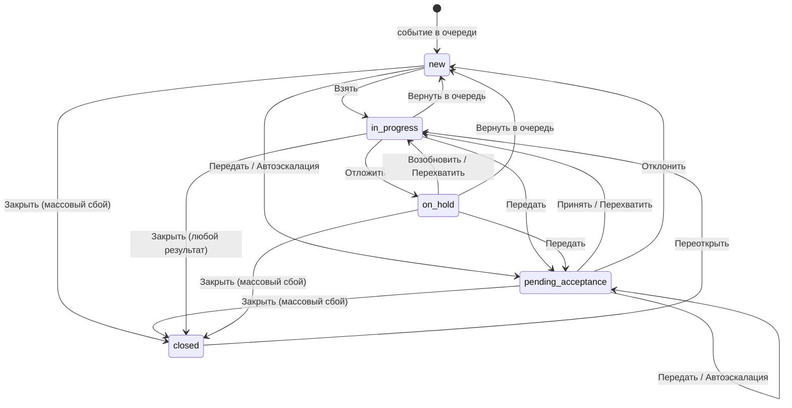

# Операторская часть МИ — контракт «фронтенд → бэкенд»

Предложение фронтенда по задаче **CLOUD-23465 «Разработка единой JSON-модели workflow»**. Документ отвечает на два вопроса: **какая модель workflow принимается за единую** и **какое API должен реализовать бэкенд**, чтобы операторское рабочее место заработало.

## Артефакты

| Файл | Что это | Кому |
|---|---|---|
| [`workflow.v4.json`](./workflow.v4.json) | **Единая JSON-модель workflow.** Состояния, переходы, guard'ы, эффекты, таймеры, права, лимиты, формы, горячие клавиши — как конфигурация, а не как код | Бэкенд хранит и исполняет; фронтенд читает и рисует по ней интерфейс |
| [`openapi.json`](./openapi.json) | **OpenAPI 3.1** — 34 адреса, 37 операций, 66 схем. Контракт REST-API операторской части | Бэкенд реализует; фронтенд генерирует типы |
| [`TRANSITIONS.md`](./TRANSITIONS.md) | Таблица переходов, собранная из машины: откуда, куда, условия и эффекты словами, матрица «состояние × переход». Руками не правится | Все, кто сверяет правила с машиной |
| `README.md` | Этот документ: как устроен workflow и какое API за что отвечает | Обе стороны |
| [`BACKEND.md`](./BACKEND.md) | Памятка для команды бэкенда: порядок работы, тестовый стенд, когда готово, что не решено | Бэкенд |

### Кто исполняет

Прототип устроен как продукт: встроенный сервер (`prototype/server.js`) отвечает по `openapi.json` и исполняет эту модель исполнителем `prototype/engine.js`, а интерфейс разговаривает с ним только запросами API. Кнопки, переходы, формы, бейджи, нормативы и автоматические переходы берутся отсюда. Поэтому каждая правка модели сразу видна в прототипе и проверяется его самопроверкой, а ответы встроенного сервера самопроверка сверяет со схемами `openapi.json` — контракт проверен исполнением, а не только чтением. После правки модели или контракта — `python3 tools/build_workflow.py`.

### Источники требований

- **[`States rules IM.md`](../State_rules/States%20rules%20IM.md)** — действующие правила, нормативный документ. Модель собрана по v4 и приведена к v7 (журнал §16). Все ссылки вида «§6.1» ведут туда.
- **[`prototype/`](../../prototype/README.md)** оттуда же — работающая реализация: из неё взяты конкретные значения — причины, нормативы, тексты журнала, наборы кнопок.
- **[`Axxon Incident Manager Vision.md`](../Axxon%20Incident%20Manager%20Vision.md)** — требования к панелям, видео, карте, отчётности.
- Модель шагов сценария переиспользуется из уже существующего редактора: `src/shared/types/scenario.ts`.

---

## Главный принцип

**Workflow живёт в конфигурации на сервере. Клиент не содержит собственной таблицы переходов.**

Без этого принципа любое изменение правил (новая причина удержания, другой лимит, новый уровень эскалации) превращается в релиз фронтенда. С ним — в запись в схеме.

Практически это значит три вещи:

1. Сервер отдаёт схему (`GET /operator/workflow/active`) — по ней клиент строит формы переходов, справочники, бейджи, горячие клавиши, фильтры очереди.
2. Сервер для **каждого инцидента** возвращает готовый список действий (`actions`) с флагами `visible` / `enabled` и текстом причины недоступности. Клиент не вычисляет права, владение и лимиты — он рисует то, что пришло.
3. Любое изменение состояния — один вызов `POST /operator/incidents/{guid}/transitions/{transitionId}`, выполняемый сервером атомарно (§10.1).

Аналогия с Jira: `states` ≈ statuses, `transitions` ≈ transitions, `guards` ≈ conditions + validators, `effects` ≈ post functions, `forms` ≈ transition screens, `schema.appliesTo` ≈ workflow scheme.

---

## Модель workflow

### Состояния (§2.1)

Состояние **объективно** — одно для всех, кто смотрит. `mine` / `foreign` состояниями не являются: это результат сравнения `owner` со смотрящим, он же определяет бейдж (§2.4) и вычисляется сервером.

| Код | Название | Категория | Владелец | Активный таймер |
|---|---|---|---|---|
| `new` | Новое | pending | нет либо дежурная группа | `reaction` |
| `pending_acceptance` | Ожидает принятия | pending | адресат передачи | `reaction` |
| `in_progress` | В работе | active | оператор | `resolution` |
| `on_hold` | Отложен | active | оператор | `resolution` приостановлен |
| `closed` | Закрыто | done | кто закрыл | — |

Конечное состояние одно. Чем закончился инцидент, говорит результат закрытия `close_result` (§2.2): «Обработан», «Ложная тревога», «Дубликат», «Плановая проверка», «Прервано», «Массовый сбой». Отдельного «Отменено» нет (RULE-02).



### Переходы (§6.1)

10 ручных переходов. Каждый — запись в `workflow.v4.json` формата §14.8: `from` / `to` / `guards` / `effects` / `form` / `ui`.

| id | Кнопка | Откуда → Куда | Право | Форма |
|---|---|---|---|---|
| `claim` | Взять | `new` → `in_progress` | `incident:claim` | — |
| `accept` | Принять | `pending_acceptance` → `in_progress` | `incident:claim` | — |
| `reject` | Отклонить | `pending_acceptance` → `new` | `incident:release` | причина |
| `hold` | Отложить | `in_progress` → `on_hold` | `incident:hold` | причина + комментарий |
| `resume` | Возобновить | `on_hold` → `in_progress` | `incident:claim` | — |
| `release` | Вернуть в очередь | `in_progress`, `on_hold` → `new` | `incident:release` | причина |
| `transfer` | Передать | `new`, `pending_acceptance`, `in_progress`, `on_hold` → `pending_acceptance` | `incident:transfer:own` / `:any` | адресат + причина |
| `takeover` | Перехватить | `pending_acceptance`, `in_progress`, `on_hold` → `in_progress` | `incident:reassign` | подтверждение |
| `close` | Закрыть | `in_progress` → `closed`; для «Массовый сбой» ещё `new`, `pending_acceptance`, `on_hold` | по результату: `incident:close` или `incident:close:unprocessed` | результат + комментарий (кроме «Обработан»); у массового сбоя — причина |
| `reopen` | Переоткрыть | `closed` → `in_progress` | `incident:reopen` | основание |

Право, исходные состояния, владение и обязательные шаги у `close` зависят от результата. Они записаны в строках справочника `reasonCatalogs.close_result`, а проверяет их одно условие `closeResultAllowed`. Кнопка видна, если доступен хотя бы один результат; список доступных результатов сервер отдаёт в `fieldOptions.resultId` действия.

Плюс 7 автоматических (`trigger: timer` / `system`), которые выполняет сервер без участия оператора: `auto_escalate`, `escalation_ceiling`, `resolution_overdue`, `hold_overdue`, `system_hold_break`, `system_hold_idle`, `system_release_idle`.

### Таймеры (§4)

Два норматива вместо одного общего: старый одновременно означал время до реакции и продолжал тикать у оператора, который как раз реагирует.

| Таймер | Смысл | Приостанавливается |
|---|---|---|
| `reaction` | До взятия в работу. Истечение — триггер автоэскалации | нет |
| `resolution` | До закрытия. Значение зависит от приоритета. Запускается один раз, при первом взятии в работу | да, при любом выходе из `in_progress`: удержание, передача, возврат в очередь, закрытие. Взятие и принятие продолжают с остатка. Переоткрытие запускает заново (`limits.reopenResolutionSec` или обычный норматив); прежние нарушения остаются в `breaches` |
| `hold` | Предельный срок удержания по выбранной причине | нет |

Дедлайны передаются **метками времени** (`dueAt`), не убывающими счётчиками: обратный отсчёт рисует клиент, значение переживает перезапуск сервиса. В `TimerState` есть `serverTime` — чтобы расхождение часов клиента не искажало отсчёт.

### Guard'ы и эффекты (§14.8)

Условия и эффекты не пишутся скриптом — берутся из фиксированного реестра с параметрами. Тогда редактор схемы это выпадающие списки, схему можно статически проверить, а каталог прав, который МИ отдаёт внешней системе для настройки ролей, собирается из схемы автоматически.

```json
{
  "fn": "hasPermission", "args": ["incident:claim"]
}
```

Реестры лежат в `workflow.v4.json` → `registries`. Позиции с `"extendsBaseRegistry": true` — то, что добавлено сверх списка из §14.8 и требует реализации: `hasScopedPermission`, `isNotOwner`, `withinHoldLimit`, `withinReopenWindow`, `setCursor`, `clearGroup` и др.

Эффекты делятся на два класса (§14.2), и это влияет на ответ API:

| Класс | Примеры | Поведение при отказе |
|---|---|---|
| `transactional` | смена состояния и владельца, флаги, таймеры, запись в журнал | в одной транзакции с переходом; при отказе переход не применяется |
| `external` | макросы ТСО, уведомления, выгрузка результата в AxxonData | через очередь исходящих с повторами и идемпотентными ключами; переход **не откатывается**, в журнал пишется неуспех |

Поэтому `TransitionResult.externalEffects` возвращает только `status: "queued"`, а фактический результат приходит записью журнала и событием в потоке.

### Язык значений

Аргументы условий и эффектов — не свободный текст. У каждого значения один смысл, и бэкенд понимает его так же, как исполнитель прототипа ([prototype/engine.js](../../prototype/engine.js)). Иначе два исполнителя одной машины разойдутся, и ни одна проверка этого не заметит. Ниже — все значения, которые машина использует сейчас. Новое значение сначала описывается здесь, потом появляется в машине.

**Адресат.** Адресат инцидента — `owner`, а если он пуст — `assignment_group`. `owner` — всегда человек; пока передачу группе никто не принял, `owner` пуст, а группа — в `assignment_group` (§8.1).

**Кто и что записывается** — аргументы `setOwner`, `setAssignmentGroup`, `setHoldReason`, второй аргумент `setFlag`:

| Значение | Смысл |
|---|---|
| `actor` | тот, кто выполняет переход. У переходов по таймеру и системных — `actor` перехода (`dispatcher`, `system`) |
| `null` | очистить поле |
| `now` | время сервера в момент перехода |
| `form.<поле>` | значение поля формы перехода; пустая строка — то же, что `null` |
| `escalation.level.target` | адресат уровня автоэскалации, на который переходит инцидент: позиция `escalation.levels[]` с `level` = текущий `escalation_level` + 1. `targetRef` записан как `user:<id>` или `group:<id>`, значение — `<id>` |
| `<значение>.ifPerson` | значение, если это человек, иначе `null`. Так в `owner` попадает только человек |
| `<значение>.ifGroup` | значение, если это дежурная группа, иначе `null`. Так группа попадает в `assignment_group` |
| id позиции справочника (`setHoldReason`) | например `break`, `no_link` — системные причины удержания |

**Кому сообщить** — аргументы `notify` и `evictOpenCard`:

| Значение | Смысл |
|---|---|
| `owner` | владелец после перехода |
| `previousOwner` | владелец до перехода, до первого эффекта |
| `newTarget` | адресат после перехода |
| `shift_lead` | старший смены |
| `escalation.alertTarget` | получатель алерта из настроек эскалации |

В прототипе `notify` и `externalCommand` ничего не отправляют: уведомлений и внешних систем у него нет.

**Отношение смотрящего к инциденту** — `ownership` в `scopeRule` и `notes[].when`, `viewerRole` в `badges`, `ownership` в `queueFilters`:

| Значение | Когда |
|---|---|
| `owner` | `owner` — смотрящий |
| `target` | адресат — смотрящий или дежурная группа, в которую он входит. В `pending_acceptance` проверяется раньше `owner`: передача лично оператору — «вам на принятие», а не «ваш» |
| `other` | всё остальное, в том числе ничей инцидент в `new` |
| `any` (только `viewerRole`) | любой смотрящий |

Условия `when` у правила бейджа: `closeResult` — результат закрытия; `addressee: "group" | "person"` — адресат инцидента группа или человек. Правила проверяются по порядку, срабатывает первое подходящее.

«Себя» в `targetIsNotSelf` и в `excludes: ["self"]` формы — смотрящий и дежурные группы, в которые он входит (§10.1). `excludes: ["currentOwner"]` — адресат инцидента.

**Поля инцидента** — первый аргумент `setFlag`, `increment`, `flagBelow`, `flagAtLeast`:

| Поле | Смысл |
|---|---|
| `escalation_level` | уровень эскалации; +1 при каждой передаче и автоэскалации |
| `close_result` | id результата закрытия из `reasonCatalogs.close_result` |
| `close_cause` | причина сбоя из справочника `causeCatalog` выбранного результата |
| `result` | комментарий при закрытии |
| `closed_by`, `closed_at` | кто и когда закрыл |
| `sla_breached` | есть хоть одна запись в `breaches` |

В API и в прототипе те же поля в camelCase; в прототипе `close_cause` называется `massCause`, `result` — `closeComment`.

**Настройки** — аргументы `settingEnabled`, `settingIs`, `flagBelow`, `flagAtLeast`, `agentIdleFor`, `restartTimer`: путь от корня машины, например `escalation.enabled`, `escalation.maxLevel`, `session.idleHoldSec`, `limits.reopenResolutionSec`. `settingIs(путь, значение)` — настройка равна значению: так три перехода по истечению норматива закрытия выбирают между `escalation.onResolutionOverdue` = `"alert"` и `"escalate"`. Вычисляемых путей нет.

**Длительность таймеров:**

| Запись | Длительность |
|---|---|
| `startTimer(id)` | норматив таймера: самая специфичная строка `overrides` (больше совпавших условий), иначе `byPriority`, иначе `defaultSec` |
| `startTimer("reaction", "byEscalationLevel")`, `startTimer("reaction", "escalation.level.reactionSec")` | `reactionSec` уровня, который у инцидента после `increment` (он стоит раньше в списке эффектов). Уровня нет в `levels` — последний уровень; `levels` пуст — обычный норматив |
| `restartTimer(id, путь)` | заново, без остатка: значение настройки по пути; `null` — обычный норматив |
| `secFrom: "reasonCatalogs.<справочник>[].<поле>"` | поле позиции справочника, выбранной в инциденте (для `hold` — причина удержания). `maxMinutes` — в минутах |
| `startsOnce: true` | таймер запускается один раз за жизнь инцидента: повторный `startTimer` продолжает с остатка, `stopTimer` — пауза |
| `pausable: true` | `pauseTimer` сохраняет остаток, `resumeTimer` продолжает с него. У таймера без `pausable` пауза — это остановка |

**Срабатывание.** `timerExpired` истинно один раз на каждый дедлайн: после перехода по таймеру тот же дедлайн больше не срабатывает, новый — срабатывает. `scope: "incidents_owned_by_agent"` у системного перехода — только инциденты, владелец которых — этот оператор.

**Лимиты.** Единица — инцидент или группа сценария целиком (`groupCountsAsOneUnit`). `withinActiveLimit(extraUnits)` — сколько единиц добавит действие сверх самого инцидента: у исключения из группы это 1. `withinHoldLimit` — по `maxOnHold`, стоит только у ручного «Отложить» (§10.2).

**Формы.** `requiredFrom: "reasonCatalog:<справочник>.<признак>"` — поле обязательно, если у позиции, выбранной в поле той же формы с `source: "reasonCatalog:<справочник>"`, признак истинен. `visibleWhen: { field, in }` — поле видно, когда значение `field` входит в `in`. `placeholder` у списка — поле пустое, пока оператор не выберет; значение ставится само, только если его задаёт `defaultWhen` или `defaultFrom`, или вариант один (§2.2). Список без `placeholder` выбирает первый доступный вариант.

**Подстановки в тексты:**

| Где | Переменные |
|---|---|
| `appendLog` | `{comment}`, `{stepNumber}`, `{holdReasonLabel}`, `{targetName}` — адресат после перехода, `{escalationLevel}` — после перехода, `{closeResultLabel}`, `{filledSteps}`, `{totalSteps}`, `{previousOwnerName}` — адресат до перехода, `{escalationReason}` — `escalation.reason` |
| `forms[].notes` | `{ownerName}` — адресат, `{nextEscalationLevel}`, `{filledSteps}`, `{totalSteps}` |
| `badges` | `{ownerName}` — адресат, `{holdReasonLabel}`, `{closeResultLabel}` — подпись причины сбоя, если она выбрана, иначе результата |

`setCursor("firstOpenStep")` — курсор сценария на первый незаполненный шаг.

---

## Карта API: что за что отвечает

### 1. Конфигурация workflow

| Эндпоинт | Отвечает за |
|---|---|
| `GET /operator/workflow/active` | **Отдаёт клиенту всю схему.** Запрашивается один раз при старте, кэшируется по `ETag`. Из неё строятся формы переходов, справочники причин, бейджи, горячие клавиши, фильтры и группировки очереди, лимиты. Параметры контекста (тип события, группа устройств, приоритет) разрешают, какая схема применима (§14.4) |
| `GET/POST/PUT /operator/workflow/schemas...` | CRUD схем под правом `incident:schema:admin`. Опубликованная схема не редактируется — создаётся новая версия |
| `POST .../validate` | §14.7. Недостижимые состояния, нетерминальные без исходящих переходов, комбинации «набор прав + состояние» без единого доступного перехода, дубли горячих клавиш. Ролей МИ не знает: наборы прав для проверки — типовые, из `validation.typicalPermissionSets` |
| `POST .../publish` | §14.6. Публикация с сопоставлением старых состояний новым, аудит, откат. Открытые инциденты доигрывают на своей версии (`schemaVersion`) |
| `POST .../simulate` | §14.7. «Набор прав, состояние и флаги — какие кнопки видны и что произойдёт». Нужен редактору схемы и автотестам фронтенда |

### 2. Сессия оператора

| Эндпоинт | Отвечает за |
|---|---|
| `GET /operator/session` | **Кто я и что мне можно.** Плоский список прав: роли и их состав ведутся во внешней системе, МИ видит только права (§5). Проблемы набора прав, найденные при входе, — в `permissionIssues` (§10.3). лимиты и текущее потребление лимитов, состояние агента, персональные настройки, смена |
| `PUT /operator/session/agent-state` | §12.2. Перерыв, возврат на смену и конец смены (`offline`): адресованные лично и не принятые инциденты сервер сам отдаёт дежурной группе оператора или в очередь (§8.1). При уходе на перерыв **сервер сам** переводит активные инциденты в `on_hold` с причиной «перерыв оператора» — право `incident:hold` не требуется, иначе оператор без этого права не смог бы уйти на перерыв. Изменённые инциденты возвращаются в ответе |
| `POST /operator/session/heartbeat` | §12.3. Признак активности. Без него через `idleHoldSec` активный инцидент уходит в `on_hold` («нет связи с оператором»), через `idleReleaseSec` — возвращается в `new`. Передаёт, какая карточка открыта, — чтобы сервер знал, чью карточку выселять |
| `PATCH /operator/session/preferences` | Vision §1.4. Раскладка панелей, тема, язык, переопределения горячих клавиш, меню вспомогательных ссылок, предвыбор адресата передачи. Прав не требует — данные инцидента не меняются |

### 3. Очередь

| Эндпоинт | Отвечает за |
|---|---|
| `GET /operator/incidents` | **Панель событий.** Фильтры, поиск, пагинация. Группа устройств (`sourceGroupGuid`, с вложенными) и поверх неё фильтры по типу события и типу устройства-источника (§19). Видимость записей — фильтр выборки по группам устройств оператора, а не право (§5). Каждая запись приходит с вычисленным `badge` и готовым списком `actions` |
| `GET /operator/incidents/counters` | Числа на фильтрах и в мобильной навигации. Отдельный лёгкий запрос, чтобы не тянуть страницу ради счётчиков |
| `POST /operator/incidents/selection` | §11. «Выбрать все» и «Однотипные» считаются **на сервере**: клиент видит только текущую страницу, а выборка ограничена `maxBulk` и правилами. Возвращает пересечение доступных действий по всей выборке — клиент сразу дизейблит то, что доступно не всем |

### 4. Карточка инцидента

| Эндпоинт | Отвечает за |
|---|---|
| `GET /operator/incidents/{guid}` | Полные данные карточки. `include` позволяет вложить сценарий, журнал, медиа и действия одним запросом. `readOnly: true` — карточка открыта на просмотр. Отдаёт `ETag` для оптимистичной блокировки |
| `GET /operator/incidents/{guid}/actions` | **§7. Единственный источник правды о кнопках.** Guard с `onFail: hide` прячет кнопку (действие не относится к ситуации), с `onFail: disable` — оставляет видимой и заблокированной с подсказкой (лимит активных, незаполненные шаги, перерыв). Отдельный эндпоинт нужен, чтобы пересчитать кнопки после изменения ответов сценария, не перезагружая карточку |
| `GET /operator/incidents/{guid}/media` | Vision §3. Камеры для видеомонитора (архив и online) и план площадки с маркером места сработки. Первая камера — источник события; ссылки на поток приходят готовыми, с временем начала архива |
| `GET/POST /operator/incidents/{guid}/journal` | Хронология и комментарии оператора |

### 5. Переходы — ядро

| Эндпоинт | Отвечает за |
|---|---|
| `POST /operator/incidents/{guid}/transitions/{transitionId}` | **Единственный способ изменить состояние инцидента.** Сервер проверяет guard'ы, применяет транзакционные эффекты в одной транзакции, внешние ставит в очередь. Обязателен `If-Match` с версией записи |
| `POST /operator/incidents/transitions/{transitionId}/bulk` | §11. Действие на выборку: одна форма причины на всех, отдельная запись в журнал каждого. Выполняется **частично успешно** — недоступные элементы попадают в `failed` с причиной, остальные обрабатываются |

Идентификаторы переходов в URL — те же, что в схеме: `claim`, `accept`, `reject`, `hold`, `resume`, `release`, `transfer`, `takeover`, `close`, `reopen`. Отдельных эндпоинтов вида `/claim`, `/hold`, `/close` **намеренно нет**: добавление перехода в схему не должно требовать нового эндпоинта.

### 6. Групповая обработка

| Эндпоинт | Отвечает за |
|---|---|
| `POST /operator/incident-groups` | §11. «Обработать как одно». Только `new` одного типа события, от 2 до `maxBulk`. Общими становятся `groupGuid`, владелец и ответы сценария; **состояние и таймеры у каждого свои** — иначе групповая обработка стала бы способом обойти нормативы. Родительский инцидент не создаётся: группа это признак, а не сущность |
| `DELETE /operator/incident-groups/{groupGuid}/members/{incidentGuid}` | Частичное завершение: инцидент возвращается к самостоятельной обработке со своей копией ответов. Только по действию оператора и если лимит активных позволяет ещё одну единицу (§10.2) |

### 7. Сценарий обработки

| Эндпоинт | Отвечает за |
|---|---|
| `GET /operator/incidents/{guid}/scenario` | Шаги и ответы. §14.5: сценарий версионируется вместе со схемой, открытые инциденты доигрывают на своей версии — поэтому шаги приходят с сервера, а не подтягиваются клиентом по текущей версии из редактора |
| `PATCH .../scenario/answers` | Автосохранение ответов. Нужно, чтобы прогресс не терялся при перехвате, передаче и перезагрузке вкладки — v4 во всех этих сценариях требует сохранения прогресса. В ответе — пересчитанный `requiredStepsFilled`, по которому клиент включает кнопку «Закрыть» |
| `PUT .../scenario/cursor` | Курсор шага хранится на сервере: иначе после перехвата новый владелец не знает, где остановился предыдущий (§6.1 требует открывать карточку с первого незаполненного шага) |
| `POST .../macros/{macroId}` | §6.3. Макрос площадки. Внешний эффект — отсюда `202` вместо `200`: фактический результат приходит записью журнала и событием в потоке |

### 8. Справочники

| Эндпоинт | Отвечает за |
|---|---|
| `GET /operator/transfer-targets` | §8.1. Люди и дежурные группы. Сервер **сам исключает** текущего оператора (иначе передачей можно обойти `incident:claim`) и, при передаче чужого, текущего владельца. Показывает доступность адресата, но передачу не запрещает |
| `GET /operator/reference/reasons/{catalogId}` | Причины удержания (`hold`), результаты закрытия (`close_result`), причины массового сбоя (`mass_fault`). Системные причины (`setBy: system`) оператору не показываются |
| `GET /operator/reference/event-types`, `/priorities` | Фильтры очереди и привязка схем |
| `GET /operator/reference/source-groups` | §19. Дерево групп устройств для панели групп: вложенные группы, устройства, по желанию счётчики открытых инцидентов. Только видимые оператору группы. Выбранная группа уходит в очередь как `sourceGroupGuid` |

Группы устройств ведёт МИ: создаёт и правит их администратор схемы с правом `incident:schema:admin` (§19, RULE-10). Оператору дерево отдаёт `GET /operator/reference/source-groups`. Запросов для редактирования групп в контракте пока нет.

### 9. Поток событий

| Эндпоинт | Отвечает за |
|---|---|
| `GET /operator/stream` (SSE) | **Обязателен, не «желателен».** Автоэскалация, срабатывание таймеров, перехват и передача чужими операторами меняют очередь и карточку помимо действий текущего клиента. Polling не годится: §9.3 требует **немедленно** перевести открытую карточку в режим просмотра, когда инцидент увели — для этого есть событие `incident.card_evicted`. Сообщение — без строки `event:` (тип — в `data.type`), в `data` — `IncidentStreamEvent`, в `id:` — его `id`: браузерный `EventSource` отдаёт в `onmessage` только сообщения без имени. Переподключение по `Last-Event-ID`, сервер досылает пропущенное. WebSocket допустим как альтернатива |

---

## Типовые последовательности

**Старт рабочего места**

```
GET /operator/session                → права, лимиты, настройки
GET /operator/workflow/active        → схема (кэш по ETag)
GET /operator/incidents?filter=open  → очередь
GET /operator/stream                 → подписка на изменения
```

**Взять и закрыть инцидент**

```
POST /operator/incidents/{g}/transitions/claim     If-Match: "12"
GET  /operator/incidents/{g}?include=scenario,media,journal,actions
PATCH /operator/incidents/{g}/scenario/answers     If-Match: "13"  (несколько раз; новая версия — в ETag ответа)
   → requiredStepsFilled.closing: true  → кнопка «Закрыть» становится активной
POST /operator/incidents/{g}/transitions/close     formValues: { comment }
```

**Передача**

```
GET  /operator/transfer-targets?incidentGuid={g}   → список без себя, своих групп и владельца
POST /operator/incidents/{g}/transitions/transfer  formValues: { targetId, comment }
   → человеку: owner = адресат; группе: owner = null, assignment_group = группа (§8.1)
   → escalation_level +1, reaction перезапущен, resolution приостановлен
   → прежнему владельцу приходит incident.card_evicted в поток
```

**Автоэскалация** — клиент ничего не вызывает:

```
поток: incident.auto_escalated { incident }   → обновить строку очереди
поток: incident.card_evicted                  → если карточка открыта, перевести в просмотр
```

**Групповая обработка**

```
POST /operator/incidents/selection    { mode: "same_type_new", anchorIncidentGuid }
POST /operator/incident-groups        { incidentGuids }
   → все взяты в работу, общие ответы, свои таймеры
POST /operator/incidents/transitions/close/bulk   { incidentGuids, formValues }
```

---

## Договорённости, на которых держится контракт

1. **Переход атомарен и выполняется сервером** (§10.1). Клиент присылает идентификатор перехода, ожидаемое состояние и версию записи. Версия — `ETag` карточки, то есть поле `version` в кавычках (`"12"`); она же — в `version` строки очереди. Переход и ответы сценария идут с ней в `If-Match` и возвращают новую в `ETag`. Нет заголовка — `428 PRECONDITION_REQUIRED`; версия или состояние не совпали — `412` с актуальным инцидентом в теле, чтобы клиент показал, что изменилось, и не ретраил молча.
2. **Ручное действие выигрывает у таймера** (§10.1). Если автоэскалация сработала в момент нажатия, применяется действие оператора; отменённое срабатывание возвращается в `TransitionResult.canceledTimerTrigger` и фиксируется в журнале.
3. **Бейдж и список кнопок считает сервер.** Клиент не реализует §2.4 и §7 у себя. Иначе правила начнут расходиться между очередью, карточкой и мобильной раскладкой.
4. **Записи журнала хранятся шаблоном и подстановками** (`templateKey` + `vars`), а не готовой строкой: иначе запись навсегда осталась бы на языке, включённом в момент записи. Поле `text` — отрендеренный вариант на языке запроса.
5. **Дедлайны — метки времени**, часы клиента на срабатывание не влияют. При старте сервиса выполняется догон срабатываний, пропущенных во время простоя (§14.3).
6. **Внешние эффекты не откатывают переход** (§14.2). Инцидент получает признак «команда не доставлена», а не остаётся в прежнем состоянии.
7. **На перерыве доступен только просмотр** (§10.1) — это одно правило `agentReady` на все переходы, а не пометка у каждого.
8. **Идентификаторы состояний и переходов стабильны**, названия — отдельные переводимые лейблы (`labelKey`): переименование состояния не должно быть миграцией данных (§14.6).

---

## Коды ошибок перехода

Ошибка — `application/problem+json`: машинный `code`, текст `message` и шаблон `messageKey` с `messageVars` для перевода. Если не выполнено условие модели, в поле `guard` — его имя из `registries.guards`.

| Ответ | `code` | Когда |
|---|---|---|
| `404` | `NOT_FOUND` | нет инцидента, справочника или перехода с таким идентификатором |
| `409` | `TRANSITION_NOT_ALLOWED_FROM_STATE` | переход не из этого состояния (`from` модели) |
| `403` | `PERMISSION_DENIED` | нет права: условия `hasPermission`, `hasScopedPermission`; править сценарий может только тот, кому позволяет `scenarioEdit` |
| `403` | `LIMIT_EXCEEDED` | исчерпан лимит активных или отложенных: `withinActiveLimit`, `withinHoldLimit` |
| `403` | `AGENT_NOT_READY` | оператор на перерыве: `agentReady` |
| `403` | `TRANSFER_TO_SELF_FORBIDDEN` | передача себе или своей дежурной группе: `targetIsNotSelf` |
| `403` | `TARGET_NO_ACCESS` | у адресата нет доступа к объекту инцидента (§8.1): `targetHasAccess` |
| `403` | `REQUIRED_STEPS_NOT_FILLED` | не заполнены обязательные шаги сценария: `requiredStepsFilled` |
| `403` | `REOPEN_WINDOW_EXPIRED` | истёк срок переоткрытия: `withinReopenWindow` |
| `403` | `GUARD_FAILED` | не выполнено любое другое условие модели |
| `409` | `REQUIRED_STEPS_NOT_FILLED` | курсор сценария через незаполненный обязательный шаг (`PUT …/scenario/cursor`) |
| `412` | `VERSION_CONFLICT` | `If-Match` или `expectedState` не совпали с записью; в теле `current` — актуальная карточка |
| `428` | `PRECONDITION_REQUIRED` | нет `If-Match` у перехода или ответов сценария |
| `422` | `FORM_FIELD_REQUIRED` | не заполнено обязательное поле формы перехода |
| `422` | `BULK_SELECTION_INVALID` | группа или выборка не подходит под правила §11 |

## Границы и открытые вопросы

Не входит в этот контракт и требует отдельных задач:

- **Отчётность и AxxonData** (Vision §4) — здесь только исходящий эффект `axxondata.export_incident` и статус доставки в карточке.
- **Плагины источников событий** (Vision §1.1, §2.1) — создание инцидентов в очереди считается уже работающим.
- **Редактор схемы workflow** как UI. API под него (`validate`, `publish`, `simulate`) в контракте есть, экран — нет.
- **Сценарии обработки** — отдельная машина состояний (§14.5 правил). Здесь только стык: наборы обязательных шагов, прогресс, курсор, право отвечать на шаги.
- **Справочник вспомогательных ссылок** (§7 правил) — общие ссылки и ссылки площадки; запросов под него в контракте пока нет.
- **Журнал действий оператора** (§12.4 правил) — сервер пишет его с первой версии, запросы на чтение и экран — позже.
- **Схема входа** — выбирает бэкенд вместе со входом в систему компании. Учесть: поток событий клиент открывает браузерным `EventSource`, а он не передаёт заголовок `Authorization`. Подходит сессия в cookie (переживает перезагрузку страницы; со страницы на другом адресе — `SameSite=None; Secure`, то есть HTTPS) или токен в адресе потока. Тестовому стенду нужно то же: тесты становятся оператором `me` после `/test/reset`.

Продуктовые вопросы §15 и как их решения отражены в контракте:

| Вопрос | Решение и контракт |
|---|---|
| Норматив в календарных минутах или по расписанию смен | решено: в календарных минутах (§4). Сервер отдаёт готовый `dueAt` |
| Нужно ли разделять «выполнено» и «закрыто» | решено: нет, закрытие одним действием (§2.1) |
| Срок переоткрытия | решено: `limits.reopenWindowMin`, по умолчанию 1440 минут — 24 часа; guard `withinReopenWindow` |
| Канал уведомлений адресату и подтверждение прочтения | решено: в МИ, без отдельного подтверждения (§8.1). Эффект `notify`; внешний канал — возможное расширение вне контракта |
| Как МИ получает права и роли пользователя из внешней системы | открыт (§15). Права проверяет сервер на каждом переходе, роли нужны для групп доступа (§5); способ их получения контракт не меняет |

---

## Тестовый стенд

Чтобы бэкенд проверялся теми же тестами, что встроенный сервер прототипа, контракт описывает две служебные операции тестового стенда (тег `test-support`). В боевой системе их нет.

| Операция | Что делает |
|---|---|
| `POST /test/reset` | Загружает эталонный набор [`fixtures/demo.json`](fixtures/demo.json), сбрасывает сессию и настройки оператора, по умолчанию останавливает часы. `operatorPermissions` — права оператора стенда на этот прогон: так проверяются `:own` и `:any` (§5); `operatorRoles` — его роли: по ним применяются группы доступа, так проверяется видимость (§5) |
| `POST /test/clock` | Сдвигает часы на `advanceSec` секунд и сразу выполняет всё, что за это время должно было сработать: автоэскалацию, нарушения нормативов (§6.2), потерю связи (§12.3). В ответе — выполненные переходы. Признак активности за время сдвига сам не появляется, поэтому тесты двигают часы шагами короче `idleHoldSec` и перед каждым шлют `heartbeat`: оператор стенда на месте |
| `PUT /test/operators/{operatorId}/roles` | Меняет роли человека посреди прогона — как в продукте смена ролей или групп доступа — и сразу выполняет то, что от этого сработало: у кого пропал доступ к объекту, тот инцидент возвращается в очередь (§5). В ответе — выполненные переходы |

**Эталонный набор** — один для прототипа и бэкенда: 26 инцидентов во всех состояниях, люди и дежурная группа, устройства и их типы, дерево групп устройств, сценарии по типам событий (до подключения машины сценариев, §14.5). Оператор стенда — `me` (поле `operator` набора), его настройки после сброса — `operatorPreferences` в формате `OperatorPreferences` контракта.

- Это выгрузка в том же виде, что инциденты в API: время абсолютное, в UTC (`occurredAt`, `closedAt`, `journal[].at`). `capturedAt` — момент снимка. При загрузке все времена сдвигаются на «сейчас − `capturedAt`»: событие, случившееся за минуту до снимка, на стенде случилось минуту назад, в какой бы день ни шёл прогон. Так же можно загрузить снимок из настоящей системы — например, ситуацию, на которой нашли ошибку.
- Таймеры заданы моментом запуска, а не дедлайном: `reaction: {"startedAt": …}` — с какого момента идёт реакция, `hold: {"startedAt": …}` — с какого момента отложен; норматив закрытия — `resolution: {"startedAt": …}`, если идёт («В работе»), или `resolution: {"leftSec": 900}`, если стоит с остатком («Отложен»). Длительность бэкенд берёт из машины (§4): норматив реакции по типу события и приоритету, а на уровне эскалации выше нуля — норматив уровня (`escalation.levels[].reactionSec`); срок удержания — по причине. Так нормативы остаются только в машине, и правка норматива сразу меняет поведение на стенде. Упрощение демо-набора: у новых и ожидающих принятия инцидентов реакция запущена в момент снимка, хотя события случились раньше — иначе при загрузке половина очереди сразу ушла бы автоэскалацией. По §4 реакция идёт с входа в «Новый», поэтому в снимке настоящей системы `reaction.startedAt` — настоящий момент этого входа.
- Идентификаторы — как в контракте: у инцидентов, устройств, групп устройств, типов событий, планов и сценариев — UUID, номер инцидента для показа — `number` (`INC-1847`). Тип события несёт и `guid`, и машинный `id` (`fire`), по которому машина выбирает нормативы и сценарий. Люди и дежурные группы (`me`, `petrova`, `noc`) — строки внешней системы (§5), их формат МИ не задаёт.
- Остальные поля инцидента — в терминах модели: `state`, `owner`, `assignmentGroup`, `escalationLevel`, `holdReason`, `closeResult`, `closeCause`, `result`, `closedBy`, `scenario.answers`, `scenario.launchedMacros`, `scenario.cursorStepId` — на каком шаге остановился оператор; `devices` — устройства события, первое — источник; `cameras` — камеры из «Связей» (§19.1).
- Доступ (§5): `people.operators[].roles` — роли основной системы (`role` рядом — только подпись для людей), `accessGroups` — группы доступа: роли, группы устройств и отдельные устройства. Оператору видны инциденты, устройство-источник которых доступно хотя бы одной его роли. В наборе роль «Оператор» видит всё, «Оператор ТЦ» — только «Торговый центр».
- Дежурные группы (§8.1): `people.dutyGroups[]` — `name` (его видит оператор, не переводится), `roles` (участники — все, у кого есть одна из ролей) и `members` (отдельные люди сверх ролей). У людей — `agentState`, их состояние из `session.states` машины (§12.1): на смене — «На смене» и «Занят». Группа на смене, если на смене хотя бы один участник. Порядок групп — порядок в списке: если человек в нескольких группах, при конце смены его инцидент уходит в первую.
- Камеры и план (`GET …/media`) — из устройств и планов набора: у устройства `position: {plan, x, y}` — где оно на плане, у камеры `thumbnailUrl`; у плана `name`, площадка `site` и `imageUrl`. План инцидента — тот, где стоит источник или первое устройство с положением, иначе план площадки. Ссылки `demo:scene/<имя>` и `demo:plan/<имя>` — рисунки-заглушки прототипа; бэкенд отдаёт настоящие ссылки видео- и картоподсистемы.
- Целостность набора проверяет `python3 tools/check_machine.py`: время в UTC и не позже снимка, люди, устройства, состояния, причины и сценарии существуют, таймеры соответствуют состоянию.

**Как проверить бэкенд:** открыть `tests/api.html?api=https://адрес-стенда`. Нужны две операции выше и разрешение на запросы со страницы (CORS; страница с диска приходит с `Origin: null`): разрешить заголовки `Content-Type` и `If-Match`, открыть странице `ETag` (`Access-Control-Expose-Headers`), разрешить `credentials`. Тесты проходят сценарии по правилам и случайные прогоны с инвариантами, сверяют каждый ответ со схемами этого контракта и проверяют, что каждая операция вызвана. Если стенд недоступен, отчёт говорит об этом одной строкой.
Тот же набор тестов проходит и по сети без бэкенда: `python3 tools/check_loopback.py` открывает `tests/api.html?api=loopback`, где Service Worker отвечает встроенным сервером по HTTP. Так проверен сетевой путь клиента; CORS и вход проверит только настоящий бэкенд.

Встроенный сервер прототипа поддерживает эти операции только на странице тестов: в самом прототипе их нет.

## Проверка артефактов

```bash
npx @redocly/cli lint Specification/State_machine/openapi.json
```

Текущее состояние: спецификация валидна по OpenAPI 3.1 — 37 операций, 66 схем, все `$ref` разрешаются. Проверено исполнением: ответы встроенного сервера сверяют со схемами самопроверка прототипа и тесты API. Остаётся одно предупреждение `info-license-strict`: правило требует SPDX-идентификатор или URL лицензии, чего у внутреннего контракта нет.

В модели workflow 5 состояний, 21 переход (10 ручных + 11 автоматических), 7 форм; перекрёстные ссылки переходов на состояния, формы, guard'ы, эффекты, права и таймеры проверены и сходятся.
