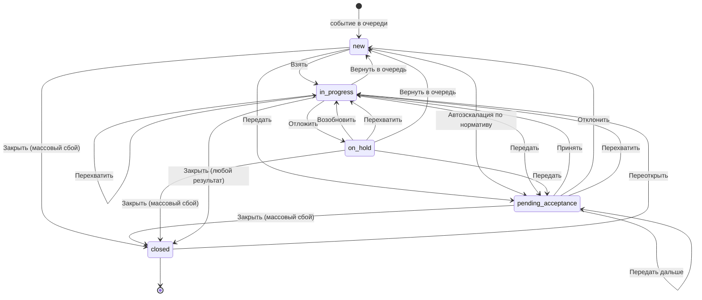

# Правила перехода состояний МИ

Версия: **v7**. Это действующие правила: файл один и правится на месте. Как ведётся журнал изменений и где лежат прошлые версии — в §16.

Жизненный цикл инцидента в менеджере инцидентов (МИ): состояния, переходы, права, нормативы и автоэскалация.

Версия 7 — это v6 с решениями третьего прохода ревью 2026-10-03 и открытых вопросов: результат закрытия выбирает оператор; горячие клавиши не работают под окнами и не занимают сочетания браузера; у передачи группе свой бейдж; права на результаты закрытия, уведомления адресату и связи камер решены; сценарии ведёт отдельная машина состояний (§14.5). Версия 6 — это v5 с уточнениями после ревью 2026-10-03: `owner` — только человек, адресат-группа — в `assignment_group`; передать своей дежурной группе нельзя; лимит отложенных — только для ручного «Отложить»; в словаре — все поля закрытия. Версия 5 опиралась на [v4](archive/004%20States%20rules%20IM.md), главное в ней: одно **Закрыть** с обязательным результатом вместо «Отменить» — состояния `canceled` больше нет; норматив закрытия не перезапускается передачей и возвратом; роли и их права — во внешней системе; нарушения нормативов — записи «вид, когда, чей»; группы и фильтры очереди (§19). Правила, которые исполняет прототип, записаны в машине состояний `Specification/State_machine/` — она источник истины, прототип её исполняет. Что изменилось относительно v6, v5 и v4 — в §16. Как устроены кнопки в очереди и что не взято из внешнего макета карточек — в §18.

> Документ описывает целевую модель. Прототип следует её терминам; где он от неё отступает — в §17.

## 1. Словарь и сокращения

### Сокращения

| Сокращение | Расшифровка | Простыми словами |
|---|---|---|
| **МИ** | Менеджер инцидентов | Рабочее место оператора: очередь событий, карточка обработки, видео и карта на одном экране |
| **SLA** | Service Level Agreement — соглашение об уровне сервиса | Отведённое время на работу с инцидентом. В МИ два норматива: время до взятия и время до закрытия (§4) |
| **ЦОД** | Центр обработки данных | Круглосуточный дежурный пост, куда передают то, что не решается силами площадки |
| **ТСО** | Технические средства охраны | Камеры, датчики, детекторы, турникеты — всё оборудование, которое порождает события |
| **СКУД** | Система контроля и управления доступом | Турникеты, шлагбаумы, двери с картами доступа |
| **СИЗ** | Средства индивидуальной защиты | Каска, жилет, очки. Есть детектор, который замечает их отсутствие |
| **PTZ** | Pan-Tilt-Zoom | Управляемая камера: её можно поворачивать, наклонять и приближать |
| **RBAC** | Role-Based Access Control | Права выдаются не человеку, а роли; человек получает права вместе с ролью. Роли ведутся во внешней системе, не в МИ (§5) |
| **AxxonData** | — | Система хранения и аналитики, куда уходит результат закрытого инцидента |
| **ITSM / ITIL** | — | Практики управления заявками и инцидентами, откуда взяты названия состояний (§16) |

### Термины

| Термин | Что это значит |
|---|---|
| **Событие** | То, что зафиксировала система: сработка детектора, датчика, тревожной кнопки |
| **Инцидент** | Событие, которое нужно разобрать по регламенту. Далее «событие» и «инцидент» — одно и то же |
| **Состояние** | Объективное положение инцидента в жизненном цикле: новое, ожидает принятия, в работе, отложен, закрыто (§2.1). Одно и то же для всех, кто смотрит |
| **Бейдж** | Подпись состояния в очереди. Вычисляется из состояния и владельца для конкретного смотрящего оператора (§2.4). Не хранится |
| **Владелец** | Оператор, за которым закреплён инцидент. Поле `owner` |
| **Передача** | Ручное действие «Передать»: выбрать адресата и отдать ему инцидент. Своё и чужое — одно действие, разные права (§5) |
| **Результат закрытия** | Чем закончился инцидент: обработан, ложная тревога, дубликат, плановая проверка, прервано, массовый сбой. Выбирается при каждом закрытии (§2.2). Поле `close_result` |
| **Закрытие без обработки** | Закрытие с любым результатом, кроме «Обработан»: сценарий не заполняется. Признак не хранится отдельно, а следует из результата |
| **Адресат** | Тот, кому передают инцидент: человек или дежурная группа |
| **Очередь** | Список инцидентов, из которого оператор выбирает, чем заняться |
| **Объект** | Устройство: камера, датчик, тревожная кнопка, точка прохода. Событие порождает устройство-источник (§19) |
| **Площадка** | Охраняемая территория или здание: торговый центр, склад, офис. Не путать с объектом — устройством (RULE-09) |
| **Группа** | Набор устройств и других групп. Вложенность не ограничена, одно устройство может входить в несколько групп. Регион и свой список объектов — это группы (§19) |
| **Карточка обработки** | Экран одного инцидента: шаги сценария, видео, карта, журнал |
| **Сценарий** | Пошаговая инструкция под тип события: что подтвердить, как классифицировать, что запустить |
| **Шаг** | Один вопрос или действие сценария. Бывает обязательным для конкретного перехода (§6.1) |
| **Журнал** | Хронология по инциденту: кто что сделал и когда. Заполняется автоматически |
| **Приоритет** | Насколько срочно: критический, высокий, средний, низкий. Влияет на нормативы и порядок в очереди |
| **Оператор** | Человек за рабочим местом МИ |
| **Старший смены** | Руководитель дежурной смены, типовой адресат первого уровня эскалации |
| **Диспетчер** | Служебная часть системы: ставит события в очередь и выполняет автоматические переходы. В журнале такие записи подписаны «Диспетчер» |
| **Детектор** | Модуль, который сам находит событие в видео или звуке |
| **Макрос** | Заранее настроенная команда системе: включить сирену, открыть шлагбаум, оповестить по площадке |
| **Алерт** | Уведомление ответственному без передачи ответственности и без смены состояния |
| **Норматив реакции** | Время от появления инцидента до взятия в работу |
| **Норматив закрытия** | Время от взятия в работу до закрытия |
| **Уровень эскалации** | Сколько раз ответственность за инцидент передавалась. Поле `escalation_level`. Растёт и при ручной передаче, и при автоэскалации: иначе цепочку норматива можно обнулять бесконечно (§8.3) |
| **Причина удержания** | Почему инцидент отложен: ждём наряд, ждём третью сторону и так далее. Поле `hold_reason` |
| **Guard (условие)** | Проверка, без которой переход не выполняется: право, владение, заполненность шагов |
| **Effect (эффект)** | Что переход меняет: владельца, флаги, таймеры, запись в журнал, внешнюю команду |
| **Схема** | Конфигурация: состояния, переходы, условия, эффекты, нормативы. То, что настраивается без программиста |

### Технические имена

Встречаются в таблицах ниже, оператору не видны.

| Имя | Что это |
|---|---|
| `new`, `pending_acceptance`, `in_progress`, `on_hold`, `closed` | Коды состояний |
| `owner` | Владелец-человек |
| `assignment_group` | Дежурная группа-владелец, пока никто не сделал взятие |
| `escalation_level` | Счётчик уровней эскалации, `0` — не эскалирован |
| `hold_reason` | Причина удержания при `on_hold` |
| `close_result` | Результат закрытия при `closed`; у массового сбоя — вместе с причиной из справочника |
| `close_cause` | Причина массового сбоя из справочника — уточнение к результату «Массовый сбой» |
| `result` | Комментарий оператора при закрытии. Обязателен для всех результатов, кроме «Обработан» (§2.2); виден в журнале |
| `closed_by`, `closed_at` | Кто и когда закрыл. Нужны для срока переоткрытия (§6.1) и права открыть закрытый карточкой (§6.3) |
| `group_id` | Признак групповой обработки |
| `reaction_due_at`, `resolution_due_at` | Дедлайны нормативов — метки времени, не счётчики |
| `breaches` | Нарушения нормативов: вид (реакция, закрытие, удержание), когда, чей — владелец в момент нарушения. Не стираются, в том числе при переоткрытии |
| `sla_breached` | Есть хоть одно нарушение в `breaches` — для фильтров и бейджей |
| `schema_version` | Версия схемы, на которой инцидент был создан |

## 2. Модель состояний

### 2.1. Объективные состояния

Состояние одно для всех. Оно не зависит от того, кто открыл очередь.

| Состояние | Код | Категория | Владелец | Терминальное |
|---|---|---|---|---|
| Новое | `new` | pending | нет (либо дежурная группа) | нет |
| Ожидает принятия | `pending_acceptance` | pending | адресат передачи | нет |
| В работе | `in_progress` | active | оператор | нет |
| Отложен | `on_hold` | active | оператор | нет |
| Закрыто | `closed` | done | кто закрыл | да |

Пояснения к выбору:

- **`pending_acceptance` вместо `escalated`.** Из имени видно, что состояние ждёт действия адресата, а значит нужен переход «Принять». В первой версии такого перехода не было, и адресат мог войти в инцидент только через «Перехватить».
- **`on_hold` — отдельное состояние, а не флаг.** Так работают категории (§2.3) и настройки автоэскалации: правило «эскалировать просроченные в работе, но не трогать отложенные» становится обычным перечислением состояний, а не разбором флагов.
- **Закрытие — одним действием.** Отдельного «выполнено» с проверкой старшим смены нет: это проще для смены. Проверить работу старший может по закрытым и при необходимости переоткрыть.
- **Одно конечное состояние `closed` и обязательный результат.** Так устроено в Jira: статус Done и поле Resolution. Ложная тревога, дубликат и проверка — значения результата, а не отдельное состояние. До v5 было два конечных состояния, «Закрыто» и «Отменено», и одна и та же ложная тревога попадала то в одно, то в другое (RULE-02). Отчёты строятся по результату.

### 2.2. Флаги и поля

Поля инцидента, влияющие на переходы: `owner`, `assignment_group`, `escalation_level`, `hold_reason`, `close_result`, `group_id`, `reaction_due_at`, `resolution_due_at`, `breaches`, `sla_breached`.

**Причины удержания** (`hold_reason`, обязательна при переходе в `on_hold`):

| Причина | Когда выбирают | Кто ставит |
|---|---|---|
| Ожидание третьей стороны | Вызвана внешняя служба, ждём ответа | оператор |
| Выезд наряда | Наряд в пути, обработка продолжится по прибытии | оператор |
| Нет данных, вернуться позже | Нужны сведения, которых сейчас нет | оператор |
| Перерыв оператора | Оператор ушёл на перерыв с открытой карточкой | система |
| Нет связи с оператором | Сессия оператора не отвечает (§12.3) | система |

**Результаты закрытия** (`close_result`, обязателен при переходе в `closed`; комментарий обязателен для всех, кроме «Обработан»):

| Результат | Когда выбирают | Сценарий | Право | Откуда |
|---|---|---|---|---|
| Обработан | Событие было и разобрано по регламенту | обязательные шаги набора «закрытие» | `incident:close` | свой `in_progress` |
| Ложная тревога | Детектор ошибся, события не было | не нужен | `incident:close` | свой `in_progress` |
| Дубликат | То же событие уже разбирается в другом инциденте | не нужен | `incident:close` | свой `in_progress` |
| Плановая проверка | Тест системы, учения | не нужен | `incident:close` | свой `in_progress` |
| Прервано: обработка невозможна | Площадка недоступна, данных нет, разобрать по регламенту нельзя | не нужен | `incident:close` | свой `in_progress` |
| Массовый сбой | Отключение электричества, потеря связи: причина известна, событий много. Причина — из справочника массовых сбоев | не нужен | `incident:close:unprocessed` | `new`, `pending_acceptance`, свой `in_progress` и `on_hold` |

Прав на закрытие два: `incident:close` — для результатов из своей карточки, `incident:close:unprocessed` — для «Массового сбоя», который закрывают из очереди без взятия в работу. Остальные результаты требуют открыть карточку, поэтому из очереди недоступны.

**Результат в форме закрытия выбирает оператор.** Если обязательные шаги заполнены, форма предлагает «Обработан». Иначе поле пустое, и закрыть без выбора нельзя: случайное нажатие не должно записать в отчёт «Ложную тревогу», которую оператор не выбирал. Если доступен единственный результат — например, «Массовый сбой» в очереди, — он выбран сразу.

Ответы сценария — пометки оператора. На результат и на выбор перехода они не влияют: вариант «Ложная» в сценарии не закрывает инцидент как ложную тревогу. Итог инцидента — только результат закрытия.

### 2.3. Категории состояний

У каждого состояния обязательна категория: `pending` — ждёт реакции, никто не работает; `active` — есть владелец, идёт работа; `done` — завершено. Это та же тройка, что категории статусов в Jira: To Do, In Progress, Done. От категории зависят группировка очереди, цвет бейджа, счётчики и отнесение в отчётах. Новое состояние, добавленное в схему, получает категорию и сразу попадает во все фильтры и сводки — без доработки интерфейса.

### 2.4. Слой представления: моё, чужое, бейджи

`mine` и `foreign` — не состояния. Это результат сравнения `owner` с текущим оператором, и в модели данных их нет. Бейдж в очереди вычисляется так:

| Состояние | Владелец относительно смотрящего | Бейдж |
|---|---|---|
| `new` | — | Новое |
| `pending_acceptance` | я | Вам на принятие |
| `pending_acceptance` | моя дежурная группа | Вашей группе · «группа» — принять может любой из группы |
| `pending_acceptance` | другой | Ожидает принятия · «адресат» |
| `in_progress` | я | В работе |
| `in_progress` | другой | «ФИО оператора» |
| `on_hold` | я | Отложен · «причина» |
| `on_hold` | другой | Отложен · «ФИО оператора» |
| `closed`, результат «Обработан» | любой | Закрыто |
| `closed`, другой результат | любой | Закрыто · «результат» |

## 3. Схема переходов

Условия переходов на диаграмме не показаны, чтобы она оставалась читаемой: полный список с правами — в §6.



## 4. Нормативы и таймеры

Один общий «норматив» первой версии разделён на два: он одновременно означал время до реакции и продолжал тикать у оператора, который как раз реагирует.

| Таймер | Смысл | Запускается | Останавливается | Удержание |
|---|---|---|---|---|
| `reaction` | Время до взятия в работу | вход в `new` или `pending_acceptance` (при передаче перезапускается заново, норматив берётся от уровня) | вход в `in_progress`, `closed` | не применимо |
| `resolution` | Время до закрытия | первый вход в `in_progress`, один раз за жизнь инцидента | не останавливается, только приостанавливается | приостанавливается при любом выходе из `in_progress`: удержание, передача, возврат в очередь, закрытие. Продолжается с остатка при каждом возврате в `in_progress` |

Правила:

1. Дедлайны хранятся метками времени (`reaction_due_at`, `resolution_due_at`), а не убывающими счётчиками. Обратный отсчёт рисует клиент. Значение можно пересчитать после перезапуска сервиса и посчитать запросом в отчёте.
2. Нормативы задаются на тип события, приоритет и группу устройств. Значение по умолчанию — на схему.
3. Истечение `reaction` — основной триггер автоэскалации (§9).
4. Истечение `resolution` по умолчанию не меняет состояние: пишется запись в журнал, записывается нарушение закрытия (`breaches`), уходит алерт старшему смены. Настройкой можно включить эскалацию и по этому таймеру.
5. **Нормативы считаются в календарных минутах**, а не по расписанию смены: это проще и предсказуемо в отчётах, а охрана обычно работает круглосуточно.
6. **Норматив закрытия не перезапускается при передаче и возврате.** Передача, возврат в очередь и удержание его приостанавливают, взятие и принятие продолжают с остатка. Иначе просрочку можно скрыть: передать инцидент коллеге или вернуть в очередь и взять снова — и норматив начнётся с начала. Время, пока инцидент ждёт взятия или принятия, в норматив закрытия не идёт: его покрывает норматив реакции. **Переоткрытие запускает норматив закрытия заново**: по нормативу переоткрытия, если он задан в схеме, иначе по обычному. Лазейки «спрятать просрочку» это не открывает: нарушения, записанные до закрытия, остаются (`breaches`). Новое нарушение после переоткрытия записывается на того, кто переоткрыл (RULE-11).
7. Удержание в `on_hold` не бесконечно: по каждой причине задаётся максимальный срок, после которого уходит алерт и записывается нарушение удержания (`breaches`).

## 5. Права доступа

МИ ролей не знает. Бэкенд МИ публикует каталог всех своих прав — таблицу ниже. Внешняя система привязывает права к ролям, а роли к людям: состав ролей и сами роли у каждого заказчика свои. МИ проверяет только права пользователя. Как МИ получает права пользователя — открытый вопрос (§15).

Ключи в формате `ресурс:действие:область`. Область различает своё и чужое: `own` — свои и ничьи инциденты, `any` — включая занятые другим оператором. Проверка «есть ли у пользователя хоть какое-то право на действие» выполняется по маске `incident:transfer:*`.

| Право | Что разрешает |
|---|---|
| `incident:claim` | Взять новое, принять адресованную передачу, возобновить свой отложенный |
| `incident:hold` | Отложить свой инцидент с указанием причины |
| `incident:release` | Вернуть свой инцидент в очередь; отклонить адресованную передачу |
| `incident:close` | Закрыть свой инцидент с результатом: «Обработан» — после обязательных шагов; «Ложная тревога», «Дубликат», «Плановая проверка», «Прервано» — без сценария |
| `incident:close:unprocessed` | Закрыть с результатом «Массовый сбой» без сценария, в том числе не беря в работу |
| `incident:reopen` | Вернуть в работу закрытый инцидент |
| `incident:transfer:own` | Передать своё, ничьё (новое) или адресованное мне |
| `incident:transfer:any` | Передать инцидент, занятый другим оператором или ожидающий принятия у другого |
| `incident:reassign` | Перехватить инцидент у работающего оператора |
| `incident:read:any` | Открыть карточку чужого инцидента только для чтения |
| `incident:bulk` | Обработать несколько инцидентов как один |
| `incident:run_action` | Запускать макросы и команды из карточки |
| `incident:schema:admin` | Менять схему, нормативы и настройки автоэскалации |
| `agent:set_not_ready` | Переводить себя в перерыв |

Отдельно от прав:

- **Видимость записей** — не право и не условие перехода, а фильтр выборки: какие группы устройств попадают оператору в очередь. Право отвечает на вопрос «можно ли выполнить действие», фильтр — на вопрос «виден ли инцидент вообще».
- **Настройки рабочего места** (раскладка панелей, тема, предвыбор адресата в форме передачи, свои горячие клавиши — §13) права не требуют: они не меняют данные инцидента.

## 6. Переходы

### 6.1. Ручные переходы

Общее правило для всех строк: переход выполняется сервером атомарно, на перерыве недоступен (§10), передача на себя запрещена (§10).

| Действие | Откуда | Куда | Право | Дополнительные условия | Что происходит |
|---|---|---|---|---|---|
| **Взять** | `new` | `in_progress` | `incident:claim` | лимит активных не превышен | `owner` = я; остановка `reaction`; `resolution` запускается при первом взятии, иначе продолжается с остатка (§4); открывается карточка с первого незаполненного шага |
| **Принять** | `pending_acceptance` | `in_progress` | `incident:claim` | адресат — я или моя дежурная группа; лимит активных | `owner` = я; остановка `reaction`; `resolution` запускается при первом взятии, иначе продолжается с остатка (§4); прогресс сценария сохраняется |
| **Отклонить** | `pending_acceptance` | `new` | `incident:release` | адресат — я или моя группа; указана причина | `owner` очищается; `escalation_level` сохраняется; `reaction` перезапускается; запись в журнал с причиной |
| **Отложить** | `in_progress` | `on_hold` | `incident:hold` | я владелец; выбрана `hold_reason` | `resolution` приостанавливается; возврат к очереди; шаг, ответы и журнал сохраняются |
| **Возобновить** | `on_hold` | `in_progress` | `incident:claim` | я владелец; лимит активных | `hold_reason` очищается; `resolution` продолжается с того же остатка |
| **Вернуть в очередь** | `in_progress`, `on_hold` | `new` | `incident:release` | я владелец; указана причина | `owner` очищается; `resolution` приостанавливается, `reaction` запускается заново; прогресс сценария сохраняется |
| **Передать** | `new`, `pending_acceptance`, `in_progress`, `on_hold` | `pending_acceptance` | `incident:transfer:own` или `incident:transfer:any` | выбран адресат и указана причина; своё / ничьё / адресованное мне — по `:own`; чужое — по `:any` | человеку — `owner` = адресат, группе — `assignment_group` = группа при пустом `owner` (§8.1); адресат получает уведомление (§8.1); `escalation_level` +1; `reaction` перезапускается, `resolution` приостанавливается; прогресс сохраняется; возврат к очереди. Если передавали чужой — прежний владелец получает уведомление, его открытая карточка переходит в режим просмотра |
| **Перехватить** | `in_progress`, `on_hold`, `pending_acceptance` | `in_progress` | `incident:reassign` | я не владелец; лимит активных | `owner` = я; `resolution` продолжается с остатка, если был приостановлен; прогресс сценария сохраняется; прежний владелец получает уведомление, его открытая карточка переходит в режим просмотра |
| **Закрыть** | по результату (§2.2): `in_progress`; «Массовый сбой» — ещё `new`, `pending_acceptance`, `on_hold` | `closed` | по результату: `incident:close` или `incident:close:unprocessed` | выбран результат; «Обработан» — заполнены обязательные шаги набора «закрытие»; кроме «Обработан» — заполнен комментарий; для `in_progress` и `on_hold` — я владелец | `close_result` = результат; `owner` = я (если не был); `reaction` останавливается, `resolution` приостанавливается, остаток сохраняется для переоткрытия; запись в журнал с результатом; результат уходит в AxxonData внешним эффектом (§14.2) |
| **Переоткрыть** | `closed` | `in_progress` | `incident:reopen` | не истёк срок переоткрытия: задаётся в схеме, по умолчанию 24 часа после закрытия | `owner` = я; `close_result` очищается, прежний остаётся в журнале записью о закрытии; `resolution` запускается заново — норматив переоткрытия, по умолчанию обычный (§4, правило 6); нарушения в `breaches` не стираются: нарушенный норматив остаётся нарушенным |
| **Обработать как одно** | `new` (несколько) | `in_progress` | `incident:bulk` + `incident:claim` | выбрано ≥ 2; правила выборки из §11 | всем выбранным ставится общий `group_id`, `owner` = я, ответы общие |

### 6.2. Автоматические переходы

Выполняются диспетчером. Права оператора в них не участвуют.

| Триггер | Откуда | Куда | Условия | Что происходит |
|---|---|---|---|---|
| Истёк `reaction` | `new`, `pending_acceptance` | `pending_acceptance` | автоэскалация включена; `escalation_level` меньше потолка | адресат уровня — в `owner` или, если это группа, в `assignment_group` (§8.1); адресат получает уведомление; `escalation_level` +1; `reaction` перезапускается; запись в журнал от диспетчера |
| Истёк `reaction`, достигнут потолок | `new`, `pending_acceptance` | не меняется | — | записывается нарушение реакции; алерт ответственному; инцидент остаётся у последнего адресата |
| Истёк `resolution` | `in_progress` | не меняется по умолчанию | настройка «эскалировать по нормативу закрытия» выключена | записывается нарушение закрытия; алерт старшему смены |
| Оператор ушёл на перерыв | `in_progress` | `on_hold` | у оператора есть активная карточка | `hold_reason` = «перерыв оператора»; право `incident:hold` не требуется |
| Сессия оператора не отвечает | `in_progress` | `on_hold` | таймаут неактивности (§12.3) | `hold_reason` = «нет связи с оператором»; алерт старшему смены |
| Сессия не отвечает дольше порога | `on_hold` | `new` | причина удержания системная | `owner` очищается; `reaction` запускается заново |

### 6.3. Действия без смены состояния

Первая версия описывала их как переходы, из-за чего таблица переходов смешивала изменение данных с навигацией.

| Действие | Когда доступно | Право | Что делает |
|---|---|---|---|
| **Открыть на просмотр** | инцидент не мой, в любом состоянии | `incident:read:any` | открывает карточку только для чтения; состояние и владелец не меняются |
| **Открыть свой** | я владелец, либо я закрыл этот инцидент | — | открывает карточку; в `closed` — только для чтения |
| **К очереди** | открыта карточка просмотра | — | закрывает карточку; ничего не меняет |
| **Запустить макрос** | я владелец, состояние `in_progress` | `incident:run_action` | внешняя команда; результат пишется в журнал (§14.2) |

Правило для закрытых инцидентов: свои закрытые доступны всегда, закрытые другими — по `incident:read:any`, как и любые чужие. Отдельного условия «всегда» больше нет.

## 7. Кнопки: очередь и карточка

Кнопка показывается, если соответствующий переход доступен: есть право, выполнены условия, состояние подходит. Права нет — кнопки нет.

### В очереди

| Бейдж | Основная кнопка | Дополнительно |
|---|---|---|
| Новое | **Взять** | **Передать**, **Закрыть** — если есть `incident:close:unprocessed` |
| Вам на принятие | **Принять** | **Отклонить**, **Передать**, **Закрыть** — по тому же праву |
| В работе (моё) | **Продолжить** | **Передать**, **Закрыть** с результатом «Массовый сбой» — по праву `incident:close:unprocessed` |
| Отложен (моё) | **Возобновить** | **Передать**, **Закрыть** с результатом «Массовый сбой» — по тому же праву |
| «ФИО оператора» / Ожидает принятия | **Открыть** (просмотр) | **Передать** — если есть `incident:transfer:any`; **Закрыть** — если есть `incident:close:unprocessed` и состояние `pending_acceptance` |
| Закрыто | **Просмотр** | **Переоткрыть** |

«Продолжить» и «Возобновить» — разные кнопки: возобновлять активный инцидент нечего, для него это просто возврат в карточку. В первой версии обе строки предлагали «Возобновить», и соответствующего перехода в таблице не было.

### Фильтры очереди

Фильтр выбирает, что видно в очереди по состоянию и отношению ко мне. Он работает вместе с выбранной группой и фильтрами по типам (§19) и поиском. Записан в машине (`queueFilters`), прототип берёт его оттуда.

| Фильтр | Что попадает |
|---|---|
| Открытые | всё, что не завершено: категории `pending` и `active` (§2.3) |
| Мне на принятие | `pending_acceptance`, адресованные мне или моей дежурной группе |
| Мои | мои `in_progress` и `on_hold`. Свои закрытые сюда не входят — они в «Завершённых» |
| Чужие | `pending_acceptance`, `in_progress`, `on_hold`, закреплённые за другими |
| Завершённые | `closed` |
| Все | без ограничений |

### В карточке

| Ситуация | Кнопки |
|---|---|
| Мой, `in_progress` | **Назад / Далее** по шагам, **Отложить**, **Передать**, **Вернуть в очередь**, **Закрыть** — форма с результатом. В конце заполненного сценария — **Закрыть инцидент**: та же форма, результат «Обработан» выбран заранее |
| Мой, `on_hold` | **Возобновить**, **Передать**, **Вернуть в очередь**, **Закрыть** с результатом «Массовый сбой» — по праву |
| Адресован мне, `pending_acceptance` | **Принять**, **Отклонить**, **Передать** — отдать дальше, не принимая |
| Чужой | **Перехватить**, **Передать** — по правам; иначе только просмотр |
| `closed` | **Переоткрыть** — по праву; иначе только просмотр |

**Перехватить** — действие только из карточки: оператор должен сначала увидеть, что уже сделано. В очереди его нет.

Цвета: обычная работа с инцидентом — основной цвет интерфейса; **Передать** — один акцент передачи ответственности; **Закрыть** — нейтральная кнопка, не красная; перехват — красный.

Кнопки в очереди стоят **справа колонкой** одной ширины и **видны всегда**. Скрывать их до наведения нельзя: очередь должна работать на телефоне, там нет hover. Чекбокс выбора есть на каждом событии и тоже всегда виден. На узком экране колонка переезжает под текст, но кнопки остаются одной ширины — не растягиваются в ряд разной длины.

Двух кнопок «Эскалация» и «Перенаправить» нет. Оператор не должен решать, «вверх» он отдаёт или «вбок»: он выбирает адресата. Иерархия — в справочнике адресатов и в цепочке автоэскалации, не в названии кнопки.

**Закрыть** в очереди — это закрытие с результатом «Массовый сбой». Остальные результаты — только из карточки своего инцидента в работе, «Обработан» — только после обязательных шагов.

## 8. Передача: адресаты и уровни

### 8.1. Кто может быть адресатом

| Правило | Поведение |
|---|---|
| Список адресатов | люди и дежурные группы, разрешённые схемой |
| Назначение на группу | инцидент принадлежит группе (`assignment_group`), пока кто-то из неё не выполнит «Принять»: всё это время `owner` пуст. После «Принять» `owner` — принявший человек, `assignment_group` очищается. Группа в `owner` не записывается никогда |
| Исключение себя | текущий оператор и дежурные группы, в которые он входит, из списка исключены всегда. Иначе оператор с правом передачи, но без права взятия, мог бы получить инцидент в работу в обход `incident:claim` |
| Исключение владельца | при передаче чужого из списка исключён текущий владелец |
| Доступность | у адресатов не на смене это указано в строке списка |
| Окончание смены адресата | если адресат ушёл со смены, не приняв инцидент, инцидент возвращается его дежурной группе |
| Уведомление адресату | в МИ: всплывающее уведомление со звуком и счётчик «Мне на принятие»; группе — всем её участникам на смене. Отдельного подтверждения прочтения нет: ответ адресата — «Принять» или «Отклонить», а молчание страхуют норматив реакции и автоэскалация. Возможное расширение — внешний канал (почта, мессенджер, SMS) для адресата не на смене: МИ отправляет то же событие `notify`, канал настраивается во внешней системе |

### 8.2. Два разных значения по умолчанию

В первой версии одно и то же значение использовалось и как персональная настройка, и как системный параметр автоэскалации. Для ничьего инцидента это неопределимо: в смене десять операторов с разными значениями.

| Настройка | Кто задаёт | Право | Где применяется |
|---|---|---|---|
| Предвыбор адресата в форме | каждый оператор себе | не требуется | только подставляет значение в выпадающий список ручной передачи |
| Адресаты уровней автоэскалации | администратор смены или схемы | `incident:schema:admin` | автоэскалация; на ручную форму не влияет |

### 8.3. Уровни

Однократный флаг «автоэскалация уже была» заменён счётчиком: иначе цепочка «старший смены → ЦОД» невозможна, а не принятый инцидент лежит без движения.

| Уровень | Адресат по умолчанию | Норматив реакции |
|---|---|---|
| 0 | нет, инцидент в общей очереди | норматив типа события |
| 1 | старший смены | сокращённый |
| 2 | дежурный ЦОД | сокращённый |
| потолок | дальше не передаётся | алерт и нарушение реакции |

Потолок и состав уровней настраиваются. Адресат уровня — конкретный пользователь, а не роль и не дежурная группа: ролей МИ не знает (§5). Задаёт его администратор схемы (§8.2). При смене людей адресата меняют в схеме; если адресата нет на смене, инцидент ждёт его, пока не истечёт норматив уровня. Ручная передача тоже увеличивает `escalation_level`: иначе передачей коллеге можно было бы бесконечно обнулять цепочку норматива. Автоэскалация — тот же эффект передачи, но без кнопки: её запускает таймер, адресата берёт схема, не оператор.

## 9. Автоэскалация: настройки

Автоэскалацию выполняет система, поэтому права оператора её не ограничивают. Настройки — под правом `incident:schema:admin`.

| Параметр | Назначение | Значение по умолчанию |
|---|---|---|
| `enabled` | Включить или выключить | включена |
| `trigger` | По какому таймеру срабатывает | `reaction` |
| `from_states` | Из каких состояний | `new`, `pending_acceptance` |
| `levels[]` | Адресат-пользователь и норматив на каждом уровне | старший смены, затем дежурный ЦОД |
| `max_level` | Потолок цепочки | 2 |
| `on_resolution_overdue` | Что делать при истечении норматива закрытия | алерт без смены состояния |
| `reason` | Текст записи в журнале | «Автоэскалация: превышен норматив реакции» |

Состояния `in_progress` и `on_hold` в `from_states` по умолчанию не входят: реакция по ним уже состоялась, а эскалировать оператора «за отсутствие реакции» в момент, когда он реагирует, бессмысленно. Если политика площадки требует эскалации просроченных в работе, состояния добавляются в перечень явно — и `on_hold` при этом можно не включать, потому что это отдельное состояние, а не флаг.

### Порядок срабатывания

1. Планировщик на сервере ведёт дедлайны. Клиент только рисует обратный отсчёт.
2. При наступлении `reaction_due_at`, если состояние входит в `from_states` и `escalation_level` меньше `max_level`: состояние → `pending_acceptance`, `owner` → адресат следующего уровня, `escalation_level` +1, `reaction` перезапускается по нормативу уровня, в журнал пишется запись от диспетчера.
3. Если оператор в этот момент держал карточку открытой, карточка переводится в режим просмотра с уведомлением.
4. При достигнутом потолке состояние не меняется: записывается нарушение реакции и уходит алерт.
5. Дедлайны, наступившие во время простоя сервиса, обрабатываются при старте (§14.3).

## 10. Ограничения и защита от тупиков

### 10.1. Инварианты

1. **Переход атомарен и выполняется сервером.** Клиент присылает идентификатор перехода вместе с ожидаемым состоянием и версией записи; при рассинхроне сервер отклоняет запрос и возвращает актуальное состояние.
2. **На перерыве доступен только просмотр.** Любое действие, меняющее состояние инцидента, недоступно. Это одно правило вместо выборочной пометки «не на перерыве» у части переходов.
3. **Передача на себя запрещена.** «Себя» — это и сам оператор, и дежурные группы, в которые он входит: передача своей группе вернулась бы ему же на принятие, подняв уровень эскалации и поставив норматив закрытия на паузу.
4. **Терминальные состояния меняются только через «Переоткрыть».** Право `incident:reopen` — единственное исключение из правила «закрытый инцидент не меняется».
5. **Ручное действие выигрывает у таймера.** Если переход по таймеру и действие оператора приходятся на один момент, применяется действие оператора, срабатывание таймера отменяется и фиксируется в журнале.

### 10.2. Лимит одновременных инцидентов

| Параметр | Значение по умолчанию | Смысл |
|---|---|---|
| `max_active` | 1 | сколько инцидентов может быть в `in_progress` у одного оператора |
| `max_on_hold` | 5 | сколько отложенных он может держать |

Инциденты одной группы сценария (§11) считаются в обоих лимитах одной единицей: иначе групповая обработка упиралась бы в `max_active`. Исключить инцидент из группы можно, только если лимит позволяет: исключённый остаётся в работе отдельной единицей, и группа превращается в две (RULE-13).

`max_on_hold` ограничивает только ручное «Отложить». Системные удержания — перерыв оператора и потеря связи с ним — откладывают инцидент всегда, даже сверх лимита: иначе оператор с пятью отложенными не смог бы уйти на перерыв, а инцидент при потере связи остался бы «в работе» у недоступного человека.

При попытке взять инцидент сверх лимита кнопка заблокирована с подсказкой, какой инцидент нужно завершить или отложить. Горячая клавиша «взять следующее новое» подчиняется тому же лимиту.

### 10.3. Гарантия выхода из карточки

Первая версия допускала тупик: без права откладывать, без права эскалировать и с незаполняемыми обязательными шагами выхода из карточки не существовало.

Выходов теперь три, и хотя бы один доступен всегда:

1. **Отложить** — `incident:hold`.
2. **Вернуть в очередь** — `incident:release`.
3. **Закрыть** с результатом «Прервано: обработка невозможна» — `incident:close`, обязательные шаги закрытия при этом не проверяются, но комментарий обязателен.

Требование к набору прав: если есть `incident:claim`, должен быть хотя бы один из `incident:hold`, `incident:release`, `incident:close`. Роли собираются во внешней системе, поэтому МИ не может проверить это при сохранении схемы. Требование передаётся внешней системе вместе с каталогом прав как правило настройки ролей. МИ проверяет набор прав пользователя при входе: если выхода нет, `incident:claim` не действует — взять или принять инцидент нельзя, а администратору уходит предупреждение.

### 10.4. Запреты

| Ситуация | Запрещено |
|---|---|
| Нет права `incident:claim` | Взять, Принять, Возобновить, групповая обработка |
| Нет права `incident:reassign` | Перехватить; остаётся просмотр |
| Нет права `incident:transfer:own` | Передать своё, новое или адресованное мне |
| Нет права `incident:transfer:any` | Передать чужой или ожидающий принятия у другого |
| Нет права `incident:close:unprocessed` | Закрыть с результатом «Массовый сбой»; остальные результаты — по `incident:close` |
| Нет права `incident:read:any` | Открыть чужую карточку, включая закрытые другими |
| Оператор на перерыве | любые действия, меняющие состояние; правки сценария и макросы |
| Инцидент не мой | правка шагов, макросы, закрытие — только после перехвата. Исключение: **Закрыть** с результатом «Массовый сбой» для `new` и `pending_acceptance` — по праву, без взятия в работу |
| Обязательные шаги набора «закрытие» не заполнены | результат «Обработан» (остальные результаты — можно, каждый по своему праву) |
| Достигнут потолок уровней | дальнейшая автоэскалация |
| Лимит активных исчерпан | Взять, Принять, Возобновить, Перехватить |

## 11. Групповая обработка

Правила, которых не было в первой версии.

| Вопрос | Правило |
|---|---|
| Как набирать выборку | чекбокс на каждом событии; в шапке списка — **Выбрать все**, **Однотипные** (`Shift`+`A`) и **Снять** (`Shift`+`D`). **Снять** сбрасывает любую выборку. Действие на карточке отмеченного инцидента применяется ко всей выборке, если оно для неё доступно. После действия выборка сбрасывается. Если инциденты уже в группе сценария, те же действия из карточки идут на всех членов группы |
| Что можно включать в выборку | любое видимое событие, в том числе разных типов и состояний. **Однотипные** набирает только `new` одного типа. **Выбрать все** — все открытые в текущем фильтре, не больше `max_bulk` |
| Сколько | от 1 до `max_bulk` (по умолчанию 10); массовые действия — от 2 |
| Какие кнопки остаются | пересечение действий по всей выборке. **Взять** — только если все отмеченные `new` одного типа (группа сценария). **Передать** и **Закрыть** с результатом «Массовый сбой» — если доступны каждому отмеченному. **Открыть**, **Продолжить**, **Возобновить**, **Принять**, **Отклонить**, **Переоткрыть** при 2+ отмеченных неактивны: их нельзя выполнить всей выборке. На неотмеченных карточках кнопки как обычно |
| Что происходит с состояниями | каждый инцидент сохраняет собственное состояние и собственные таймеры; общими становятся `group_id`, владелец и ответы сценария — только после **Взять** однотипных |
| Родительский инцидент | не создаётся: группа — это признак, а не сущность |
| Закрытие | одним действием на всю группу / выборку, один результат и один набор ответов, отдельная запись в журнал каждого инцидента |
| Если норматив истёк у одного из членов | этот инцидент выходит из группы и эскалируется по общим правилам; в журнал всех членов пишется запись о выходе; остальные продолжают обрабатываться |
| Почему не «остановить таймеры группы» | иначе групповая обработка становится способом легально обойти нормативы |
| Частичное завершение | оператор может исключить инцидент из группы вручную, он возвращается в `in_progress` со своими ответами. Только если лимит активных позволяет ещё одну единицу (§10.2); иначе кнопка неактивна с подсказкой |
| Возврат в очередь | инцидент выходит из группы, ответы сценария сохраняются. Ничейный инцидент в очереди не может делить владельца и ответы с группой, которая осталась у оператора. Если вернуть всю группу, она распадается |
| Закрыть выбранные: массовый сбой | кнопка **Закрыть** на любой отмеченной карточке, если `incident:close:unprocessed` и переход доступен каждому в выборке. Одна форма причины на всю выборку. Группа сценария не создаётся: каждый инцидент закрывается сам, со своей записью в журнале |

## 12. Состояние оператора

Состояние оператора — отдельная машина состояний. В первой версии «перерыв» лежал в общем списке прав и условий переходов инцидента, хотя к инциденту не относится.

### 12.1. Состояния

| Состояние | Смысл | Назначаются ли новые инциденты |
|---|---|---|
| На смене | готов принимать инциденты | да |
| Занят | работает с инцидентом | да, в пределах лимита |
| Перерыв (с причиной) | обед, инструктаж, обход | нет |
| Не на смене | сессия закрыта или смена окончена | нет |

### 12.2. Переход в перерыв

Право `agent:set_not_ready`. При уходе на перерыв активный инцидент автоматически переводится в `on_hold` с причиной «перерыв оператора» — системным действием, право `incident:hold` для этого не нужно. Иначе оператор без права откладывать не смог бы уйти на перерыв.

### 12.3. Отвал оператора

Сессия оператора присылает признак активности. При его пропаже:

| Порог | Действие |
|---|---|
| `idle_hold` (по умолчанию 5 минут) | активный инцидент → `on_hold`, причина «нет связи с оператором», алерт старшему смены |
| `idle_release` (по умолчанию 20 минут) | отложенные по системной причине → `new`, владелец очищается |

Без этого инцидент, брошенный вместе с закрытым браузером, может отобрать только обладатель права перехвата, и до этого он никак не помечен как проблемный.

## 13. Горячие клавиши

Клавиши задаются в два слоя:

- **Схема** задаёт набор по умолчанию для всех операторов. Меняет его администратор с правом `incident:schema:admin`.
- **Оператор** переназначает клавиши под себя в настройках рабочего места. Права на это не нужно (§5). Назначение хранится за пользователем, а не за компьютером, и действует на любом рабочем месте. Кнопка «Сбросить» возвращает набор схемы.

Клавиша только вызывает действие. Право проверяется на действие, а не на клавишу: своя клавиша не даёт оператору ничего сверх его прав.

| Клавиша по умолчанию | Действие | Право | Работает в поле ввода |
|---|---|---|---|
| `N` | Взять следующее новое | `incident:claim` | нет |
| `A` | Принять адресованную передачу | `incident:claim` | нет |
| `R` | Возобновить свой отложенный | `incident:claim` | нет |
| `E` | Передать выбранный | `incident:transfer:own` / `:any` | нет |
| `T` | Перехватить | `incident:reassign` | нет |
| `H` | Отложить с указанием причины | `incident:hold` | нет |
| `G` | Обработать выделенные как одно | `incident:bulk` | нет |
| `Shift`+`A` | Выбрать однотипные новые | `incident:bulk` | нет |
| `Shift`+`D` | Снять выделение | — | нет |
| `B` | Перерыв или возврат на смену | `agent:set_not_ready` | нет |
| `F1` | Регламент обработки инцидента | — | да |
| `?` | Список горячих клавиш | — | нет |
| `Enter` | Открыть форму закрытия инцидента | `incident:close` | нет |
| `←` / `→` | Предыдущая / следующая камера инцидента | — | нет |
| `1`–`4` | Камера инцидента по номеру | — | нет |
| `Esc` | Отмена по контексту, см. ниже | — | да |

Правила, снимающие неоднозначность первой версии:

1. **`Esc` разбирается по приоритету:** открытая форма или модальное окно → полноэкранный режим → панель групп на узком экране → и только если ничего из этого не открыто, возврат к очереди. Инцидент при этом не меняется: остаётся «В работе», норматив закрытия идёт. Случайное нажатие не должно менять состояние — тот же принцип, что у `Enter` (правило 2). Отложить — только осознанно: кнопкой или клавишей `H`, с причиной.
2. **`Enter` не закрывает инцидент напрямую.** Он открывает форму закрытия с результатом — подтверждение нужно нажать отдельно. Случайное закрытие опаснее случайного открытия справки.
3. **В полях ввода работает только `F1` и `Esc`.** Остальные клавиши игнорируются, чтобы набор комментария не вызывал действий по инциденту. При открытом окне — форме, справке, регламенте — работают только `Esc`, `F1` и `?`: действие за окном оператор не увидит. `Enter` и пробел на кнопке или ссылке в фокусе нажимают её, а не вызывают горячую клавишу.
4. **`Esc`, `F1` и `?` не переназначаются.** `Esc` и `F1` — единственные клавиши, которые работают в полях ввода (правило 3). По `?` оператор всегда найдёт список клавиш, даже если забыл, что переназначил.
5. **Дубли проверяются в обоих слоях.** При сохранении схемы — дубли в наборе по умолчанию. При сохранении настроек оператора — дубли в его итоговом наборе и занятые неизменяемые клавиши. В обоих слоях запрещены сочетания с `Ctrl`: их занимает браузер (`Ctrl`+`A` — выделить всё, `Ctrl`+`D` — закладка, `Ctrl`+`W`, `Ctrl`+`T` и подобные), а на Mac `Ctrl` совпадает с `Cmd`. Набор с дублем или таким сочетанием не сохраняется.
6. **Личное назначение важнее схемы.** Если администратор поставил по умолчанию клавишу, которую оператор уже занял под другое действие, у оператора остаётся его назначение. Действие из схемы остаётся у него без клавиши, и настройки показывают это как конфликт.

## 14. Требования к реализации

Пункты, без которых схема остаётся картинкой. Настраивать её будет можно, а работать под нагрузкой она не будет.

### 14.1. Конкурентность

Оптимистичная блокировка: клиент присылает ожидаемое состояние и версию записи. Типовые гонки, которые обязаны разрешаться предсказуемо: двое одновременно берут один инцидент; автоэскалация срабатывает в момент взятия; перенаправление уводит карточку, в которой оператор заполняет шаг. Правило разрешения — ручное действие выигрывает у таймера (§10.1).

### 14.2. Эффекты переходов

Эффекты делятся на два класса:

| Класс | Примеры | Поведение при отказе |
|---|---|---|
| Транзакционные | смена состояния и владельца, флаги, таймеры, запись в журнал | выполняются в одной транзакции с переходом; при отказе переход не применяется |
| Внешние | макросы ТСО, шлагбаум, вызов наряда, запись результата в AxxonData | через очередь исходящих сообщений с повторами и идемпотентными ключами; переход не откатывается, в журнал пишется неуспех, инцидент получает признак «команда не доставлена» |

### 14.3. Таймеры

Единый серверный планировщик. Дедлайны — метки времени. При старте сервиса выполняется догон срабатываний, пропущенных во время простоя. Часы клиента на срабатывание не влияют. Каждый дедлайн срабатывает один раз; новый дедлайн того же таймера — новое срабатывание. Нормативы считаются в календарных минутах (§4).

### 14.4. Область применения схемы

Схема привязывается к типу события, группе устройств и приоритету. Есть схема по умолчанию и детерминированное правило разрешения конфликтов — по специфичности условия. Пожар, проникновение и отказ оборудования могут иметь разные состояния, нормативы и цепочки адресатов.

### 14.5. Связь со сценарием обработки

Сценарии обработки ведёт отдельная машина состояний — своя конфигурация, свои версии, публикация и права. Машина инцидента её не заменяет и в неё не встраивается: две машины соприкасаются только в местах ниже. Так правка инструкции не требует новой версии схемы, а схема не может сломать сценарий.

Что машина инцидента берёт у машины сценариев:

| Что | Где используется |
|---|---|
| Заполнены ли обязательные шаги набора (`stepSets`, например «закрытие») | результат «Обработан» (§2.2) и его выбор по умолчанию в форме закрытия |
| Прогресс: сколько шагов заполнено из скольких, номер текущего шага | журнал, подписи форм, строка очереди |
| Курсор на первый незаполненный шаг | при возобновлении и принятии — эффект `setCursor` |
| Общие ответы для группы сценария | групповая обработка (§11) |

Что машина инцидента отдаёт машине сценариев:

| Что | Правило |
|---|---|
| Можно ли сейчас отвечать на шаги | `scenarioEdit`: инцидент «В работе», смотрящий — владелец, не на перерыве (§10.4). Иначе сценарий открыт на просмотр |
| Состояние инцидента и владелец | для собственных условий сценария, например макросов |

Наборы обязательных шагов привязываются не к инциденту, а к переходу и результату: закрытие с результатом «Обработан» требует одного набора, передача — другого. Ответы сценария — пометки оператора: на переходы они не влияют, итог инцидента задаёт только результат закрытия (§2.2). Открытый инцидент доигрывает на тех версиях обеих машин, с которыми начат.

### 14.6. Публикация и версионирование

Идентификаторы состояний и переходов стабильны, названия — отдельные переводимые лейблы: переименование состояния не должно быть миграцией данных. При публикации новой версии задаётся сопоставление старых состояний новым, ведётся аудит изменений с автором и временем, доступен откат.

### 14.7. Валидация и симуляция

Валидатор при сохранении схемы ловит: недостижимые состояния; нетерминальные состояния без исходящих переходов; состояния без входящих переходов; комбинации «набор прав + состояние» без единого доступного перехода; состояния, из которых адресат с типовым набором прав не может выйти; дубли горячих клавиш; ссылки на несуществующие права и права, не используемые ни одним переходом.

Ролей МИ не знает, поэтому проверки, зависящие от прав, идут на типовых наборах прав. Их задаёт схема как примеры для проверки, например «оператор» и «старший смены». Это не роли: настоящие роли собираются во внешней системе.

Симулятор отвечает на вопрос «набор прав, состояние и флаги — какие кнопки видны и что произойдёт» и позволяет прогнать схему по историческим инцидентам перед публикацией.

### 14.8. Как строка таблицы переходов выглядит в схеме

Каждая строка §6.1 — это запись конфигурации. Условия и эффекты берутся из фиксированного реестра с параметрами, а не пишутся скриптом: тогда редактор — это выпадающие списки, схему можно статически проверить, а каталог прав, который МИ отдаёт внешней системе для настройки ролей, собирается из схемы автоматически. Ниже — переход «Принять», которого не было в первой версии.

```json
{
  "id": "accept_escalation",
  "label": "Принять",
  "from": ["pending_acceptance"],
  "to": "in_progress",
  "trigger": "manual",
  "concurrency": { "expectedVersion": true, "onTimerConflict": "manual_wins" },
  "guards": [
    { "fn": "hasPermission", "args": ["incident:claim"] },
    { "fn": "isTarget" },
    { "fn": "agentReady" },
    { "fn": "withinActiveLimit" }
  ],
  "effects": [
    { "kind": "transactional", "fn": "setOwner", "args": ["actor"] },
    { "kind": "transactional", "fn": "stopTimer", "args": ["reaction"] },
    { "kind": "transactional", "fn": "resumeTimer", "args": ["resolution"] },
    { "kind": "transactional", "fn": "appendLog", "args": ["Передача принята"] }
  ],
  "ui": { "surface": ["queue", "card"], "style": "primary", "hotkey": "A" }
}
```

Реестр условий: `hasPermission(key)`, `isOwner`, `isTarget`, `agentReady`, `withinActiveLimit`, `requiredStepsFilled(set)`, `closeResultAllowed(result)`, `timerExpired(id)`, `flagBelow(field, n)`, `minSelected(n)`, `settingEnabled(key)`.

`closeResultAllowed` проверяет строку справочника результатов закрытия (§2.2): право, исходное состояние, владение, набор обязательных шагов. Так у одного перехода «Закрыть» условия зависят от выбранного результата.

`evictOpenCard` переводит открытую у человека карточку в режим просмотра с уведомлением о причине: автоэскалация, передача или перехват. Карточка не исчезает: оператор видит, что произошло, и не теряет, на что смотрел.

`resumeTimer` продолжает таймер с остатка, а ещё не запускавшийся — запускает с полного норматива. Так «Взять», «Принять» и «Переоткрыть» используют один эффект, и норматив закрытия не перезапускается (§4).

Реестр эффектов: `setState`, `setOwner`, `setAssignmentGroup`, `setHoldReason`, `clearHoldReason`, `startTimer`, `stopTimer`, `pauseTimer`, `resumeTimer`, `increment(field)`, `setFlag(field)`, `appendLog(template)`, `returnToQueue`, `evictOpenCard`, `notify(target)`, `externalCommand(id)`.

Границу расширяемости стоит зафиксировать сразу: продуктовая команда меняет схему — состояния, переходы, условия из реестра, нормативы, привязки; разработчики расширяют сам реестр условий и эффектов.

### 14.9. Языки интерфейса

МИ встраивается в стороннее облако. Список языков не ограничен и настраивается снаружи, в облаке. Каталог строк МИ с переводами хранится в бэкенде МИ, а не в облаке: подписи кнопок, состояний, причин, результатов, записей журнала. Названия состояний и переходов — переводимые лейблы (§14.6). Русский, английский и испанский в прототипе — только для показа.

## 15. Открытые вопросы

Требуют продуктового решения, в этой версии сознательно не зафиксированы. У каждого вопроса есть владелец и срок, иначе он дойдёт до разработчиков нерешённым (RULE-05). Открытые вопросы Vision ведутся здесь же (DOC-03).

| Вопрос | Варианты | Кто решает | Срок |
|---|---|---|---|
| Как МИ получает права пользователя из внешней системы (§5) | в токене при входе (снятое право действует до перевхода) / запросом во внешнюю систему с кэшем / в токене при входе плюс событие «права изменились», по которому МИ перечитывает права. Предпочтительно последнее | бэкенд МИ вместе с владельцами внешней системы | до описания API бэкенда |
| Vision: нужны ли дашборды | — | joynickray | после первой версии, вместе с отчётами |

Решённые вопросы — что решено и где это записано:

| Вопрос | Решение | Где |
|---|---|---|
| Норматив — в календарных минутах или по расписанию смены | в календарных минутах | §4, §14.3 |
| Разделять ли «выполнено» и «закрыто» | нет, закрытие — одним действием | §2.1 |
| Срок, в течение которого закрытый инцидент можно переоткрыть | задаётся в схеме, по умолчанию 24 часа | §6.1 |
| Vision: место инцидента на карте — автоматически или по запросу | автоматически | прототип |
| Уведомления адресату: канал и подтверждение прочтения | в МИ, без отдельного подтверждения; внешний канал — возможное расширение | §8.1 |
| Кто настраивает сценарии обработки и как они соотносятся со схемой | отдельная машина состояний сценариев — утверждена, в репозиторий подключается позже; стык двух машин — в §14.5 | §14.5 |
| Vision: где настраивать связи камер | отдельный объект «Связи»: устройство → камеры с порядком показа | §19.1 |
| Права на результаты закрытия и из каких состояний доступен каждый | два права: `incident:close` — из своего «В работе», `incident:close:unprocessed` — «Массовый сбой» из очереди и своих «В работе» и «Отложен» | §2.2 |

## 16. Журнал изменений

Правила ведутся одним файлом. Как вносить изменение:

1. Правка делается прямо в этом файле.
2. В журнал добавляется строка: что изменилось и по какому пункту ревью или решению. Номер пункта — в начале сообщения коммита, как договорено в [reviews/README.md](../../reviews/README.md).
3. Смысловые изменения копятся в следующей версии. Когда версия готова, номер в шапке растёт, а коммит отмечается тегом `rules-vN`. Ссылка на любую прошлую версию — по тегу или по коммиту.

Прошлые версии заморожены в [archive/](archive/) и не правятся. Там же история рассуждений:

| Версия | Файл | Главное |
|---|---|---|
| v1 | [001 States rules IM.md](archive/001%20States%20rules%20IM.md) | Первая версия |
| — | [States rules IM - analisys.md](archive/States%20rules%20IM%20-%20analisys.md) | Разбор v1: противоречия и логические дыры |
| v2 | [002 States rules IM.md](archive/002%20States%20rules%20IM.md) | Объективные состояния, два норматива, уровни эскалации. Разбор v1 → v2 — в её §16 |
| v3 | [003 States rules IM.md](archive/003%20States%20rules%20IM.md) | Одна операция **Передать**. Разбор v2 → v3 — в её §16 |
| v4 | [004 States rules IM.md](archive/004%20States%20rules%20IM.md) | Копия v4 на момент перехода к одному файлу |
| v5 | тег `rules-v5` | Одно «Закрыть» с результатом, роли вне МИ, нарушения — записи, группы и фильтры очереди, машина состояний — источник истины. Изменения — ниже, в «v5: что изменилось относительно v4» |
| v6 | тег `rules-v6` | Владелец — только человек, передача своей группе запрещена, лимит отложенных — только ручной. Изменения — ниже, в «v6: что изменилось относительно v5» |
| v7 | этот файл, тег `rules-v7` | Результат закрытия выбирает оператор, клавиши без сочетаний браузера, бейдж передачи группе, решения открытых вопросов, сценарии — отдельной машиной. Изменения — ниже, в «v7: что изменилось относительно v6» |

### Изменения после v7

Решения из [reviews/](../../reviews/README.md) войдут в v8.

| Изменение | Основание | Коммит |
|---|---|---|

### v7: что изменилось относительно v6

Третий проход ревью 2026-10-03 (UX / оператор, дизайнер) и решения открытых вопросов §15.

| Изменение | Основание | Коммит |
|---|---|---|
| §13, правило 3: при открытом окне работают только `Esc`, `F1` и `?`; `Enter` и пробел на кнопке в фокусе нажимают её | BUG-07, BUG-08, ревью 2026-10-03 | `229bd17` |
| §11, §13: «Однотипные» и «Снять» — `Shift`+`A` и `Shift`+`D`; сочетания с `Ctrl` запрещены и в наборе схемы | RULE-24, ревью 2026-10-03 | `eab79df` |
| §2.4: передача дежурной группе оператора — свой бейдж «Вашей группе · группа» | RULE-25, ревью 2026-10-03 | `11b9f2d` |
| §15: у вопроса о получении прав — предпочтительный вариант (токен плюс событие «права изменились»); дашборды — после первой версии | решение по §15, 2026-10-03 | `51bca46` |
| §14.5, §15: сценарии — отдельная машина состояний; §14.5 описывает стык двух машин вместо «сценарий версионируется вместе со схемой» | решение по §15, 2026-10-03 | `51bca46` |
| §19.1, §15: связи камер — отдельный объект «Связи», устройство → камеры | решение по §15, 2026-10-03 | `51bca46` |
| §8.1, §15: уведомление адресату — в МИ, без отдельного подтверждения прочтения; внешний канал — возможное расширение. §6.1: «Передать» и автоэскалация пишут адресата-группу в `assignment_group`, как уже сказано в §8.1 | решение по §15, 2026-10-03 | `51bca46` |
| §2.2, §15: права на результаты закрытия зафиксированы — `incident:close` и `incident:close:unprocessed`, как в таблице результатов | решение по §15, 2026-10-03 | `51bca46` |
| §2.2: результат в форме закрытия выбирает оператор — поле пустое, если «Обработан» недоступен и вариантов больше одного | RULE-23, ревью 2026-10-03 | `78755e0` |

### v6: что изменилось относительно v5

Решения второго прохода ревью 2026-10-03.

| Изменение | Основание | Коммит |
|---|---|---|
| §1: в технических именах — `close_cause`, `result`, `closed_by`, `closed_at` | RULE-21, ревью 2026-10-03 | `b4951fb` |
| §8.1, §10.1: передача на себя запрещена и для дежурных групп, в которые входит оператор | RULE-20, ревью 2026-10-03 | `8e8991b` |
| §8.1: при передаче группе `owner` пуст, адресат — `assignment_group`; машина приведена к этому | RULE-19, ревью 2026-10-03 | `7023634` |
| §10.2: лимит отложенных — только для ручного «Отложить»; перерыв и потеря связи откладывают всегда | RULE-22, ревью 2026-10-03 | `7179c43` |
| §17: убрана таблица «Что приведено к v4» — она про v3 и упоминает форму, которой больше нет | выпуск v6 | тег `rules-v6` |

### v5: что изменилось относительно v4

Решения ревью 2026-10-01 и 2026-10-03 и сверки машины состояний 2026-10-02.

| Изменение | Основание | Коммит |
|---|---|---|
| §1: четвёртый приоритет — низкий | BUG-03, ревью 2026-10-01 | `e28fa44` |
| §13, §5: горячие клавиши в два слоя — набор по умолчанию в схеме, переназначение оператором; `Esc`, `F1`, `?` не меняются; дубли проверяются в обоих слоях | RULE-04, ревью 2026-10-01 | `e28fa44` |
| §2.1, §2.3: `on_hold` — категория `active`: у отложенного есть владелец, в счётчик «ждут реакции» он не попадает. Отложенные отличаются по самому состоянию | RULE-08, ревью 2026-10-01 | `a012af7` |
| §4, §6.1, §14.8: норматив закрытия запускается один раз, при первом взятии. Передача, возврат в очередь и закрытие его приостанавливают, взятие, принятие и переоткрытие продолжают с остатка | RULE-07, ревью 2026-10-01 | `aeadbe8` |
| §1, §5, §10.3, §14.7, §14.8, §15: ролей в МИ нет. МИ публикует каталог прав, роли собираются во внешней системе. Проверки по ролям переведены на наборы прав; набор без выхода из карточки проверяется при входе | RULE-01, ревью 2026-10-01 | `54892d6` |
| §1–§7, §10, §11, §14.5, §15: «Отменить» и состояние `canceled` убраны. Одно «Закрыть» с обязательным результатом (`close_result`): «Обработан» требует сценария, остальные — нет. «Закрыть без обработки» — закрытие с результатом не «Обработан». «Переоткрыть» очищает результат. Право `incident:cancel` убрано | RULE-02, ревью 2026-10-01 | `046fe1e` |
| §1, §19: объект — устройство; группы вложенные, устройство может входить в несколько групп; регион и свой список — группы. Тип события и тип устройства — фильтры очереди поверх выбранной группы | RULE-03, ревью 2026-10-01 | `2f8a623` |
| §15: у открытых вопросов — владелец и срок; туда же перенесены открытые вопросы Vision. Решены: нормативы — в календарных минутах (§4, §14.3), закрытие — одним действием (§2.1), срок переоткрытия — из схемы, по умолчанию 24 часа (§6.1), место на карте — автоматически | RULE-05, DOC-03, ревью 2026-10-01 | `755590a` |
| §14.9: список языков не ограничен и настраивается в облаке, куда встраивается МИ; каталог строк с переводами — в бэкенде МИ | DOC-04, ревью 2026-10-01 | `1e08292` |
| §17: вместо «прототип приведён к v4» — список отступлений прототипа от правил | RULE-06, ревью 2026-10-01 | `f4d14cd` |
| §6.1, §14.8: переоткрытие не сбрасывает `sla_breached`, иначе просрочку можно скрыть. В реестр условий добавлено `closeResultAllowed` для одного «Закрыть» с результатом | сверка с машиной состояний, 2026-10-02 | `9be300e` |
| §8.3, §9: адресаты уровней автоэскалации — конкретные пользователи, не роли и не группы | сверка с машиной состояний, 2026-10-02 | `9be300e` |
| §10.2: группа сценария считается в лимитах одной единицей — как уже сделано в машине и прототипе | сверка с машиной состояний, 2026-10-02 | `9be300e` |
| §11: «Вернуть в очередь» выводит инцидент из группы — как уже сделано в машине и прототипе | сверка с машиной состояний, 2026-10-02 | `9be300e` |
| §13, §17: клавиши видео `←` `→` и `1`–`4` — в таблице клавиш и в машине, как уже сделано в прототипе | сверка машины с прототипом, 2026-10-02 | `9be300e` |
| §13, правило 1: `Esc` в своей карточке только возвращает к очереди и не откладывает инцидент — как уже сделано в машине и прототипе. §6.1, §14.8: при передаче чужого и перехвате открытая карточка прежнего владельца переходит в просмотр, как при автоэскалации (§9) | сверка машины с прототипом, 2026-10-02 | `9be300e` |
| §17: ещё три отступления прототипа, найденные сверкой с машиной: перерыв без причины, нет отслеживания связи с самим оператором, норматив реакции после передачи | сверка машины с прототипом, 2026-10-02 | `9be300e` |
| §17: прототип исполняет машину состояний — убраны отступления, которые исчезли: карточка при автоэскалации, перерыв без причины, исключение из группы, нормативы | переключение прототипа на машину, 2026-10-02 | `6a29d2b` |
| §5: «принять / отклонить адресованную передачу» вместо «эскалацию» — ручная операция одна, «Передать» | RULE-16, ревью 2026-10-03 | `23d3034` |
| §7, §17: у своих «В работе» и «Отложен» в очереди — «Закрыть» с результатом «Массовый сбой», как в §2.2; отступление из §17 убрано | RULE-17, ревью 2026-10-03 | `7faacf4` |
| §10.2, §11: исключить из группы можно, только если лимит активных позволяет ещё одну единицу | RULE-13, ревью 2026-10-03 | `664bd53` |
| §4, §6.1: переоткрытие запускает норматив закрытия заново — норматив переоткрытия из схемы, по умолчанию обычный | RULE-11, ревью 2026-10-03 | `53fdc44` |
| §1, §2.2, §4, §6.2, §8.3, §9, §14.3: нарушения — список записей «вид, когда, чей» (`breaches`); `sla_breached` — есть хоть одно; каждый дедлайн срабатывает один раз | RULE-12, PROC-01, ревью 2026-10-03 | `53fdc44` |
| §1, §2.2, §4, §5, §9, §14.4: объект — устройство, охраняемая территория — «площадка»; «группа объектов» → «группа устройств» | RULE-09, ревью 2026-10-03 | `ebe6123` |
| §19: группы ведёт администратор схемы в МИ; свой список обрабатывается как единый через групповую обработку §11 по выбранной группе | RULE-10, ревью 2026-10-03 | `4d79a9d` |
| §15: у вопроса «права на результаты закрытия» — владелец и срок | RULE-14, ревью 2026-10-03 | `ce3c9c1` |
| §2.2, §10.3: согласованы дополнения, внесённые сверх решений RULE-01 и RULE-02, — пятый результат «Прервано: обработка невозможна», обязательный комментарий для всех результатов кроме «Обработан», проверка набора прав при входе | RULE-15, ревью 2026-10-03 | `a00f1e5` |
| §7: таблица фильтров очереди по `queueFilters` машины; «Мои» — только `in_progress` и `on_hold` | RULE-18, ревью 2026-10-03 | `6f8a28f` |

### v4: что изменилось относительно v3

| Что было в v3 | Проблема | Решение в v4 |
|---|---|---|
| Закрыть можно только из `in_progress` после обязательных шагов | При массовом сбое (отключение электричества) очередь забивается однотипными событиями, и каждый надо провести по сценарию | Переход **Закрыть без обработки** из `new`, `pending_acceptance`, своего `in_progress` / `on_hold`. Право `incident:close:unprocessed`. Причина из справочника обязательна |
| Выборка однотипных только вручную по чекбоксам | Для массового сбоя отметить десять одинаковых событий долго | **Выбрать все**, **Однотипные** и **Снять**; закрытие и передача — с кнопок карточки на всю выборку. Смешанную выборку нельзя взять в работу |

Не менялось: шесть состояний, два таймера, **Передать**, **Принять** / **Отклонить**, **Перехватить** только из карточки, автоэскалация, лимиты, перерыв, §14.

## 17. Соответствие прототипу

Прототип исполняет машину состояний (`Specification/State_machine/workflow.v4.json`) через `prototype/engine.js`: доступность кнопок, переходы, формы, бейджи, нормативы, автоматические переходы по таймерам и горячие клавиши берутся из неё. Своей таблицы переходов у прототипа нет. Полного соответствия правилам всё же нет: ниже — где прототип отступает. Кто согласует правила по прототипу, сверяется с этим списком (RULE-06).

### Отступления

| Правило | В прототипе |
|---|---|
| §6.2, §12.3: при пропаже признака активности инцидент оператора откладывается, после `idle_release` возвращается в очередь | признак активности не отслеживается: это делает сервер, без него не воспроизвести. Связь «теряют» только эмулированные коллеги |
| §13: оператор переназначает клавиши под себя | машина это поддерживает, но экрана настроек нет: набор из схемы |
| §5, §10.3: права приходят из внешней системы, набор без выхода из карточки проверяется при входе | входа нет: один набор прав на всех, все права включены |
| §6, §10.1: состояние меняется только переходами | эмуляция коллег берёт инциденты и двигает их сценарии напрямую, в обход проверок. Передача оператору и потеря связи у коллег идут через эффекты машины. Нужна только чтобы очередь выглядела живой |
| §8.1: уведомление адресату со звуком | уведомление показывается без звука; уведомлений группе нет — в прототипе один оператор |
| §14.5: сценарии — отдельная машина состояний | машина сценариев ещё не подключена: сценарии — демо-данные в `app.js`, стык с машиной инцидента — функции `stepsFilled`, `progress`, `setCursor`, `shareAnswers` в `ctx` исполнителя |

## 18. Очередь-плашки — что взято из внешнего макета

Независимый разбор [макета карточек очереди](https://chat.deepseek.com/share/l04k29xdv1j8giq1kj). В прототип попало только то, с чем согласен.

| Предложение | Решение | Почему |
|---|---|---|
| Кнопки снизу карточки, не справа | **отклонено** | В ряду кнопки разной ширины: набор из 2 и из 4 действий выглядит по-разному. Колонка справа одной ширины это убирает |
| Плашка: рамка, скругление, чуть более светлый фон | **взято** | Карточка отделяется от фона списка; в светлой теме плашка белая (`surface`) на приглушённом фоне списка |
| Небольшой сдвиг при наведении | **взято** | Усиливает фокус. На `prefers-reduced-motion` сдвига нет |
| Кнопки скрыты, пока не наведёшь или не выберешь | **отклонено** | Очередь должна работать на телефоне, там нет hover. Лишний тап, чтобы увидеть действия, замедляет разбор |
| Чекбокс тоже появляется только при наведении | **отклонено** | То же: на телефоне выбор должен быть виден сразу |
| При выборе 2+ прятать кнопки карточек и выезжать плавающую панель | **отклонено** | Действия остаются на карточке. Недоступные для всей выборки кнопки неактивны. Отдельные кнопки в шапке очереди не нужны |
| Плавное раскрытие кнопок через `max-height` | **не бралось** | Кнопки видимы всегда, анимировать нечего |

## 19. Группы и фильтры очереди

Vision требует группировать события по региону, по типу события, по типу объекта и по своему списку объектов. Четыре режима покрываются двумя механизмами: группами и фильтрами (RULE-03).

### 19.1. Объекты и группы

- **Объект** — устройство: камера, датчик, тревожная кнопка, точка прохода. У события одно устройство-источник, остальные устройства события — связанные, например камеры рядом.
- **Связи** — отдельный объект, как в Интеллекте: «устройство → камеры» с порядком показа. Инцидент показывает камеры своего устройства-источника, первая — главная. Связь — свойство места, а не события: настраивается один раз на устройство и работает для любого типа события. Камеры от сценария — возможное расширение.
- **Группа** — отдельная сущность. В группу входят устройства и другие группы, вложенность не ограничена. Одно устройство может входить в несколько групп.
- **Регион** — группа с вложенными группами территорий: площадка → здание → этаж → помещение.
- **Свой список** — любая группа, собранная вручную, например «Все кассы» или «Периметр».

Отдельных режимов «по региону» и «свой список» нет: это разные группы в одном дереве. Панель групп показывает дерево. Выбранная группа ограничивает очередь событиями её устройств, включая вложенные группы.

**Кто ведёт группы.** Группы хранит МИ. Создаёт, переименовывает и меняет их состав администратор схемы с правом `incident:schema:admin`. Оператор группы не правит: он выбирает группу в дереве.

**Свой список «как единый».** Vision требует, чтобы события своего списка можно было обработать как одно. Это групповая обработка §11: оператор выбирает группу в дереве, **Однотипные** отмечают однотипные новые события только этой группы, и **Взять** берёт их одной карточкой.

### 19.2. Фильтры по типам

Тип события и тип устройства — свойства, а не группы. Тип события есть у события, тип устройства — у устройства-источника. Через группы их не выразить: одна камера даёт и «Проникновение», и «Саботаж».

Поэтому это фильтры очереди поверх выбранной группы: «Склад №1» + «Пожарная тревога» + «Пожарный извещатель». Фильтры сочетаются между собой, с фильтром по состоянию («Открытые», «Мои» и другие) и с поиском.

Групповая обработка (§11) — другое: это действие над несколькими событиями, а не способ разложить очередь.
