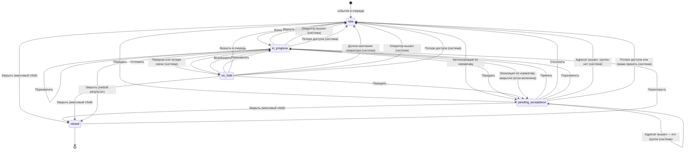

# Правила перехода состояний МИ

Версия: **v8**. Это действующие правила: файл один и правится на месте. Как ведётся журнал изменений и где лежат прошлые версии — в §16.

Жизненный цикл инцидента в менеджере инцидентов (МИ): состояния, переходы, права, нормативы и автоэскалация.

Версия 8 — это v7, сверенная с машиной, с решениями ревью 2026-10-05:

- **доступ:** оператор видит инциденты только по объектам из групп доступа своих ролей; передача и автоэскалация — только тем, у кого есть доступ;
- **группы:** дежурные группы задаются ролями;
- **эскалация и выход оператора:** эскалация по нормативу закрытия настраивается; при выходе оператора из МИ его инциденты в работе и отложенные возвращаются в очередь, а адресованные лично — дежурной группе; смен и расписания в модели нет, есть «вошёл / вышел»;
- **§6:** суть каждого перехода; точный перечень условий и эффектов — в [TRANSITIONS.md](../State_machine/TRANSITIONS.md), собранном из машины.

Правила, которые исполняет прототип, записаны в машине состояний `Specification/State_machine/` — она источник истины. Что изменилось от версии к версии — в [журнале изменений](CHANGELOG.md) (§16).

> Документ описывает целевую модель. Прототип следует её терминам; где он от неё отступает — в §17.

> Правила описывают механику, а значения задаёт машина состояний [`workflow.v4.json`](../State_machine/workflow.v4.json): нормативы (`timers`), лимиты и срок переоткрытия (`limits`), уровни и адресаты эскалации (`escalation`), пороги потери связи (`session`), причины удержания со сроками, результаты закрытия, причины массового сбоя (`reasonCatalogs`). Переходы машины словами, с подставленными значениями, — [`TRANSITIONS.md`](../State_machine/TRANSITIONS.md); строки §6 ссылаются на них колонкой «В машине».

## 1. Словарь и сокращения

### Сокращения

| Сокращение | Расшифровка | Простыми словами |
|---|---|---|
| **МИ** | Менеджер инцидентов | Рабочее место оператора: очередь событий, карточка обработки, видео и карта на одном экране |
| **SLA** | Service Level Agreement — соглашение об уровне сервиса | Отведённое время на работу с инцидентом. В МИ два норматива: время до взятия и время до закрытия (§4) |
| **ЦОД** | Центр обработки данных | Круглосуточный дежурный пост, куда передают то, что не решается силами площадки |
| **ТСО** | Технические средства охраны | Камеры, датчики, детекторы, турникеты — всё оборудование, которое порождает события |
| **СКУД** | Система контроля и управления доступом | Турникеты, шлагбаумы, двери с картами доступа |
| **СИЗ** | Средства индивидуальной защиты | Каска, жилет, очки. Есть детектор, который замечает их отсутствие |
| **PTZ** | Pan-Tilt-Zoom | Управляемая камера: её можно поворачивать, наклонять и приближать |
| **RBAC** | Role-Based Access Control | Права выдаются не человеку, а роли; человек получает права вместе с ролью. Роли ведутся во внешней системе, не в МИ (§5) |
| **AxxonData** | — | Система хранения и аналитики, куда уходит результат закрытого инцидента |
| **ITSM / ITIL** | — | Практики управления заявками и инцидентами, откуда взяты названия состояний (§16) |

### Термины

| Термин | Что это значит |
|---|---|
| **Событие** | То, что зафиксировала система: сработка детектора, датчика, тревожной кнопки |
| **Инцидент** | Событие, которое нужно разобрать по регламенту. Далее «событие» и «инцидент» — одно и то же |
| **Состояние** | Объективное положение инцидента в жизненном цикле: новое, ожидает принятия, в работе, отложен, закрыто (§2.1). Одно и то же для всех, кто смотрит |
| **Бейдж** | Подпись состояния в очереди. Вычисляется из состояния и владельца для конкретного смотрящего оператора (§2.4). Не хранится |
| **Владелец** | Оператор, за которым закреплён инцидент. Поле `owner` |
| **Передача** | Ручное действие «Передать»: выбрать адресата и отдать ему инцидент. Своё и чужое — одно действие, разные права (§5) |
| **Результат закрытия** | Чем закончился инцидент: обработан, ложная тревога, дубликат, плановая проверка, прервано, массовый сбой. Выбирается при каждом закрытии (§2.2). Поле `close_result` |
| **Закрытие без обработки** | Закрытие с любым результатом, кроме «Обработан»: сценарий не заполняется. Признак не хранится отдельно, а следует из результата |
| **Адресат** | Тот, кому передают инцидент: человек или дежурная группа |
| **Дежурная группа** | Группа людей, которой можно адресовать инцидент вместо одного человека; принять может любой её участник с доступом к объекту. Состоит из ролей и, при необходимости, отдельных людей. Ведёт администратор схемы (§8.1) |
| **Очередь** | Список инцидентов, из которого оператор выбирает, чем заняться |
| **Объект** | Устройство: камера, датчик, тревожная кнопка, точка прохода. Событие порождает устройство-источник (§19) |
| **Площадка** | Охраняемая территория или здание: торговый центр, склад, офис. Не путать с объектом — устройством (RULE-09) |
| **Группа** | Набор устройств и других групп. Вложенность не ограничена, одно устройство может входить в несколько групп. Регион и свой список объектов — это группы (§19) |
| **Карточка обработки** | Экран одного инцидента: шаги сценария, видео, карта, журнал |
| **Сценарий** | Пошаговая инструкция под тип события: что подтвердить, как классифицировать, что запустить |
| **Шаг** | Один вопрос или действие сценария. Бывает обязательным для конкретного перехода (§6.1) |
| **Журнал** | Хронология по инциденту: кто что сделал и когда. Заполняется автоматически |
| **Приоритет** | Насколько срочно: критический, высокий, средний, низкий. Влияет на нормативы и порядок в очереди |
| **Оператор** | Человек за рабочим местом МИ |
| **Старший оператор** | Оператор с расширенными правами: перехват, передача чужих, переоткрытие, «Массовый сбой». В Vision — «старший смены». Особой роли в модели у него нет: права приходят от внешней системы (§5), алерты — получателю алертов (§9) |
| **Получатель алертов** | Пользователь или дежурная группа из настроек (`alerts.target`, §9), которым уходят алерты: нарушения нормативов, потолок эскалации, потеря связи и доступа. Получают только те, кто на месте и с доступом к объекту инцидента |
| **Диспетчер** | Служебная часть системы: ставит события в очередь и выполняет автоматические переходы. В журнале такие записи подписаны «Диспетчер» |
| **Детектор** | Модуль, который сам находит событие в видео или звуке |
| **Макрос** | Заранее настроенная команда системе: включить сирену, открыть шлагбаум, оповестить по площадке |
| **Алерт** | Уведомление получателю алертов без передачи ответственности и без смены состояния |
| **Норматив реакции** | Время от появления инцидента до взятия в работу |
| **Норматив закрытия** | Время от взятия в работу до закрытия |
| **Уровень эскалации** | Сколько раз ответственность за инцидент передавалась. Поле `escalation_level`. Растёт и при ручной передаче, и при автоэскалации: иначе цепочку норматива можно обнулять бесконечно (§8.3) |
| **Причина удержания** | Почему инцидент отложен: ждём наряд, ждём третью сторону и так далее. Поле `hold_reason` |
| **Guard (условие)** | Проверка, без которой переход не выполняется: право, владение, заполненность шагов |
| **Effect (эффект)** | Что переход меняет: владельца, флаги, таймеры, запись в журнал, внешнюю команду |
| **Схема** | Конфигурация: состояния, переходы, условия, эффекты, нормативы. То, что настраивается без программиста |

### Технические имена

Встречаются в таблицах ниже, оператору не видны.

| Имя | Что это | В API |
|---|---|---|
| `new`, `pending_acceptance`, `in_progress`, `on_hold`, `closed` | Коды состояний | `state` |
| `owner` | Владелец-человек | `owner` |
| `assignment_group` | Дежурная группа-владелец, пока никто не сделал взятие | `assignmentGroup` |
| `escalation_level` | Счётчик уровней эскалации, `0` — не эскалирован | `escalationLevel` |
| `hold_reason` | Причина удержания при `on_hold` | `holdReasonId` |
| `close_result` | Результат закрытия при `closed`; у массового сбоя — вместе с причиной из справочника | `closeResultId`, подпись — `closeResultLabel` |
| `close_cause` | Причина массового сбоя из справочника — уточнение к результату «Массовый сбой» | `closeCauseId` |
| `result` | Комментарий оператора при закрытии. Обязателен для всех результатов, кроме «Обработан» (§2.2); виден в журнале | `result` (карточка) |
| `closed_by`, `closed_at` | Кто и когда закрыл. Нужны для срока переоткрытия (§6.1) и права открыть закрытый карточкой (§6.3) | `closedAt`; кто закрыл — в журнале |
| `group_id` | Признак групповой обработки | `groupGuid` |
| `reaction_due_at`, `resolution_due_at` | Дедлайны нормативов — метки времени, не счётчики | `timer.dueAt` — норматив, который идёт сейчас; срок удержания — `holdTimer` |
| `breaches` | Нарушения нормативов: вид (реакция, закрытие, удержание), когда, чей — владелец в момент нарушения. Не стираются, в том числе при переоткрытии | `breaches` |
| `sla_breached` | Есть хоть одно нарушение в `breaches` — для фильтров и бейджей | `slaBreached` |
| `schema_version` | Версия схемы, на которой инцидент был создан | `schemaVersion` |

## 2. Модель состояний

### 2.1. Объективные состояния

Состояние одно для всех. Оно не зависит от того, кто открыл очередь. Новый инцидент появляется в состоянии «Новое» — это начальное состояние машины (`initial`).

| Состояние | Код | Категория | Владелец | Терминальное |
|---|---|---|---|---|
| Новое | `new` | pending | нет | нет |
| Ожидает принятия | `pending_acceptance` | pending | адресат передачи | нет |
| В работе | `in_progress` | active | оператор | нет |
| Отложен | `on_hold` | active | оператор | нет |
| Закрыто | `closed` | done | кто закрыл | да |

Пояснения к выбору:

- **`pending_acceptance` вместо `escalated`.** Из имени видно, что состояние ждёт действия адресата, а значит нужен переход «Принять». В первой версии такого перехода не было, и адресат мог войти в инцидент только через «Перехватить».
- **`on_hold` — отдельное состояние, а не флаг.** Так работают категории (§2.3) и настройки автоэскалации: правило «эскалировать просроченные в работе, но не трогать отложенные» становится обычным перечислением состояний, а не разбором флагов.
- **Закрытие — одним действием.** Отдельного «выполнено» с проверкой старшим нет: это проще для смены. Проверить работу старший может по закрытым и при необходимости переоткрыть.
- **Одно конечное состояние `closed` и обязательный результат.** Так устроено в Jira: статус Done и поле Resolution. Ложная тревога, дубликат и проверка — значения результата, а не отдельное состояние. До v5 было два конечных состояния, «Закрыто» и «Отменено», и одна и та же ложная тревога попадала то в одно, то в другое (RULE-02). Отчёты строятся по результату.

### 2.2. Флаги и поля

Поля инцидента, влияющие на переходы: `owner`, `assignment_group`, `escalation_level`, `hold_reason`, `close_result`, `group_id`, `reaction_due_at`, `resolution_due_at`, `breaches`, `sla_breached`.

**Причины удержания** (`hold_reason`, обязательна при переходе в `on_hold`):

| Причина | Когда выбирают | Кто ставит |
|---|---|---|
| Ожидание третьей стороны | Вызвана внешняя служба, ждём ответа | оператор |
| Выезд наряда | Наряд в пути, обработка продолжится по прибытии | оператор |
| Нет данных, вернуться позже | Нужны сведения, которых сейчас нет | оператор |
| Перерыв оператора | Оператор ушёл на перерыв с открытой карточкой | система |
| Нет связи с оператором | Сессия оператора не отвечает (§12.3) | система |

**Результаты закрытия** (`close_result`, обязателен при переходе в `closed`; комментарий обязателен для всех, кроме «Обработан»):

| Результат | Когда выбирают | Сценарий | Право | Откуда |
|---|---|---|---|---|
| Обработан | Событие было и разобрано по регламенту | обязательные шаги набора «закрытие» | `incident:close` | свой `in_progress` |
| Ложная тревога | Детектор ошибся, события не было | не нужен | `incident:close` | свой `in_progress` |
| Дубликат | То же событие уже разбирается в другом инциденте | не нужен | `incident:close` | свой `in_progress` |
| Плановая проверка | Тест системы, учения | не нужен | `incident:close` | свой `in_progress` |
| Прервано: обработка невозможна | Площадка недоступна, данных нет, разобрать по регламенту нельзя | не нужен | `incident:close` | свой `in_progress` |
| Массовый сбой | Отключение электричества, потеря связи: причина известна, событий много. Причина — из справочника массовых сбоев | не нужен | `incident:close:unprocessed` | `new`, `pending_acceptance`, свой `in_progress` и `on_hold` |

Прав на закрытие два: `incident:close` — для результатов из своей карточки, `incident:close:unprocessed` — для «Массового сбоя», который закрывают из очереди без взятия в работу. Остальные результаты требуют открыть карточку, поэтому из очереди недоступны.

**Результат в форме закрытия выбирает оператор.** Если обязательные шаги заполнены, форма предлагает «Обработан». Иначе поле пустое, и закрыть без выбора нельзя: случайное нажатие не должно записать в отчёт «Ложную тревогу», которую оператор не выбирал. Если доступен единственный результат — например, «Массовый сбой» в очереди, — он выбран сразу.

Ответы сценария — пометки оператора. На результат и на выбор перехода они не влияют: вариант «Ложная» в сценарии не закрывает инцидент как ложную тревогу. Итог инцидента — только результат закрытия.

### 2.3. Категории состояний

У каждого состояния обязательна категория: `pending` — ждёт реакции, никто не работает; `active` — есть владелец, идёт работа; `done` — завершено. Это та же тройка, что категории статусов в Jira: To Do, In Progress, Done. От категории зависят группировка очереди, цвет бейджа, счётчики и отнесение в отчётах. Новое состояние, добавленное в схему, получает категорию и сразу попадает во все фильтры и сводки — без доработки интерфейса.

### 2.4. Слой представления: моё, чужое, бейджи

`mine` и `foreign` — не состояния. Это результат сравнения `owner` с текущим оператором, и в модели данных их нет. Бейдж в очереди вычисляется так:

| Состояние | Владелец относительно смотрящего | Бейдж |
|---|---|---|
| `new` | — | Новое |
| `pending_acceptance` | я | Вам на принятие |
| `pending_acceptance` | моя дежурная группа | Вашей группе · «группа» — принять может любой из группы |
| `pending_acceptance` | другой | Ожидает принятия · «адресат» |
| `in_progress` | я | В работе |
| `in_progress` | другой | «ФИО оператора» |
| `on_hold` | я | Отложен · «причина» |
| `on_hold` | другой | Отложен · «ФИО оператора» |
| `closed`, результат «Обработан» | любой | Закрыто |
| `closed`, другой результат | любой | Закрыто · «результат» |

## 3. Схема переходов

Условия переходов на диаграмме не показаны, чтобы она оставалась читаемой: полный список с правами — в §6.



## 4. Нормативы и таймеры

Один общий «норматив» первой версии разделён на два: он одновременно означал время до реакции и продолжал тикать у оператора, который как раз реагирует.

| Таймер | Смысл | Запускается | Останавливается | Удержание |
|---|---|---|---|---|
| `reaction` | Время до взятия в работу | вход в `new` или `pending_acceptance` (при передаче перезапускается заново, норматив берётся от уровня) | вход в `in_progress`, `closed` | не применимо |
| `resolution` | Время до закрытия | первый вход в `in_progress`, один раз за жизнь инцидента | не останавливается, только приостанавливается | приостанавливается при любом выходе из `in_progress`: удержание, передача, возврат в очередь, закрытие. Продолжается с остатка при каждом возврате в `in_progress` |
| `hold` | Предельный срок удержания | вход в `on_hold`; срок — по причине удержания (§2.2) | выход из `on_hold` | — |

Правила:

1. Дедлайны хранятся метками времени (`reaction_due_at`, `resolution_due_at`), а не убывающими счётчиками. Обратный отсчёт рисует клиент. Значение можно пересчитать после перезапуска сервиса и посчитать запросом в отчёте.
2. Нормативы задаются на тип события, приоритет и группу устройств. Значение по умолчанию — на схему.
3. Истечение `reaction` — основной триггер автоэскалации (§9). Если автоэскалация выключена, истечение `reaction` — нарушение реакции (`breaches`) и алерт получателю алертов, без передачи: просрочка реакции видна всегда.
4. Истечение `resolution` по умолчанию не меняет состояние: пишется запись в журнал, записывается нарушение закрытия (`breaches`), уходит алерт получателю алертов. Настройкой можно включить эскалацию и по этому таймеру (`on_resolution_overdue`, §9): тогда инцидент в работе передаётся адресату следующего уровня, как при автоэскалации по реакции, а на потолке — нарушение и алерт получателю алертов (§6.2).
5. **Нормативы считаются в календарных минутах**, а не по расписанию смены: это проще и предсказуемо в отчётах, а охрана обычно работает круглосуточно.
6. **Норматив закрытия не перезапускается при передаче и возврате.** Передача, возврат в очередь и удержание его приостанавливают, взятие и принятие продолжают с остатка. Иначе просрочку можно скрыть: передать инцидент коллеге или вернуть в очередь и взять снова — и норматив начнётся с начала. Время, пока инцидент ждёт взятия или принятия, в норматив закрытия не идёт: его покрывает норматив реакции. **Переоткрытие запускает норматив закрытия заново**: по нормативу переоткрытия, если он задан в схеме, иначе по обычному. Лазейки «спрятать просрочку» это не открывает: нарушения, записанные до закрытия, остаются (`breaches`). Новое нарушение после переоткрытия записывается на того, кто переоткрыл (RULE-11).
7. Удержание в `on_hold` не бесконечно: по каждой причине задаётся максимальный срок, после которого уходит алерт и записывается нарушение удержания (`breaches`).

## 5. Права доступа

МИ не знает, что разрешают роли: бэкенд МИ публикует каталог своих прав — таблицу ниже, а основная система привязывает права к ролям, роли — к людям. Состав ролей у каждого заказчика свой. МИ проверяет права пользователя. Роли пользователя МИ получает от основной системы вместе с правами — чтобы применить группы доступа (ниже) и собрать дежурные группы (§8.1). Права и роли МИ нужны не только вошедшего пользователя, но и всех остальных: передать можно только тому, кто может принять (§8.1). Как именно МИ их получает — открытый вопрос (§15).

Ключи в формате `ресурс:действие:область`. Область различает своё и чужое: `own` — свои и ничьи инциденты, `any` — включая занятые другим оператором. Проверка «есть ли у пользователя хоть какое-то право на действие» выполняется по маске `incident:transfer:*`.

| Право | Что разрешает |
|---|---|
| `incident:claim` | Взять новое, возобновить свой отложенный; перехватить и переоткрыть — вместе с их правами. Без него инцидент в работу не попадает |
| `incident:accept` | Принять передачу, адресованную мне или моей дежурной группе |
| `incident:hold` | Отложить свой инцидент с указанием причины |
| `incident:release` | Вернуть свой инцидент в очередь; отклонить адресованную передачу |
| `incident:close` | Закрыть свой инцидент с результатом: «Обработан» — после обязательных шагов; «Ложная тревога», «Дубликат», «Плановая проверка», «Прервано» — без сценария |
| `incident:close:unprocessed` | Закрыть с результатом «Массовый сбой» без сценария, в том числе не беря в работу |
| `incident:reopen` | Вернуть в работу закрытый инцидент |
| `incident:transfer:own` | Передать своё, ничьё (новое) или адресованное мне |
| `incident:transfer:any` | Передать инцидент, занятый другим оператором или ожидающий принятия у другого |
| `incident:reassign` | Перехватить инцидент у работающего оператора |
| `incident:read:any` | Открыть карточку чужого инцидента только для чтения |
| `incident:bulk` | Обработать несколько инцидентов как один |
| `incident:run_action` | Запускать макросы и команды из карточки |
| `incident:schema:admin` | Менять схему, нормативы и настройки автоэскалации |
| `agent:set_not_ready` | Переводить себя в перерыв |

Отдельно от прав:

- **С какими объектами работает оператор** — группы доступа. Они настраиваются в самом МИ администратором с правом `incident:schema:admin`: для роли задаётся, какие группы устройств (§19) или отдельные устройства ей доступны. Оператору видны только инциденты, устройство-источник которых доступно хотя бы одной из его ролей. Вне них инцидент не виден никак — ни в очереди, ни карточкой, ни в потоке событий, даже если он его или адресован ему. Связанные камеры без доступа в карточке не показываются. Когда группы доступа или роли меняются, сервер проверяет открытые инциденты: если у владельца или адресата больше нет доступа к объекту, инцидент возвращается в очередь (§6.2), а прежний владелец или адресат — у группы её участники — получает уведомление «INC-N вам больше не доступен: изменились группы доступа». Только номер: данных инцидента он уже не видит. Если доступ у адресата остался, но принять он больше не может — у него отняли право `incident:accept`, — не принятый инцидент тоже возвращается в очередь (§8.1).
- **Настройки рабочего места** (раскладка панелей, тема, предвыбор адресата в форме передачи, свои горячие клавиши — §13) права не требуют: они не меняют данные инцидента.

## 6. Переходы

### 6.1. Ручные переходы

Общее правило для всех строк: переход выполняется сервером атомарно, на перерыве и после выхода недоступен (§10), передача на себя запрещена (§10).

Здесь — суть каждого перехода и почему он так устроен. Полный перечень условий и эффектов с числами — в [TRANSITIONS.md](../State_machine/TRANSITIONS.md), собранном из машины: ищите по идентификатору из колонки «В машине».

| Действие | В машине | Откуда | Куда | Право | Главное условие | Суть |
|---|---|---|---|---|---|---|
| **Взять** | `claim` | `new` | `in_progress` | `incident:claim` | лимит активных | Владелец — я. Норматив реакции снят; норматив закрытия запускается при первом взятии, иначе продолжается с остатка (§4). Карточка открывается с первого незаполненного шага |
| **Принять** | `accept` | `pending_acceptance` | `in_progress` | `incident:accept` | адресат — я или моя дежурная группа; лимит активных | Владелец — я, адресация группе снимается (§8.1). Нормативы — как при «Взять». Прогресс сценария сохраняется |
| **Отклонить** | `reject` | `pending_acceptance` | `new` | `incident:release` | адресат — я или моя группа; указана причина | Инцидент снова ничей, в общей очереди. Уровень эскалации сохраняется — отклонением цепочку не обнулить. Норматив реакции — заново |
| **Отложить** | `hold` | `in_progress` | `on_hold` | `incident:hold` | я владелец; выбрана причина; лимит отложенных (§10.2) | Норматив закрытия на паузе, идёт срок удержания по причине (§4, правило 7). Шаг, ответы и журнал сохраняются |
| **Возобновить** | `resume` | `on_hold` | `in_progress` | `incident:claim` | я владелец; лимит активных | Норматив закрытия продолжается с того же остатка |
| **Вернуть в очередь** | `release` | `in_progress`, `on_hold` | `new` | `incident:release` | я владелец; указана причина | Инцидент ничей. Норматив закрытия на паузе, реакция — заново: просрочку возвратом не скрыть (§4, правило 6). Прогресс сохраняется, инцидент выходит из группы сценария |
| **Передать** | `transfer` | `new`, `pending_acceptance`, `in_progress`, `on_hold` | `pending_acceptance` | `incident:transfer:own` / `:any` | адресат может принять, не я и не моя группа (§8.1); указана причина | Владелец — адресат, а если адресат — группа, то она (§8.1). Уровень эскалации +1 — передачей нельзя обнулить цепочку (§8.3). Норматив закрытия на паузе, реакция — по нормативу уровня. Прогресс сохраняется. Уведомление адресату; если инцидент был чужой — и прежнему владельцу, его карточка переходит в просмотр |
| **Перехватить** | `takeover` | `in_progress`, `on_hold`, `pending_acceptance` | `in_progress` | `incident:reassign` + `incident:claim` | я не владелец; лимит активных | Владелец — я. Норматив закрытия продолжается с остатка. Прогресс сохраняется. Прежний владелец получает уведомление, его карточка переходит в просмотр |
| **Закрыть** | `close` | по результату (§2.2): `in_progress`; «Массовый сбой» — ещё `new`, `pending_acceptance`, `on_hold` | `closed` | по результату: `incident:close` или `incident:close:unprocessed` | выбран результат; «Обработан» — после обязательных шагов, остальные — с комментарием; в работе и отложенный — только свой | Результат записывается, владелец — я. Нормативы останавливаются, остаток закрытия сохраняется для переоткрытия. Результат уходит в AxxonData (§14.2) |
| **Переоткрыть** | `reopen` | `closed` | `in_progress` | `incident:reopen` + `incident:claim` | не истёк срок переоткрытия; лимит активных | Владелец — я, результат снят (прежний остаётся в журнале). Норматив закрытия — заново, по нормативу переоткрытия (§4, правило 6). Нарушения не стираются |
| **Обработать как одно** | `claim` на выборку (`bulk.createsGroup`), `grouping` | `new` (несколько) | `in_progress` | `incident:bulk` + `incident:claim` | выбрано ≥ 2 новых одного типа (§11) | Все выбранные — мои, с общей группой сценария и общими ответами; состояние и нормативы у каждого свои |

### 6.2. Автоматические переходы

Выполняются диспетчером. Права оператора в них не участвуют. Полный перечень — в [TRANSITIONS.md](../State_machine/TRANSITIONS.md).

| Триггер | В машине | Откуда | Куда | Условие | Суть |
|---|---|---|---|---|---|
| Истёк `reaction` | `auto_escalate` | `new`, `pending_acceptance` | `pending_acceptance` | автоэскалация включена; есть следующий уровень, адресат которого может принять (§8.3) | Инцидент уходит адресату ближайшего такого уровня, уровень эскалации — номер этого уровня. Реакция — по нормативу уровня. Уведомление адресату |
| Истёк `reaction`, достигнут потолок или принять некому | `escalation_ceiling` | `new`, `pending_acceptance` | не меняется | автоэскалация включена; до потолка нет уровня, адресат которого может принять (§8.3) | Никому не передаётся, остаётся у последнего адресата. Нарушение реакции, алерт получателю алертов |
| Истёк `reaction`, автоэскалация выключена | `reaction_overdue` | `new`, `pending_acceptance` | не меняется | автоэскалация выключена (§9) | Нарушение реакции, алерт получателю алертов. Никому не передаётся |
| Истёк `resolution` | `resolution_overdue` | `in_progress` | не меняется | `on_resolution_overdue` = алерт (по умолчанию, §9) | Нарушение закрытия, алерт получателю алертов |
| Истёк `resolution`, включена эскалация | `resolution_escalate` | `in_progress` | `pending_acceptance` | `on_resolution_overdue` = эскалация; есть следующий уровень, адресат которого может принять (§8.3) | Нарушение закрытия и передача адресату ближайшего такого уровня, как при автоэскалации. Инцидент выходит из группы сценария, прежний владелец получает уведомление |
| Истёк `resolution`, включена эскалация, достигнут потолок или принять некому | `resolution_ceiling` | `in_progress` | не меняется | `on_resolution_overdue` = эскалация; до потолка нет уровня, адресат которого может принять | Нарушение закрытия, алерт получателю алертов |
| Истёк предельный срок удержания | `hold_overdue` | `on_hold` | не меняется | срок причины удержания задан в справочнике (§2.2, §4, правило 7) | Нарушение удержания, алерт получателю алертов. Инцидент остаётся отложенным: возобновить или вернуть его должен человек |
| Оператор ушёл на перерыв | `system_hold_break` | `in_progress` | `on_hold` | у оператора есть активная карточка | Причина — «перерыв оператора»; право `incident:hold` не требуется (§12.2) |
| Сессия оператора не отвечает | `system_hold_idle` | `in_progress` | `on_hold` | таймаут неактивности (§12.3) | Причина — «нет связи с оператором», алерт получателю алертов |
| Сессия не отвечает дольше порога | `system_release_idle` | `on_hold` | `new` | причина удержания системная | Инцидент ничей, реакция — заново |
| Оператор вышел из МИ | `owner_signed_out` | `in_progress`, `on_hold` | `new` | инцидент оператора; оператор вышел (§12.1) | Как «Вернуть в очередь»: инцидент ничей, причина удержания снята, норматив закрытия на паузе, реакция — заново, инцидент выходит из группы сценария, прогресс сохраняется. Отложенные — с любой причиной: оператора больше нет |
| Адресат вышел, не приняв | `target_signed_out_to_group` | `pending_acceptance` | `pending_acceptance` | адресован лично; адресат вышел и состоит в дежурной группе | Инцидент уходит дежурной группе адресата. Уровень не меняется, реакция продолжается — уход адресата не даёт лишнего времени |
| Адресат вышел, не приняв, а группы у него нет | `target_signed_out_to_queue` | `pending_acceptance` | `new` | адресован лично; адресат вышел; группы у него нет | Инцидент снова ничей, в общей очереди; реакция продолжается |
| Владелец или адресат потерял доступ к объекту | `addressee_lost_access` | `pending_acceptance`, `in_progress`, `on_hold` | `new` | у владельца или адресата больше нет доступа к объекту (§5); группе хватает одного участника с доступом | Инцидент ничей, в общей очереди. Норматив закрытия на паузе, реакция — заново. Уровень и прогресс сценария сохраняются. Алерт получателю алертов |
| Адресат больше не может принять | `addressee_cannot_accept` | `pending_acceptance` | `new` | доступ к объекту есть, а права `incident:accept` у адресата больше нет; у группы — ни у одного участника нет того и другого (§8.1) | Инцидент ничей, в общей очереди, реакция — заново, алерт получателю алертов. Иначе он ждал бы адресата, который не может принять, до истечения норматива реакции |

### 6.3. Действия без смены состояния

Первая версия описывала их как переходы, из-за чего таблица переходов смешивала изменение данных с навигацией.

| Действие | В машине | Когда доступно | Право | Что делает |
|---|---|---|---|---|
| **Открыть на просмотр** | `open_readonly` | `pending_acceptance`, `in_progress`, `on_hold`: я не владелец и не адресат. У новых вместо этого — «Взять», у закрытых — «Просмотр» | `incident:read:any` | открывает карточку только для чтения; состояние и владелец не меняются |
| **Продолжить** и **Просмотр** | `open_card`, `open_done` | «Продолжить» — мой `in_progress` (у своего отложенного — «Возобновить», это переход). «Просмотр» — `closed`: мой, закрытый мной или по `incident:read:any` | — | открывает карточку; в `closed` — только для чтения |
| **К очереди** | `back_to_queue` | открыта карточка просмотра | — | закрывает карточку; ничего не меняет |
| **Запустить макрос** | `run_macro` | я владелец, состояние `in_progress` | `incident:run_action` | внешняя команда; результат пишется в журнал (§14.2) |

Правило для закрытых инцидентов: свои закрытые доступны всегда, закрытые другими — по `incident:read:any`, как и любые чужие. Отдельного условия «всегда» больше нет.

## 7. Кнопки: очередь и карточка

Кнопка показывается, если соответствующий переход доступен: есть право, выполнены условия, состояние подходит. Права нет — кнопки нет.

### В очереди

| Бейдж | Основная кнопка | Дополнительно |
|---|---|---|
| Новое | **Взять** | **Передать**, **Закрыть** — если есть `incident:close:unprocessed` |
| Вам на принятие / Вашей группе | **Принять** | **Отклонить**, **Передать**, **Закрыть** — по тому же праву |
| В работе (моё) | **Продолжить** | **Передать**, **Закрыть** с результатом «Массовый сбой» — по праву `incident:close:unprocessed` |
| Отложен (моё) | **Возобновить** | **Передать**, **Закрыть** с результатом «Массовый сбой» — по тому же праву |
| «ФИО оператора» / Ожидает принятия | **Открыть** (просмотр) | **Передать** — если есть `incident:transfer:any`; **Закрыть** — если есть `incident:close:unprocessed` и состояние `pending_acceptance` |
| Закрыто | **Просмотр** | **Переоткрыть** |

«Продолжить» и «Возобновить» — разные кнопки: возобновлять активный инцидент нечего, для него это просто возврат в карточку. В первой версии обе строки предлагали «Возобновить», и соответствующего перехода в таблице не было.

### Фильтры очереди

Фильтр выбирает, что видно в очереди по состоянию и отношению ко мне. Он работает вместе с выбранной группой и фильтрами по типам (§19) и поиском. Записан в машине (`queueFilters`), прототип берёт его оттуда.

| Фильтр | Что попадает |
|---|---|
| Открытые | всё, что не завершено: категории `pending` и `active` (§2.3) |
| Мне на принятие | `pending_acceptance`, адресованные мне или моей дежурной группе |
| Мои | мои `in_progress` и `on_hold`. Свои закрытые сюда не входят — они в «Завершённых» |
| Чужие | `pending_acceptance`, `in_progress`, `on_hold`, закреплённые за другими |
| Завершённые | `closed` |
| Все | без ограничений |

### В карточке

| Ситуация | Кнопки |
|---|---|
| Мой, `in_progress` | **Назад / Далее** по шагам, **Отложить**, **Передать**, **Вернуть в очередь**, **Закрыть** — форма с результатом. В конце заполненного сценария — **Закрыть инцидент**: та же форма, результат «Обработан» выбран заранее |
| Мой, `on_hold` | **Возобновить**, **Передать**, **Вернуть в очередь**, **Закрыть** с результатом «Массовый сбой» — по праву |
| Адресован мне, `pending_acceptance` | **Принять**, **Отклонить**, **Передать** — отдать дальше, не принимая |
| Чужой | **Перехватить**, **Передать** — по правам; иначе только просмотр |
| `closed` | **Переоткрыть** — по праву; иначе только просмотр |

**Перехватить** — действие только из карточки: оператор должен сначала увидеть, что уже сделано. В очереди его нет.

Цвета: обычная работа с инцидентом — основной цвет интерфейса; **Передать** — один акцент передачи ответственности; **Закрыть** — нейтральная кнопка, не красная; перехват — красный.

Кнопки в очереди стоят **справа колонкой** одной ширины и **видны всегда**. Скрывать их до наведения нельзя: очередь должна работать на телефоне, там нет hover. Чекбокс выбора есть на каждом событии и тоже всегда виден. На узком экране колонка переезжает под текст, но кнопки остаются одной ширины — не растягиваются в ряд разной длины.

Двух кнопок «Эскалация» и «Перенаправить» нет. Оператор не должен решать, «вверх» он отдаёт или «вбок»: он выбирает адресата. Иерархия — в справочнике адресатов и в цепочке автоэскалации, не в названии кнопки.

**Закрыть** в очереди — это закрытие с результатом «Массовый сбой». Остальные результаты — только из карточки своего инцидента в работе, «Обработан» — только после обязательных шагов.

### Меню вспомогательных ссылок

Меню справки в шапке: регламент, телефоны ответственных, схемы, контакты служб — файлы и веб-страницы. Список ведёт администратор схемы (`incident:schema:admin`) как справочник: общие ссылки и ссылки площадки. Ссылки площадки показываются, когда открыт инцидент этой площадки: клиент запрашивает справочник с площадкой инцидента (`GET /operator/reference/help-links?site=…`). Название ссылки вводит администратор — не переводится (§14.9). Оператор список не настраивает: важные контакты у всех операторов одинаковые и не теряются при смене рабочего места.

## 8. Передача: адресаты и уровни

### 8.1. Кто может быть адресатом

| Правило | Поведение |
|---|---|
| Список адресатов | люди и дежурные группы, разрешённые схемой |
| Дежурные группы | создаёт и меняет администратор схемы (`incident:schema:admin`). Группа задаётся ролями и, при необходимости, отдельными людьми: участники — все, у кого есть одна из её ролей, плюс названные люди. Людей и их роли МИ получает от основной системы (§5, §15). Порядок групп задаёт администратор: если человек состоит в нескольких группах, «его дежурная группа» — первая по порядку. У группы — название: его видит оператор в списке адресатов, на бейдже и в журнале; названия не переводятся (§14.9) |
| Назначение на группу | инцидент принадлежит группе (`assignment_group`), пока кто-то из неё не выполнит «Принять»: всё это время `owner` пуст. После «Принять» `owner` — принявший человек, `assignment_group` очищается. «Отклонить» тоже очищает `assignment_group`: инцидент снова ничей и в общей очереди. «Перехватить» и «Закрыть» очищают его, иначе после «Переоткрыть» инцидент оказался бы в работе у человека и одновременно у группы. Группа в `owner` не записывается никогда |
| Исключение себя | текущий оператор и дежурные группы, в которые он входит, из списка исключены всегда. Иначе оператор с правами передачи и принятия, но без права взятия, мог бы взять новый инцидент в работу в обход `incident:claim` |
| Исключение владельца | при передаче чужого из списка исключён текущий владелец |
| Адресат может принять | передать можно только тому, кто может принять: у него есть право `incident:accept` и доступ к объекту инцидента — ему доступно устройство-источник (§5). Дежурной группе — если хотя бы у одного её участника есть и то, и другое. Остальные в списке адресатов не показываются: иначе передача повисла бы в «Ожидает принятия» до истечения норматива реакции. Если адресат перестал мочь принять уже после передачи — отняли право или доступ, — инцидент возвращается в очередь (§6.2). Принять из группы может только участник с доступом: остальным инцидент не виден |
| Доступность | в строке списка указано состояние адресата, если он вышел или на перерыве (§12.1); передачу это не запрещает. Группа на месте, если на месте хотя бы один её участник |
| Адресат вышел | если адресат вышел из МИ, не приняв адресованный ему лично инцидент, инцидент уходит его дежурной группе — первой по порядку, если их несколько, — а если группы нет, в общую очередь (§6.2). Норматив реакции при этом продолжается. Если адресат уже вышел в момент передачи или автоэскалации — так же: инцидент сразу уходит его дежурной группе или в очередь. Ждать вышедшего незачем, а группа может принять (RULE-47) |
| Уведомление адресату | в МИ: всплывающее уведомление со звуком и счётчик «Мне на принятие»; группе — всем её участникам на месте. Отдельного подтверждения прочтения нет: ответ адресата — «Принять» или «Отклонить», а молчание страхуют норматив реакции и автоэскалация. Возможное расширение — внешний канал (почта, мессенджер, SMS) для вышедшего адресата: МИ отправляет то же событие `notify`, канал настраивается во внешней системе |

### 8.2. Два разных значения по умолчанию

В первой версии одно и то же значение использовалось и как персональная настройка, и как системный параметр автоэскалации. Для ничьего инцидента это неопределимо: в зале десять операторов с разными значениями.

| Настройка | Кто задаёт | Право | Где применяется |
|---|---|---|---|
| Предвыбор адресата в форме | каждый оператор себе | не требуется | только подставляет значение в выпадающий список ручной передачи |
| Адресаты уровней автоэскалации | администратор схемы | `incident:schema:admin` | автоэскалация; на ручную форму не влияет |

### 8.3. Уровни

Однократный флаг «автоэскалация уже была» заменён счётчиком: иначе цепочка «старшие операторы → ЦОД» невозможна, а не принятый инцидент лежит без движения.

| Уровень | Адресат по умолчанию | Норматив реакции |
|---|---|---|
| 0 | нет, инцидент в общей очереди | норматив типа события |
| 1 | старший оператор или группа «Старшие операторы» | сокращённый |
| 2 | дежурный ЦОД | сокращённый |
| потолок | дальше не передаётся | алерт и нарушение реакции |

Потолок и состав уровней настраиваются. Адресат уровня — пользователь или дежурная группа; задаёт его администратор схемы (§8.2). Удобнее группа: её состав задают роли (§8.1), поэтому при смене людей схему менять не нужно, а принять может любой участник на месте; инцидент при этом ждёт в `assignment_group`, как при ручной передаче группе. Если адресат уровня — человек и он вышел, инцидент сразу уходит его дежурной группе или в очередь (§8.1). Если адресат уровня не может принять — у него нет права `incident:accept` или доступа к объекту инцидента (§8.1; у группы — ни у одного участника нет того и другого), уровень пропускается: инцидент уходит ближайшему следующему адресату, который может принять, а `escalation_level` становится номером этого уровня. Если такого адресата нет до потолка, инцидент никому не передаётся: записывается нарушение реакции (при эскалации по нормативу закрытия — нарушение закрытия) и уходит алерт получателю алертов. Ручная передача тоже увеличивает `escalation_level`: иначе передачей коллеге можно было бы бесконечно обнулять цепочку норматива. Автоэскалация — тот же эффект передачи, но без кнопки: её запускает таймер, адресата берёт схема, не оператор.

## 9. Автоэскалация: настройки

Автоэскалацию выполняет система, поэтому права оператора её не ограничивают. Настройки — под правом `incident:schema:admin`.

| Параметр | Назначение | Значение по умолчанию | В машине |
|---|---|---|---|
| `enabled` | Включить или выключить. Выключена — истёкшая реакция только записывается нарушением и уходит алертом, без передачи (§4, правило 3) | включена | `escalation.enabled` |
| `levels[]` | Адресат — пользователь или дежурная группа — и норматив на каждом уровне | старший оператор, затем дежурный ЦОД | `escalation.levels` |
| `max_level` | Потолок цепочки | 2 | `escalation.maxLevel` |
| `on_resolution_overdue` | Что делать при истечении норматива закрытия: алерт без смены состояния или эскалация адресату следующего уровня (§6.2) | алерт | `escalation.onResolutionOverdue`: `alert` или `escalate` |
| `reason` | Текст записи в журнале | «Автоэскалация: превышен норматив реакции» | `escalation.reason` |
| `alerts.target` | Получатель алертов — нарушения нормативов, потолок эскалации, потеря связи и доступа: пользователь или дежурная группа; группе — её участникам на месте. Получают только те, у кого есть доступ к объекту инцидента (§5). Если таких нет, нарушение и запись перехода остаются, а в журнал пишется «Алерт не отправлен: получателя на месте с доступом к объекту нет». Алерт не передаёт инцидент и не меняет владельца | группа «Старшие операторы» | `alerts.target`, `alerts.noRecipientLog` |

Автоэскалация срабатывает по нормативу реакции, а он идёт только в «Новое» и «Ожидает принятия» (§4): после взятия реакция уже состоялась, и эскалировать оператора «за отсутствие реакции» в момент, когда он реагирует, бессмысленно. Поэтому перечня состояний и выбора таймера в настройках нет — их задаёт переход `auto_escalate`. Просроченные в работе эскалируются по нормативу закрытия: `on_resolution_overdue` = эскалация.

### Порядок срабатывания

1. Планировщик на сервере ведёт дедлайны. Клиент только рисует обратный отсчёт.
2. При наступлении `reaction_due_at`, если инцидент в «Новое» или «Ожидает принятия» и до `max_level` есть уровень, адресат которого может принять (§8.3): состояние → `pending_acceptance`, `owner` → адресат ближайшего такого уровня, `escalation_level` = его номер, `reaction` перезапускается по нормативу уровня, в журнал пишется запись от диспетчера.
3. Если оператор в этот момент держал карточку открытой, карточка переводится в режим просмотра с уведомлением.
4. При достигнутом потолке или если до потолка принять некому, состояние не меняется: записывается нарушение реакции и уходит алерт.
5. Дедлайны, наступившие во время простоя сервиса, обрабатываются при старте (§14.3).

## 10. Ограничения и защита от тупиков

### 10.1. Инварианты

1. **Переход атомарен и выполняется сервером.** Клиент присылает идентификатор перехода вместе с ожидаемым состоянием и версией записи; при рассинхроне сервер отклоняет запрос и возвращает актуальное состояние.
2. **На перерыве и после выхода доступен только просмотр.** Любое действие, меняющее состояние инцидента, недоступно. Это одно правило вместо выборочной пометки «не на перерыве» у части переходов: какие состояния оператора такие, задаёт машина (`session.states[].readOnly`).
3. **Передача на себя запрещена.** «Себя» — это и сам оператор, и дежурные группы, в которые он входит: передача своей группе вернулась бы ему же на принятие, подняв уровень эскалации и поставив норматив закрытия на паузу.
4. **Терминальные состояния меняются только через «Переоткрыть».** Право `incident:reopen` — единственное исключение из правила «закрытый инцидент не меняется».
5. **Ручное действие выигрывает у таймера.** Если переход по таймеру и действие оператора приходятся на один момент, применяется действие оператора, срабатывание таймера отменяется и фиксируется в журнале.

### 10.2. Лимит одновременных инцидентов

| Параметр | Значение по умолчанию | Смысл | В машине |
|---|---|---|---|
| `max_active` | 1 | сколько инцидентов может быть в `in_progress` у одного оператора | `limits.maxActive` |
| `max_on_hold` | 5 | сколько отложенных он может держать | `limits.maxOnHold` |

Инциденты одной группы сценария (§11) считаются в обоих лимитах одной единицей: иначе групповая обработка упиралась бы в `max_active`. Исключить инцидент из группы можно, только если лимит позволяет: исключённый остаётся в работе отдельной единицей, и группа превращается в две (RULE-13).

`max_on_hold` ограничивает только ручное «Отложить». Системные удержания — перерыв оператора и потеря связи с ним — откладывают инцидент всегда, даже сверх лимита: иначе оператор с пятью отложенными не смог бы уйти на перерыв, а инцидент при потере связи остался бы «в работе» у недоступного человека.

При попытке взять инцидент сверх лимита кнопка заблокирована с подсказкой, какой инцидент нужно завершить или отложить. Горячая клавиша «взять следующее новое» подчиняется тому же лимиту.

### 10.3. Гарантия выхода из карточки

Первая версия допускала тупик: без права откладывать, без права эскалировать и с незаполняемыми обязательными шагами выхода из карточки не существовало.

Выходов теперь три, и хотя бы один доступен всегда:

1. **Отложить** — `incident:hold`.
2. **Вернуть в очередь** — `incident:release`.
3. **Закрыть** с результатом «Прервано: обработка невозможна» — `incident:close`, обязательные шаги закрытия при этом не проверяются, но комментарий обязателен.

В работу инцидент попадает только по праву взятия `incident:claim` или принятия `incident:accept`: «Перехватить» и «Переоткрыть» требуют и `incident:claim` (§6.1).

Требование к набору прав: если есть `incident:claim` или `incident:accept`, должен быть хотя бы один из `incident:hold`, `incident:release`, `incident:close`. Роли собираются во внешней системе, поэтому МИ не может проверить это при сохранении схемы. Требование передаётся внешней системе вместе с каталогом прав как правило настройки ролей. МИ проверяет набор прав пользователя при входе: если выхода нет, `incident:claim` и `incident:accept` не действуют — взять или принять инцидент нельзя, передать такому пользователю тоже (§8.1), а администратору уходит предупреждение.

### 10.4. Запреты

| Ситуация | Запрещено |
|---|---|
| Нет права `incident:claim` | Взять, Возобновить, Перехватить, Переоткрыть, групповая обработка |
| Нет права `incident:accept` | Принять; передать такому пользователю тоже нельзя (§8.1) |
| Нет права `incident:reassign` | Перехватить; остаётся просмотр |
| Нет права `incident:transfer:own` | Передать своё, новое или адресованное мне |
| Нет права `incident:transfer:any` | Передать чужой или ожидающий принятия у другого |
| Нет права `incident:close:unprocessed` | Закрыть с результатом «Массовый сбой»; остальные результаты — по `incident:close` |
| Нет права `incident:read:any` | Открыть чужую карточку, включая закрытые другими |
| Оператор на перерыве или вышел | любые действия, меняющие состояние; правки сценария и макросы |
| Инцидент не мой | правка шагов, макросы, закрытие — только после перехвата. Исключение: **Закрыть** с результатом «Массовый сбой» для `new` и `pending_acceptance` — по праву, без взятия в работу |
| Обязательные шаги набора «закрытие» не заполнены | результат «Обработан» (остальные результаты — можно, каждый по своему праву) |
| Достигнут потолок уровней | дальнейшая автоэскалация |
| Лимит активных исчерпан | Взять, Принять, Возобновить, Перехватить, Переоткрыть |

## 11. Групповая обработка

Правила, которых не было в первой версии.

| Вопрос | Правило |
|---|---|
| Как набирать выборку | чекбокс на каждом событии; в шапке списка — **Выбрать все**, **Однотипные** (`Shift`+`A`) и **Снять** (`Shift`+`D`). **Снять** сбрасывает любую выборку. Действие на карточке отмеченного инцидента применяется ко всей выборке, если оно для неё доступно. После действия выборка сбрасывается. Если инциденты уже в группе сценария, те же действия из карточки идут на всех членов группы |
| Что можно включать в выборку | любое видимое событие, в том числе разных типов и состояний. **Однотипные** набирает только `new` одного типа. **Выбрать все** — все открытые в текущем фильтре, не больше `max_bulk` |
| Сколько | от 1 до `max_bulk` (по умолчанию 10); массовые действия — от 2 |
| Какие кнопки остаются | пересечение действий по всей выборке. **Взять** — только если все отмеченные `new` одного типа (группа сценария). **Передать**, **Отклонить** и **Закрыть** с результатом «Массовый сбой» — если действие доступно каждому отмеченному. При передаче выборки, может ли адресат принять, проверяется для каждого инцидента (§8.1): где не может, инцидент не передаётся, и оператор видит причину. **Открыть**, **Продолжить**, **Возобновить**, **Принять**, **Переоткрыть** при 2+ отмеченных неактивны: открыть разом несколько карточек нельзя, а взять в работу разом можно только однотипные новые — остальное упёрлось бы в лимит активных. **Отложить**, **Вернуть в очередь** и **Перехватить** на выборку не идут вовсе: это кнопки карточки; «Отложить» и «Вернуть в очередь» действуют на группу сценария, а не на набранную руками выборку. На неотмеченных карточках кнопки как обычно |
| Что происходит с состояниями | каждый инцидент сохраняет собственное состояние и собственные таймеры; общими становятся `group_id`, владелец и ответы сценария — только после **Взять** однотипных |
| Родительский инцидент | не создаётся: группа — это признак, а не сущность |
| Закрытие | одним действием на всю группу / выборку, один результат и один набор ответов, отдельная запись в журнал каждого инцидента |
| Почему не «остановить таймеры группы» | иначе групповая обработка становится способом легально обойти нормативы |
| Частичное завершение | оператор может исключить инцидент из группы вручную, он возвращается в `in_progress` со своими ответами. Только если лимит активных позволяет ещё одну единицу (§10.2); иначе кнопка неактивна с подсказкой |
| Возврат в очередь | инцидент выходит из группы, ответы сценария сохраняются. Ничейный инцидент в очереди не может делить владельца и ответы с группой, которая осталась у оператора. Если вернуть всю группу, она распадается |
| Закрыть выбранные: массовый сбой | кнопка **Закрыть** на любой отмеченной карточке, если `incident:close:unprocessed` и переход доступен каждому в выборке. Одна форма причины на всю выборку. Группа сценария не создаётся: каждый инцидент закрывается сам, со своей записью в журнале |

## 12. Состояние оператора

Состояние оператора — отдельная машина состояний. В первой версии «перерыв» лежал в общем списке прав и условий переходов инцидента, хотя к инциденту не относится.

### 12.1. Состояния

| Состояние | Смысл | Назначаются ли новые инциденты |
|---|---|---|
| Готов | вошёл в МИ, готов принимать инциденты | да |
| Занят | работает с инцидентом | да, в пределах лимита |
| Перерыв (с причиной) | обед, инструктаж, обход | нет |
| Вышел | оператор вышел из МИ или ещё не вошёл. Выходя, он сразу возвращает в очередь свои инциденты в работе и отложенные, а адресованные ему лично и не принятые отдаёт дежурной группе или в очередь (§8.1, §6.2). Доступен только просмотр (§10.1) | нет |

Смен и расписания в модели нет: МИ знает только, вошёл оператор или вышел. Так устроены операторские пульты и пульты охраны; график дежурств, если понадобится, ведёт отдельная система. «Выйти» — явное действие оператора с подтверждением: интерфейс показывает, сколько инцидентов вернётся в очередь. Ждать потери связи (§12.3) при осознанном уходе незачем — она остаётся для аварий: закрытая вкладка, пропавшая сеть. Доступность адресата в списке передачи (§8.1) — это его состояние.

### 12.2. Переход в перерыв

Право `agent:set_not_ready`. При уходе на перерыв активный инцидент автоматически переводится в `on_hold` с причиной «перерыв оператора» — системным действием, право `incident:hold` для этого не нужно. Иначе оператор без права откладывать не смог бы уйти на перерыв.

### 12.3. Отвал оператора

Сессия оператора присылает признак активности. При его пропаже:

| Порог | Действие | В машине |
|---|---|---|
| `idle_hold` (по умолчанию 5 минут) | активный инцидент → `on_hold`, причина «нет связи с оператором», алерт получателю алертов | `session.idleHoldSec`, секунды |
| `idle_release` (по умолчанию 20 минут) | отложенные по системной причине → `new`, владелец очищается | `session.idleReleaseSec`, секунды |

Без этого инцидент, брошенный вместе с закрытым браузером, может отобрать только обладатель права перехвата, и до этого он никак не помечен как проблемный.

### 12.4. Журнал действий оператора

Сервер ведёт общий журнал действий оператора: кто, когда и что сделал (Vision). В него попадают:

- каждый переход инцидента — тот же, что пишется в журнал инцидента, с автором и временем;
- вход и выход оператора;
- уход на перерыв с причиной и возврат с перерыва;
- потеря связи и её восстановление (§12.3).

Журнал только дополняется, правке и удалению не подлежит. Данные — в первой версии: без них не разобрать спорный случай. Экран просмотра журнала — позже.

## 13. Горячие клавиши

Клавиши задаются в два слоя:

- **Схема** задаёт набор по умолчанию для всех операторов. Меняет его администратор с правом `incident:schema:admin`.
- **Оператор** переназначает клавиши под себя в настройках рабочего места. Права на это не нужно (§5). Назначение хранится за пользователем, а не за компьютером, и действует на любом рабочем месте. Кнопка «Сбросить» возвращает набор схемы.

Клавиша только вызывает действие. Право проверяется на действие, а не на клавишу: своя клавиша не даёт оператору ничего сверх его прав.

| Клавиша по умолчанию | Действие | Право | Работает в поле ввода |
|---|---|---|---|
| `N` | Взять следующее новое | `incident:claim` | нет |
| `A` | Принять адресованную передачу | `incident:claim` | нет |
| `R` | Возобновить свой отложенный | `incident:claim` | нет |
| `E` | Передать выбранный | `incident:transfer:own` / `:any` | нет |
| `T` | Перехватить | `incident:reassign` | нет |
| `H` | Отложить с указанием причины | `incident:hold` | нет |
| `G` | Обработать выделенные как одно | `incident:bulk` | нет |
| `Shift`+`A` | Выбрать однотипные новые | `incident:bulk` | нет |
| `Shift`+`D` | Снять выделение | — | нет |
| `B` | Перерыв или возврат с перерыва | `agent:set_not_ready` | нет |
| `F1` | Регламент обработки инцидента | — | да |
| `?` | Список горячих клавиш | — | нет |
| `Enter` | Открыть форму закрытия инцидента | `incident:close` | нет |
| `←` / `→` | Предыдущая / следующая камера инцидента | — | нет |
| `1`–`4` | Камера инцидента по номеру | — | нет |
| `Esc` | Отмена по контексту, см. ниже | — | да |

Правила, снимающие неоднозначность первой версии:

1. **`Esc` разбирается по приоритету:** открытая форма или модальное окно → полноэкранный режим → панель групп на узком экране → и только если ничего из этого не открыто, возврат к очереди. Инцидент при этом не меняется: остаётся «В работе», норматив закрытия идёт. Случайное нажатие не должно менять состояние — тот же принцип, что у `Enter` (правило 2). Отложить — только осознанно: кнопкой или клавишей `H`, с причиной.
2. **`Enter` не закрывает инцидент напрямую.** Он открывает форму закрытия с результатом — подтверждение нужно нажать отдельно. Случайное закрытие опаснее случайного открытия справки.
3. **В полях ввода работает только `F1` и `Esc`.** Остальные клавиши игнорируются, чтобы набор комментария не вызывал действий по инциденту. При открытом окне — форме, справке, регламенте — работают только `Esc`, `F1` и `?`: действие за окном оператор не увидит. `Enter` и пробел на кнопке или ссылке в фокусе нажимают её, а не вызывают горячую клавишу.
4. **`Esc`, `F1` и `?` не переназначаются.** `Esc` и `F1` — единственные клавиши, которые работают в полях ввода (правило 3). По `?` оператор всегда найдёт список клавиш, даже если забыл, что переназначил.
5. **Дубли проверяются в обоих слоях.** При сохранении схемы — дубли в наборе по умолчанию. При сохранении настроек оператора — дубли в его итоговом наборе и занятые неизменяемые клавиши. В обоих слоях запрещены сочетания с `Ctrl`: их занимает браузер (`Ctrl`+`A` — выделить всё, `Ctrl`+`D` — закладка, `Ctrl`+`W`, `Ctrl`+`T` и подобные), а на Mac `Ctrl` совпадает с `Cmd`. Набор с дублем или таким сочетанием не сохраняется.
6. **Личное назначение важнее схемы.** Если администратор поставил по умолчанию клавишу, которую оператор уже занял под другое действие, у оператора остаётся его назначение. Действие из схемы остаётся у него без клавиши, и настройки показывают это как конфликт.

## 14. Требования к реализации

Пункты, без которых схема остаётся картинкой. Настраивать её будет можно, а работать под нагрузкой она не будет.

### 14.1. Конкурентность

Оптимистичная блокировка: клиент присылает ожидаемое состояние и версию записи. Типовые гонки, которые обязаны разрешаться предсказуемо: двое одновременно берут один инцидент; автоэскалация срабатывает в момент взятия; перенаправление уводит карточку, в которой оператор заполняет шаг. Правило разрешения — ручное действие выигрывает у таймера (§10.1).

### 14.2. Эффекты переходов

Эффекты делятся на два класса:

| Класс | Примеры | Поведение при отказе |
|---|---|---|
| Транзакционные | смена состояния и владельца, флаги, таймеры, запись в журнал | выполняются в одной транзакции с переходом; при отказе переход не применяется |
| Внешние | макросы ТСО, шлагбаум, вызов наряда, запись результата в AxxonData | через очередь исходящих сообщений с повторами и идемпотентными ключами; переход не откатывается, в журнал пишется неуспех, инцидент получает признак «команда не доставлена» |

### 14.3. Таймеры

Единый серверный планировщик. Дедлайны — метки времени. При старте сервиса выполняется догон срабатываний, пропущенных во время простоя. Часы клиента на срабатывание не влияют. Каждый дедлайн срабатывает один раз; новый дедлайн того же таймера — новое срабатывание. Нормативы считаются в календарных минутах (§4).

Порядок: если готовы сразу несколько автоматических переходов, первым выполняется тот, чьё условие наступило раньше: таймер — по дедлайну, потеря связи — последний признак активности плюс порог, остальное — в момент проверки; при равенстве — по порядку в машине. Переход, который стал возможен после другого, наступает не раньше него, а переход без таймера — сразу после него (RULE-48). Эффекты считают время от этого момента, после каждого перехода выбор делается заново. Так результат не зависит от того, как часто работает планировщик, и догон после простоя даёт то же, что проверка каждую секунду. Пример: оператор взял инцидент и пропал. Через 5 минут инцидент отложен по потере связи, и норматив закрытия встаёт на паузу — эскалации по закрытию не будет, даже если сервис простоял два часа и догоняет всё разом. Упрощение: условия без времени — доступ, права, состояние оператора — при догоне берутся на текущий момент, а не на момент наступления; если роли поменялись во время простоя, результат будет «как сейчас».

### 14.4. Область применения схемы

Схема привязывается к типу события, группе устройств и приоритету. Есть схема по умолчанию и детерминированное правило разрешения конфликтов — по специфичности условия. Пожар, проникновение и отказ оборудования могут иметь разные состояния, нормативы и цепочки адресатов.

### 14.5. Связь со сценарием обработки

Сценарии обработки ведёт отдельная машина состояний — своя конфигурация, свои версии, публикация и права. Машина инцидента её не заменяет и в неё не встраивается: две машины соприкасаются только в местах ниже. Так правка инструкции не требует новой версии схемы, а схема не может сломать сценарий.

Что машина инцидента берёт у машины сценариев:

| Что | Где используется |
|---|---|
| Заполнены ли обязательные шаги набора (`stepSets`, например «закрытие») | результат «Обработан» (§2.2) и его выбор по умолчанию в форме закрытия |
| Прогресс: сколько шагов заполнено из скольких, номер текущего шага | журнал, подписи форм, строка очереди |
| Курсор на первый незаполненный шаг | при возобновлении и принятии — эффект `setCursor` |
| Общие ответы для группы сценария | групповая обработка (§11) |

Что машина инцидента отдаёт машине сценариев:

| Что | Правило |
|---|---|
| Можно ли сейчас отвечать на шаги | `scenarioEdit`: инцидент «В работе», смотрящий — владелец, не на перерыве и не вышел (§10.4). Иначе сценарий открыт на просмотр |
| Состояние инцидента и владелец | для собственных условий сценария, например макросов |

Наборы обязательных шагов привязываются не к инциденту, а к переходу и результату: закрытие с результатом «Обработан» требует одного набора, передача — другого. Ответы сценария — пометки оператора: на переходы они не влияют, итог инцидента задаёт только результат закрытия (§2.2). Открытый инцидент доигрывает на тех версиях обеих машин, с которыми начат.

### 14.6. Публикация и версионирование

Идентификаторы состояний и переходов стабильны, названия — отдельные переводимые лейблы: переименование состояния не должно быть миграцией данных. При публикации новой версии задаётся сопоставление старых состояний новым, ведётся аудит изменений с автором и временем, доступен откат.

### 14.7. Валидация и симуляция

Валидатор при сохранении схемы ловит: не ровно одно начальное состояние; недостижимые из него состояния; нетерминальные состояния без исходящих переходов; состояния без входящих переходов; комбинации «набор прав + состояние» без единого доступного перехода; состояния, из которых адресат с типовым набором прав не может выйти; дубли горячих клавиш; ссылки на несуществующие права и права, не используемые ни одним переходом; незаданные настройки, без которых истёкший норматив не оставит следа: включена ли автоэскалация, что делать при просрочке закрытия, получатель алертов (§9).

Что разрешают роли, МИ не знает, поэтому проверки, зависящие от прав, идут на типовых наборах прав. Их задаёт схема как примеры для проверки, например «оператор» и «старший оператор». Это не роли: настоящие роли собираются во внешней системе.

Симулятор отвечает на вопрос «набор прав, состояние и флаги — какие кнопки видны и что произойдёт» и позволяет прогнать схему по историческим инцидентам перед публикацией.

### 14.8. Как строка таблицы переходов выглядит в схеме

Каждая строка §6.1 — это запись конфигурации. Условия и эффекты берутся из фиксированного реестра с параметрами, а не пишутся скриптом: тогда редактор — это выпадающие списки, схему можно статически проверить, а каталог прав, который МИ отдаёт внешней системе для настройки ролей, собирается из схемы автоматически. Ниже — переход «Принять», которого не было в первой версии.

```json
{
  "id": "accept",
  "label": "Принять",
  "from": ["pending_acceptance"],
  "to": "in_progress",
  "trigger": "manual",
  "concurrency": { "expectedVersion": true, "onTimerConflict": "manual_wins" },
  "guards": [
    { "fn": "hasPermission", "args": ["incident:claim"] },
    { "fn": "isTarget" },
    { "fn": "agentReady" },
    { "fn": "withinActiveLimit" }
  ],
  "effects": [
    { "kind": "transactional", "fn": "setOwner", "args": ["actor"] },
    { "kind": "transactional", "fn": "setAssignmentGroup", "args": [null] },
    { "kind": "transactional", "fn": "stopTimer", "args": ["reaction"] },
    { "kind": "transactional", "fn": "resumeTimer", "args": ["resolution"] },
    { "kind": "transactional", "fn": "appendLog", "args": ["Передача принята, прогресс сценария сохранён"] }
  ],
  "bulk": { "allowed": false },
  "ui": { "surface": ["queue", "card"], "style": "primary", "hotkey": "A", "navigate": "card" }
}
```

Реестр условий: `hasPermission(key)`, `isOwner`, `isTarget`, `agentReady`, `withinActiveLimit`, `requiredStepsFilled(set)`, `timerExpired(id)`, `settingEnabled(key)`.

`closeResultAllowed` проверяет строку справочника результатов закрытия (§2.2): право, исходное состояние, владение, набор обязательных шагов. Так у одного перехода «Закрыть» условия зависят от выбранного результата.

`evictOpenCard` переводит открытую у человека карточку в режим просмотра с уведомлением о причине: автоэскалация, передача или перехват. Карточка не исчезает: оператор видит, что произошло, и не теряет, на что смотрел.

`resumeTimer` продолжает таймер с остатка, а ещё не запускавшийся — запускает с полного норматива. Так «Взять», «Принять» и «Переоткрыть» используют один эффект, и норматив закрытия не перезапускается (§4).

Реестр эффектов: `setOwner`, `setAssignmentGroup`, `setHoldReason`, `clearHoldReason`, `startTimer`, `stopTimer`, `pauseTimer`, `resumeTimer`, `increment(field)`, `setFlag(field)`, `appendLog(template)`, `returnToQueue`, `evictOpenCard`, `notify(target)`, `externalCommand(id)`.

Границу расширяемости стоит зафиксировать сразу: продуктовая команда меняет схему — состояния, переходы, условия из реестра, нормативы, привязки; разработчики расширяют сам реестр условий и эффектов.

Оба списка выше — базовые. Действующий реестр ведёт сама машина, в разделе `registries`: функции сверх базового списка помечены там `extendsBaseRegistry`, их бэкенду тоже нужно реализовать. Среди них и `closeResultAllowed`, описанный выше.

### 14.9. Языки интерфейса

МИ встраивается в стороннее облако. Список языков не ограничен и настраивается снаружи, в облаке. Каталог строк МИ с переводами хранится в бэкенде МИ, а не в облаке: подписи кнопок, состояний, причин, результатов, записей журнала. Названия состояний и переходов — переводимые лейблы (§14.6). Русский, английский и испанский в прототипе — только для показа. Названия, которые вводят люди, — устройств, площадок, дежурных групп, — не переводятся: показываются так, как введены.

## 15. Открытые вопросы

Требуют продуктового решения, в этой версии сознательно не зафиксированы. У каждого вопроса есть владелец и срок, иначе он дойдёт до разработчиков нерешённым (RULE-05). Открытые вопросы Vision ведутся здесь же (DOC-03).

| Вопрос | Варианты | Кто решает | Срок |
|---|---|---|---|
| Как МИ получает права и роли пользователя из внешней системы (§5): права — для действий; роли — для групп доступа и дежурных групп; нужен и список всех пользователей с ролями и правами — для состава групп и адресатов: передать можно только тому, кто может принять (§8.1) | в токене при входе (снятое право действует до перевхода) / запросом во внешнюю систему с кэшем / в токене при входе плюс событие «права изменились», по которому МИ перечитывает права. Предпочтительно последнее | бэкенд МИ вместе с владельцами внешней системы | до описания API бэкенда |
| Vision: нужны ли дашборды | — | joynickray | после первой версии, вместе с отчётами |

Решённые вопросы — что решено и где это записано:

| Вопрос | Решение | Где |
|---|---|---|
| Норматив — в календарных минутах или по расписанию смены | в календарных минутах | §4, §14.3 |
| Разделять ли «выполнено» и «закрыто» | нет, закрытие — одним действием | §2.1 |
| Срок, в течение которого закрытый инцидент можно переоткрыть | задаётся в схеме, по умолчанию 24 часа | §6.1 |
| Vision: место инцидента на карте — автоматически или по запросу | автоматически | прототип |
| Уведомления адресату: канал и подтверждение прочтения | в МИ, без отдельного подтверждения; внешний канал — возможное расширение | §8.1 |
| Кто настраивает сценарии обработки и как они соотносятся со схемой | отдельная машина состояний сценариев — утверждена, в репозиторий подключается позже; стык двух машин — в §14.5 | §14.5 |
| Vision: где настраивать связи камер | отдельный объект «Связи»: устройство → камеры с порядком показа | §19.1 |
| Нужно ли расписание смен | нет: МИ знает только «вошёл / вышел»; график дежурств, если понадобится, — в отдельной системе (RULE-37) | §12.1 |
| Права на результаты закрытия и из каких состояний доступен каждый | два права: `incident:close` — из своего «В работе», `incident:close:unprocessed` — «Массовый сбой» из очереди и своих «В работе» и «Отложен» | §2.2 |

## 16. Журнал изменений

Правила ведутся одним файлом. Как вносить изменение:

1. Правка делается прямо в этом файле.
2. В журнал [CHANGELOG.md](CHANGELOG.md) добавляется строка в «Изменения после v8»: что изменилось и по какому пункту ревью или решению. Номер пункта — в начале сообщения коммита, как договорено в [reviews/README.md](../../reviews/README.md).
3. Смысловые изменения копятся в следующей версии. Когда версия готова, номер в шапке растёт, а коммит отмечается тегом `rules-vN`. Ссылка на любую прошлую версию — по тегу или по коммиту.

Прошлые версии заморожены в [archive/](archive/) и не правятся. Там же история рассуждений:

| Версия | Файл | Главное |
|---|---|---|
| v1 | [001 States rules IM.md](archive/001%20States%20rules%20IM.md) | Первая версия |
| — | [States rules IM - analisys.md](archive/States%20rules%20IM%20-%20analisys.md) | Разбор v1: противоречия и логические дыры |
| v2 | [002 States rules IM.md](archive/002%20States%20rules%20IM.md) | Объективные состояния, два норматива, уровни эскалации. Разбор v1 → v2 — в её §16 |
| v3 | [003 States rules IM.md](archive/003%20States%20rules%20IM.md) | Одна операция **Передать**. Разбор v2 → v3 — в её §16 |
| v4 | [004 States rules IM.md](archive/004%20States%20rules%20IM.md) | Копия v4 на момент перехода к одному файлу |
| v5 | тег `rules-v5` | Одно «Закрыть» с результатом, роли вне МИ, нарушения — записи, группы и фильтры очереди, машина состояний — источник истины. Изменения — в [CHANGELOG.md](CHANGELOG.md), «v5: что изменилось относительно v4» |
| v6 | тег `rules-v6` | Владелец — только человек, передача своей группе запрещена, лимит отложенных — только ручной. Изменения — в [CHANGELOG.md](CHANGELOG.md), «v6: что изменилось относительно v5» |
| v7 | тег `rules-v7` | Результат закрытия выбирает оператор, клавиши без сочетаний браузера, бейдж передачи группе, решения открытых вопросов, сценарии — отдельной машиной. Изменения — в [CHANGELOG.md](CHANGELOG.md), «v7: что изменилось относительно v6» |
| v8 | этот файл, тег `rules-v8` | Группы доступа и видимость, дежурные группы по ролям, эскалация по закрытию, конец смены, смены без расписания, §6 — суть, перечень — в [TRANSITIONS.md](../State_machine/TRANSITIONS.md). Изменения — в [CHANGELOG.md](CHANGELOG.md), «v8: что изменилось относительно v7» |

Что именно менялось, на основании чего и каким коммитом — в [CHANGELOG.md](CHANGELOG.md): по версиям, от свежих к старым.

## 17. Соответствие прототипу

Прототип устроен как продукт: интерфейс разговаривает только запросами из `Specification/State_machine/openapi.json`, а отвечает ему встроенный сервер в той же вкладке (`prototype/server.js`), который исполняет машину состояний (`workflow.v4.json`) через `prototype/engine.js`. Доступность кнопок, переходы, формы, бейджи, нормативы, автоматические переходы по таймерам и горячие клавиши берутся из машины, ответы сервера самопроверка сверяет со схемами контракта. Своей таблицы переходов у прототипа нет. Полного соответствия правилам всё же нет: ниже — где прототип отступает. Кто согласует правила по прототипу, сверяется с этим списком (RULE-06).

### Отступления

| Правило | В прототипе |
|---|---|
| §13: оператор переназначает клавиши под себя | машина это поддерживает, но экрана настроек нет: набор из схемы |
| §5, §10.3: права приходят из внешней системы, набор без выхода из карточки проверяется при входе | входа нет: у оператора стенда все права, если тест не задал другие; права коллег — по их ролям из каталога ролей эталонного набора (`roles`), состояние — из набора (`agentState`): вышедший коллега ничего не берёт, а переданное ему сразу уходит его группе. Набор без выхода при входе не проверяется |
| §8.1: уведомление адресату со звуком | уведомление показывается без звука; уведомлений группе нет — в прототипе один оператор |
| §12.4: сервер ведёт общий журнал действий оператора — переходы, вход и выход, перерывы, потеря связи | журнал ведётся только по инцидентам (`/operator/incidents/{guid}/journal`). Сводного журнала оператора встроенный сервер не хранит и не отдаёт |
| §14.5: сценарии — отдельная машина состояний | машина сценариев ещё не подключена: сценарии — в эталонном наборе данных (`Specification/State_machine/fixtures/demo.json`), стык с машиной инцидента — функции `stepsFilled`, `progress`, `setCursor`, `shareAnswers` в `ctx` исполнителя |
| §14.1: сервер общий для всех операторов, данные хранятся | встроенный сервер живёт в одной вкладке: один оператор, данные — до перезагрузки страницы. Одновременные действия нескольких операторов, перезапуск и хранение проверит только настоящий бэкенд |
| поиск в очереди на языке интерфейса | встроенный сервер ищет по номеру и русским названиям: словари перевода — у клиента. Как искать на языке оператора, решает бэкенд |
| §14.9: названия, введённые людьми, не переводятся | прототип переводит названия из эталонного набора — устройств, площадок, групп — словарём `i18n-data.js`, чтобы демо выглядело цельно на трёх языках |
| `index.html?api=https://…` — работа с настоящим бэкендом | бэкенда ещё нет. Сетевой путь клиента (`fetch`, заголовки, поток событий SSE) проверен тестами API через петлю — встроенный сервер за Service Worker (`tools/check_loopback.py`). CORS и вход проверит только настоящий бэкенд |

## 18. Очередь-плашки — что взято из внешнего макета

Это решения по оформлению прототипа, а не правила: они перенесены в [README прототипа](../../prototype/README.md), раздел «Очередь-плашки: что взято из внешнего макета».

## 19. Группы и фильтры очереди

Vision требует группировать события по региону, по типу события, по типу объекта и по своему списку объектов. Четыре режима покрываются двумя механизмами: группами и фильтрами (RULE-03).

### 19.1. Объекты и группы

- **Объект** — устройство: камера, датчик, тревожная кнопка, точка прохода. У события одно устройство-источник, остальные устройства события — связанные, например камеры рядом.
- **Связи** — отдельный объект, как в Интеллекте: «устройство → камеры» с порядком показа. Инцидент показывает камеры своего устройства-источника, первая — главная. Связь — свойство места, а не события: настраивается один раз на устройство и работает для любого типа события. Камеры инцидента — связь его устройства-источника; у самого инцидента своего списка камер нет. Связи ведёт администратор схемы, читаются запросом `GET /operator/admin/camera-links`. Камеры от сценария — возможное расширение.
- **Группа** — отдельная сущность. В группу входят устройства и другие группы, вложенность не ограничена. Одно устройство может входить в несколько групп.
- **Регион** — группа с вложенными группами территорий: площадка → здание → этаж → помещение.
- **Свой список** — любая группа, собранная вручную, например «Все кассы» или «Периметр».

Отдельных режимов «по региону» и «свой список» нет: это разные группы в одном дереве. Панель групп показывает дерево. Выбранная группа ограничивает очередь событиями её устройств, включая вложенные группы.

**Кто ведёт группы.** Группы хранит МИ. Создаёт, переименовывает и меняет их состав администратор схемы с правом `incident:schema:admin`. Оператор группы не правит: он выбирает группу в дереве. Группы устройств только группируют устройства для очереди. Что доступно оператору, задают группы доступа (§5).

**Свой список «как единый».** Vision требует, чтобы события своего списка можно было обработать как одно. Это групповая обработка §11: оператор выбирает группу в дереве, **Однотипные** отмечают однотипные новые события только этой группы, и **Взять** берёт их одной карточкой.

### 19.2. Фильтры по типам

Тип события и тип устройства — свойства, а не группы. Тип события есть у события, тип устройства — у устройства-источника. Через группы их не выразить: одна камера даёт и «Проникновение», и «Саботаж».

Поэтому это фильтры очереди поверх выбранной группы: «Склад №1» + «Пожарная тревога» + «Пожарный извещатель». Фильтры сочетаются между собой, с фильтром по состоянию («Открытые», «Мои» и другие) и с поиском.

Групповая обработка (§11) — другое: это действие над несколькими событиями, а не способ разложить очередь.

## 20. Настройки администратора

Настройка — значение, которое администратор с правом `incident:schema:admin` подстраивает под площадку, не меняя логику переходов: нормативы, причины, автоэскалация и получатель алертов, лимиты, пороги связи, горячие клавиши по умолчанию, группы доступа, дежурные группы, группы устройств, справочные ссылки, связи камер. Переходы, состояния, формы и бейджи — модель, а не настройки.

Полный перечень по вкладкам будущей админки, с текущими значениями, — [SETTINGS.md](../State_machine/SETTINGS.md). Он собран из раздела `adminSettings` машины, и `check_machine.py` следит, чтобы ни одна настройка схемы не выпала. Часть настроек — схема (машина), часть — данные МИ (группы доступа, дежурные группы, ссылки, связи): их бэкенд хранит отдельно и отдаёт своими запросами. В прототипе перечень можно посмотреть: меню пользователя → «Настройки администратора», только просмотр.
